# IdentityGateway — Documentação de Negócio

> **Versão:** 1.1 · **Data:** 2026-09-20
> **Fonte da verdade:** [`especificacao-arquitetural-v2.2.md`](especificacao-arquitetural-v2.2.md)
> **Estado do projeto:** especificação concluída, implementação não iniciada.

Este documento explica **o que o IdentityGateway faz, para quem, como funciona e por que foi
desenhado assim**. Ele é derivado da especificação arquitetural v2.2 e não a substitui: onde a
spec fixa contratos, assinaturas e código de referência, aqui a linguagem é de negócio, com
âncoras técnicas para quem quiser descer ao detalhe.

**Rastreabilidade.** Toda afirmação relevante cita sua origem: `§N` remete a uma seção da v2.2,
`ADR-00N` a uma decisão arquitetural, e `C*`, `A*`, `N*`, `X*` e `CI-*` aos achados da
[`revisao-critica.md`](revisao-critica.md). Essa rastreabilidade é deliberada — a linha evolutiva
dos documentos (ideia → v2.0 → revisão → v2.1 → v2.2) é parte do que o projeto demonstra.

**Como navegar.** As quatro partes são independentes e podem ser lidas fora de ordem:

| Parte | Responde a | Para quem chega agora |
|---|---|---|
| [I — Visão de negócio](#parte-i--visão-de-negócio) | Que problema resolve, para quem, com que valor | **Comece aqui** |
| [II — Funcionalidades e regras](#parte-ii--funcionalidades-e-regras-de-negócio) | O que a API entrega e sob que regras | Quem vai implementar ou avaliar escopo |
| [III — Fluxos de execução](#parte-iii--fluxos-de-execução) | Como a solução funciona, passo a passo | Quem quer entender o mecanismo |
| [IV — Arquitetura e decisões](#parte-iv--arquitetura-e-decisões) | Por que foi desenhado assim | Quem avalia julgamento arquitetural |

Os diagramas são Mermaid e renderizam nativamente no GitHub.

---

## Sumário

**[Parte I — Visão de negócio](#parte-i--visão-de-negócio)**
Sumário executivo · O problema e o contexto · Atores e personas · Capacidades de negócio ·
O modelo de valor · Glossário · As sete decisões e suas consequências

**[Parte II — Funcionalidades e regras de negócio](#parte-ii--funcionalidades-e-regras-de-negócio)**
Catálogo de 23 funcionalidades (F-01..F-23) · Ciclo de vida do Tenant · Ciclo de vida do Membro ·
27 regras transversais (RN-001..RN-027) · Matriz de permissões · Roadmap M0–M7 · Limites

**[Parte III — Fluxos de execução](#parte-iii--fluxos-de-execução)**
Diagrama de contexto · Os nove fluxos da §9 · Quando a Gateway cai · Quando o Keycloak cai ·
Consistência eventual

**[Parte IV — Arquitetura e decisões](#parte-iv--arquitetura-e-decisões)**
Arquitetura em uma página · As nove ADRs · Keycloak × Gateway · Modelo de segurança ·
A história da revisão crítica · Linha evolutiva · Qualidade e verificabilidade

**[Apêndice — Verificações que dependem do Keycloak real](#apêndice--verificações-que-dependem-do-keycloak-real)**

---

# Parte I — Visão de negócio

### 1. Sumário executivo

O **IdentityGateway** resolve um problema que aparece assim que uma organização decide operar um produto SaaS para múltiplos clientes corporativos: o Keycloak dá conta de *autenticar pessoas*, mas não dá conta de *governar clientes*. Ele sabe guardar senhas, aplicar MFA, emitir e assinar tokens e federar com provedores externos — e faz tudo isso muito melhor do que qualquer implementação caseira. O que ele não sabe é que um tenant tem um **plano contratado com limite de usuários**, que um cliente inadimplente precisa ser **suspenso com efeito imediato**, que um contrato encerrado precisa de um **estado terminal auditável**, ou que uma operação destrutiva exige **reautenticação forte**. Essas são regras de negócio, e o IdentityGateway é a camada que as torna explícitas, versionadas e testáveis sobre o Keycloak (§1, §5).

A proposta de valor se resume em uma frase: **governança centralizada na definição, desacoplada na execução** (§1). O IdentityGateway é o *Control Plane* do ecossistema — a fonte única da verdade sobre quem é tenant, quem é membro, que papéis e permissões cada um tem, que aplicações estão registradas e que provedores de identidade cada cliente usa. Mas ele deliberadamente **não participa** do login nem do tráfego de negócio: as credenciais são digitadas exclusivamente no Keycloak, os tokens são emitidos pelo Keycloak diretamente para a aplicação cliente, e as APIs de negócio validam esses tokens localmente com as chaves públicas (JWKS). A Gateway nunca vê uma senha e nunca está no caminho do token (§2, ADR-002, ADR-003).

O público direto do sistema são três perfis: o **provedor da plataforma** (platform-admin), que cria e administra a carteira de clientes; o **administrador de cada cliente corporativo** (tenant-admin), que gerencia os próprios membros, aplicações, permissões e federação sem abrir ticket para ninguém; e as **equipes de engenharia** que constroem as APIs de negócio, que ganham uma biblioteca pronta (`IdentityGateway.Client.AspNetCore`) em vez de reacertar, API por API, os detalhes de validação de token do Keycloak — detalhes que a própria especificação documenta como a origem mais comum de erro nessa integração (§12, §12.1).

O valor de negócio aparece em três eixos. **Time-to-market:** registrar um novo cliente corporativo é uma chamada REST que provisiona a Organization no Keycloak, convida o administrador inicial e ativa o tenant, de forma assíncrona e idempotente, sem intervenção manual (§9.1). **Continuidade:** como a Gateway está fora do caminho crítico, a indisponibilidade dela não derruba logins nem o tráfego de negócio que depende só de papéis globais (§2.1, ADR-002). **Conformidade:** a Gateway guarda vínculos e governança, não dados pessoais — esses ficam no Keycloak — e implementa tanto o direito ao esquecimento por indivíduo (§9.5) quanto o encerramento de contrato por cliente inteiro (§9.8), que é o cenário em que a LGPD costuma ser invocada de fato.

Um ponto de honestidade que o próprio documento faz questão de registrar, e que vale ser lido como qualidade e não como fraqueza: o projeto **não elimina o ponto único de falha, ele o desloca**. Com o Keycloak fora do ar, nenhum login acontece e, decorridos os 5 minutos de vida do access token, o Data Plane inteiro para. O ADR-002 tira a Gateway do caminho crítico; ele não torna o sistema resiliente à queda do Keycloak (§2.1, §19). Registrar esse limite, em vez de vender resiliência que não existe, é parte do que o projeto se propõe a demonstrar.

> **Natureza do artefato.** O IdentityGateway é um **projeto de portfólio** (§1): uma especificação arquitetural completa em .NET 10, API-first, sem front-end no repositório e sem código escrito até esta versão. A demonstração prevista é um README com `curl` reproduzível (§16).

---

### 2. O problema e o contexto

#### 2.1. A dor concreta

Uma organização que vende software para outras empresas precisa responder, todo dia, a perguntas que nenhum IdP responde sozinho:

| Pergunta de negócio | O Keycloak puro responde? |
|---|---|
| "Este cliente já estourou o limite de usuários do plano dele?" | Não. Plano e limite não são conceitos do Keycloak. |
| "Este cliente está inadimplente — como corto o acesso dele agora?" | Parcialmente. Desabilitar usuários é operação administrativa manual, um a um. |
| "Quem administra o cliente que acabei de cadastrar?" | Não. É uma sequência manual de passos no console. |
| "Encerramos o contrato — qual o estado auditável desse cliente?" | Não. Não existe ciclo de vida contratual. |
| "Que permissões finas este usuário tem neste cliente?" | Não sem Authorization Services, que traz outra ordem de complexidade. |
| "Que aplicações este cliente registrou, e com que credenciais?" | Sim, mas sem fronteira por cliente: o console é global. |

O denominador comum é que essas perguntas são sobre **contrato, plano e ciclo de vida comercial**, e o Keycloak modela **identidade e sessão**. Forçar o IdP a carregar semântica de negócio leva a um dos dois caminhos ruins: configuração manual no console administrativo, que não é versionável, não é revisável em pull request e não é testável; ou extensões em Java (Event Listener SPI, authenticators customizados), que acoplam a regra de negócio ao ciclo de release do IdP.

#### 2.2. Por que não "Keycloak puro"

A especificação é explícita sobre o que a Gateway **não** faz, e isso é tão importante quanto o que ela faz (§1.1): ela não emite tokens, não armazena senhas, não intermedia o login e não reassina nada. O Keycloak permanece o **único dono de credenciais e único emissor de tokens** (princípio 3, §3). A camada existe por quatro razões:

1. **Traduzir contrato em configuração de identidade.** "Plano Enterprise com 200 usuários e SSO próprio" vira, de forma automatizada e idempotente, uma Organization com domínios e um IdP federado vinculados (ADR-001, ADR-006).
2. **Dar ao cliente corporativo autonomia com fronteira.** O tenant-admin administra o próprio tenant por API, sem acesso ao console do Keycloak — que é, por natureza, global. A fronteira é garantida por três regras de isolamento independentes e testadas negativamente (§3 princípio 5, §13).
3. **Manter a configuração como código.** Realm, client scopes, mappers e infraestrutura local versionados no repositório; a evolução do realm por Terraform, porque arquivos de export não produzem diffs revisáveis (§15, princípio 6).
4. **Padronizar o lado consumidor.** A armadilha de integração mais comum — papéis do Keycloak chegam aninhados e `RequireRole` responde 403 mesmo com o papel presente no token — é resolvida uma vez, na biblioteca, em vez de ser redescoberta por cada equipe (§12.1). A mesma armadilha se repete no campo mais sensível, o `tenant_id` (§12.2, achado C1).

#### 2.3. A alternativa rejeitada: a Gateway como intermediária

A leitura ingênua de "autenticar usuários de forma centralizada" leva a Gateway a intermediar o fluxo OIDC ou a validar cada token. O ADR-002 rejeita isso explicitamente. Em linguagem de negócio: **um intermediário obrigatório no login é um interruptor geral** — se ele cai, ninguém entra em lugar nenhum, e cada requisição de negócio paga a latência de uma chamada de rede extra. A decisão de ficar fora tem custo (§5 detalha), mas o custo é localizado e declarado.

---

### 3. Atores e personas

> **Modelo plano, sem sub-tenancy.** Um tenant **não** possui "clientes de negócio" abaixo dele. O tenant-admin administra, dentro do próprio tenant, membros, clients OIDC, permission sets, domínios e IdPs — e nada mais. Introduzir hierarquia desmontaria o `SameTenantRequirement`, cuja comparação é de **igualdade** (§0, escopo confirmado). Além disso, na v1 **um usuário pertence a exatamente um tenant** (ADR-009).

#### 3.1. Platform-admin — o provedor da plataforma

**Quem é:** a equipe do provedor do SaaS (comercial + operações). É quem assina contratos e opera a carteira de clientes.

**O que faz:** registra tenants com `POST /tenants`, informando obrigatoriamente o `initialAdminEmail` (§8, §9.1); consulta qualquer tenant e o status do provisionamento; altera nome e plano; suspende e reativa tenants; encerra contratos com `DELETE /tenants/{tenantId}` — operação que exige **step-up authentication** e só é possível a partir de `Suspended` (§6.2, §8, §9.8).

**O que NÃO pode:**
- **Convidar membros dentro de um tenant.** Esta é a restrição mais contraintuitiva do desenho e é deliberada: convidar exige `tenant-admin` **daquele tenant**, e o platform-admin não satisfaz o `SameTenantRequirement` (§9.1, achado C9). Por isso o tenant nasce com um administrador, em vez de abrir uma exceção no mecanismo de isolamento.
- Encerrar um tenant `Active` diretamente — precisa suspendê-lo antes (§6.2).
- Ver senhas, tokens ou dados pessoais além do que o Keycloak expõe (ADR-003, §10.3).
- Ser criado pela API: o papel **não é atribuível** pela `RoleAssignmentPolicy` e nasce no bootstrap do realm, com senha gerada aleatoriamente e exibida uma única vez (§11.2, §15, achado C13).

#### 3.2. Tenant-admin — o administrador do cliente corporativo

**Quem é:** a pessoa designada pelo cliente corporativo para administrar identidade e acesso da empresa dele. O primeiro deles nasce junto com o tenant, pelo `initialAdminEmail` (§9.1).

**O que faz, sempre dentro do próprio tenant:** convida membros, reenvia e cancela convites, desativa e reativa membros, exclui definitivamente um membro (LGPD, com step-up); atribui papéis sujeito à `RoleAssignmentPolicy`; cria e mantém permission sets; registra domínios de e-mail e IdPs federados; registra clients OIDC — SPA e mobile como `Public`, serviços M2M como `Confidential` — e rotaciona credenciais (com step-up) (§8).

**O que NÃO pode:**
- **Tocar em qualquer outro tenant.** Duas regras independentes garantem isso: o `SameTenantRequirement` compara o tenant da rota com o claim `tenant_id` do token, e o **pertencimento de sub-recurso** exige que todo member, client ou permission-set informado pertença ao tenant da rota. Um id alheio resulta em **404, não 403** — responder 403 confirmaria a existência do recurso em outro tenant (§6.4, §10.1).
- **Escalar privilégio.** A `RoleAssignmentPolicy` impede atribuir papel acima do próprio, na hierarquia `platform-admin` > `tenant-admin` > `financial-manager` > `reader` (§6.3).
- Mudar o próprio plano ou limite — isso é do platform-admin (§8).
- Criar sub-tenants. Não existem (§0).

#### 3.3. Membro do tenant — o usuário final

**Quem é:** o funcionário do cliente corporativo que usa as aplicações de negócio.

**O ciclo de vida dele** (`Invited` → `Active` → `Deactivated` / `Expired` / `Erased`, §6.1):
- Nasce **`Invited`** e já **ocupa uma vaga do plano**. Recebe um e-mail do Keycloak com ações obrigatórias (`UPDATE_PASSWORD`, `VERIFY_EMAIL`) — a Gateway nunca define senha (ADR-003).
- Autentica-se **diretamente no Keycloak**, por Authorization Code + PKCE, eventualmente redirecionado ao IdP corporativo da própria empresa (§9.2).
- Pode nascer também **pelo primeiro login federado**, sem convite prévio — caso em que a Gateway o absorve por leitura de eventos (§9.4, ADR-007).

**O que NÃO pode:** administrar nada por padrão — papéis de administração são atribuídos explicitamente; pertencer a dois tenants (ADR-009); e, uma vez `Erased`, o estado é terminal e nenhum dado que identifique a pessoa permanece na Gateway (§6.1, §9.5).

#### 3.4. Aplicação cliente — SPA, mobile ou serviço M2M

**Quem é:** o software registrado por um tenant-admin como client OIDC.

**O que faz:** consulta `POST /auth/discovery` para descobrir, a partir do e-mail, o `issuer`, o `authorization_endpoint` e o `kc_idp_hint` do tenant (§9.2); obtém tokens **diretamente do Keycloak** — PKCE para apps interativos, Client Credentials para M2M (§9.3); e chama as APIs de negócio com o `access_token`.

**O que NÃO pode:** obter tokens pela Gateway (ADR-002); receber um `client_secret` mais de uma vez — ele é devolvido **uma única vez** na criação ou rotação, e não é persistido nem na auditoria, nem no log, nem no store de idempotência (§9.3, §10.3, achado CI-2). O método preferencial é `private_key_jwt`, em que a chave privada nunca sai do cliente.

**Distinção que importa** (§10.1): um **client de tenant** carrega o `tenant_id` do tenant que o criou e está sujeito ao `SameTenantRequirement` como qualquer ator. Um **client de plataforma** — provisionado fora da API, no bootstrap, com escopo `gateway.permissions.read` — tem **acesso irrestrito por desenho**, porque é a credencial que as Resource APIs usam para resolver permissões de qualquer tenant. É a exceção nomeada ao anti-pattern 7 (§17), e é auditada **por chamada** justamente por ser exceção.

#### 3.5. API consumidora — o Data Plane

**Quem é:** cada API de negócio do ecossistema. No repositório há a `SampleResourceApi` como demonstração (§1.1).

**O que faz:** valida o JWT localmente com o JWKS do Keycloak, sem nenhuma chamada à Gateway (nível 1); para permissões finas por tenant (nível 2), busca as permissões efetivas de (`sub`, `tenant_id`) **uma vez**, guarda em cache e invalida ao receber o evento `PermissionsChanged` via RabbitMQ (§2, §9.6).

**O que NÃO pode:** validar token chamando a Gateway — é o anti-pattern 2 (§17), que transformaria a Gateway em gargalo e ponto único de falha; e responder **403** quando a Gateway está indisponível com cache frio. A resposta correta é **503 com `Retry-After`**, porque 403 faz o sintoma apontar para o lugar errado: o usuário lê "você não tem permissão", o suporte investiga papéis e o plantão procura uma mudança de autorização que não houve (§9.6, achado C6).

#### 3.6. Diagrama de contexto (C4 nível 1)

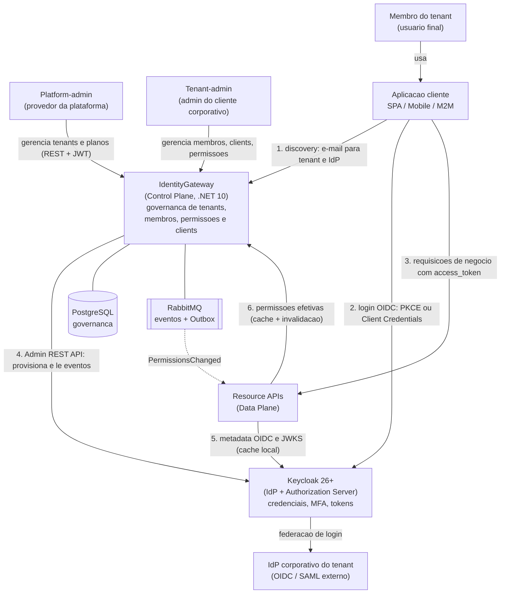

**A regra que o diagrama torna visível:** a Gateway **não aparece** nas setas (2) e (3). Se ela cair, logins continuam e as requisições que dependem apenas de papéis globais também (§2.1).

---

### 4. Capacidades de negócio

#### 4.1. Mapa de capacidades

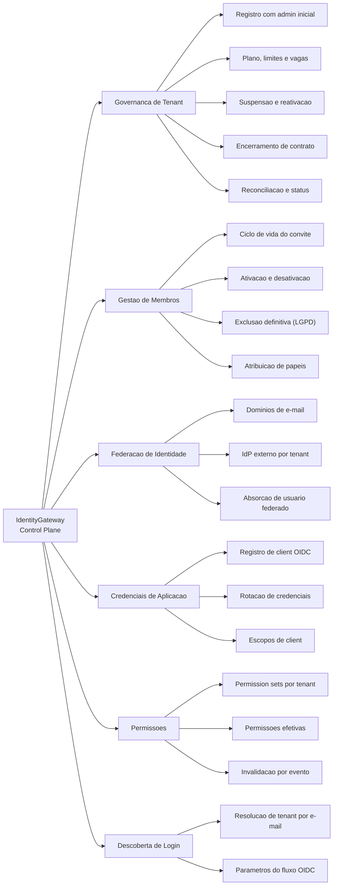

#### 4.2. Domínio: Governança de Tenant

| Capacidade | O que entrega | Quem usa |
|---|---|---|
| Registro de tenant com administrador inicial | `POST /tenants` exige `initialAdminEmail` e responde `202 Accepted` com recurso de status. O provisionamento executa três passos idempotentes — garante a Organization, garante o convite do admin como `tenant-admin`, marca `Active` — e o tenant **nasce operável por construção** (§8, §9.1) | Platform-admin |
| Gestão de plano, limites e vagas | `Plan` como value object com `Tier`, `MaxUsers` e `MaxClients`. Contador de vagas protegido por concorrência otimista (`xmin`), com retry explícito em conflito (§6.1, §11.10) | Platform-admin (define), tenant-admin (consome) |
| Suspensão e reativação com efeito real | Suspender **não é flag no banco**: marca `WasActiveBeforeSuspension`, desabilita os usuários no Keycloak e **revoga sessões ativas**. Reativar restaura apenas quem estava `Active` na suspensão (§9.7) | Platform-admin |
| Encerramento de contrato | `DELETE /tenants/{tenantId}`, só a partir de `Suspended` e com step-up. Desabilita Organization e membros, marca `Terminated` (terminal), **sem remoção física** de dados do Keycloak (§6.2, §9.8) | Platform-admin |
| Status de provisionamento e reconciliação | `GET /tenants/{tenantId}/provisioning`. Um job compara periodicamente **todos os tenants em estado não terminal** com as Organizations existentes, e também o sentido inverso — Organizations órfãs (§9.1, ADR-006) | Platform-admin, operação |

#### 4.3. Domínio: Gestão de Membros

| Capacidade | O que entrega | Quem usa |
|---|---|---|
| Ciclo de vida completo do convite | Convidar, **reenviar** (`resend-invite`, que **reinicia o prazo**) e **cancelar** (`DELETE .../invite`, que leva a `Revoked`). `Invited` já ocupa vaga, e por isso a **expiração é obrigatória**: um **job da Gateway** libera a vaga ao vencer o prazo, configurável por tenant com padrão de **7 dias** (§6.1, §8, §9.9, achado N7) | Tenant-admin |
| Ativação e desativação | Desativar desabilita o usuário no Keycloak **e revoga sessões** — sem a revogação, um refresh token emitido antes continuaria funcionando. A vaga é liberada **uma vez só**, como consequência da transição efetiva de estado (§9.5, §6.1) | Tenant-admin |
| Exclusão definitiva (LGPD art. 18) | Exclusão no Keycloak; na Gateway o membro passa a `Erased` e o `ExternalUserId` vira valor anônimo. **A trilha de auditoria preserva a ação, não a identidade.** Exige step-up (§9.5, §8) | Tenant-admin |
| Atribuição de papéis sem escalação | `PUT .../members/{memberId}/roles` sujeito à `RoleAssignmentPolicy`: só papéis do próprio tenant e nunca acima do papel mais alto do ator (§6.3, §8) | Tenant-admin |
| Catálogo de papéis | `GET /roles` expõe o catálogo pequeno e fixo: `platform-admin`, `tenant-admin`, `financial-manager`, `reader` (§8, ADR-005) | Qualquer autenticado |

#### 4.4. Domínio: Federação de Identidade

| Capacidade | O que entrega | Quem usa |
|---|---|---|
| Domínios de e-mail por tenant | `POST/DELETE /tenants/{tenantId}/domains`. É o que permite resolver o tenant a partir do e-mail e alimentar o redirecionamento identity-first do Keycloak (§8, ADR-001) | Tenant-admin |
| IdP externo por tenant | `POST/DELETE /tenants/{tenantId}/identity-providers` — OIDC ou SAML. O cliente corporativo usa o próprio SSO, e **a política de senha passa a ser dele**, o que reduz na prática o custo do realm único (§8, §19) | Tenant-admin |
| Absorção de usuário criado no primeiro login federado | O usuário nasce no Keycloak sem passar pela Gateway. Um background service lê os eventos e dispara `RegisterExternalMember`. Se o plano estourou, o membro **é registrado assim mesmo**, o tenant é marcado `OverSubscribed` e o fato é auditado (§9.4, ADR-007) | Automático |
| Tolerância e volta do limite | `TenantOverSubscribed` abre uma janela configurável (padrão: 7 dias). Vencida sem ajuste de plano nem desativação, os excedentes — o mais recente primeiro — são desabilitados. Sem isso, "detectamos e não fazemos nada" deixaria o plano sem efeito justamente para o perfil de cliente maior (§9.4, achado N10) | Automático, com visibilidade ao platform-admin |

#### 4.5. Domínio: Credenciais de Aplicação

| Capacidade | O que entrega | Quem usa |
|---|---|---|
| Registro de client OIDC | `POST /tenants/{tenantId}/clients`: `Public` para SPA e mobile (PKCE), `Confidential` para M2M (§8, §6.1) | Tenant-admin |
| Credencial que não fica na Gateway | `private_key_jwt` preferencial — a chave privada nunca sai do cliente. Com `client_secret`, o segredo é devolvido **uma única vez** e **nenhum valor de credencial** entra no log, na auditoria ou no store de idempotência (§9.3, §10.3) | Tenant-admin, aplicação cliente |
| Rotação de credenciais | `POST .../clients/{clientId}/rotate-credentials`, com step-up. No replay de uma chamada idempotente, a resposta é `200` **sem o campo sensível** (§8, §10.3) | Tenant-admin |
| Escopos e modelo de confiança de client | Client de tenant recebe `tenant_id` e é isolado como qualquer ator; client de plataforma tem acesso irrestrito por desenho, `private_key_jwt` obrigatório e auditoria por chamada (§10.1) | Tenant-admin / operação da plataforma |

#### 4.6. Domínio: Permissões

| Capacidade | O que entrega | Quem usa |
|---|---|---|
| Permission sets por tenant | CRUD em `/tenants/{tenantId}/permission-sets`. Permissões no formato `recurso:ação` (ex.: `invoices:approve`), com nome único dentro do tenant (§8, §6.1) | Tenant-admin |
| Permissões efetivas de um membro | `GET .../members/{memberId}/effective-permissions`, consumido também pelo **client de plataforma** com escopo `gateway.permissions.read` (§8, §10.1) | Tenant-admin, Resource APIs |
| Separação papéis globais × permissões finas | O token carrega só `tenant_id` e um catálogo pequeno e fixo de papéis. Permissões finas, customizáveis por tenant, vivem na Gateway. Resultado de negócio: **token pequeno** e mudança de permissão sem exigir novo login (ADR-005) | Toda a plataforma |
| Invalidação por evento | `PermissionsChanged` via RabbitMQ invalida o cache da Resource API. A janela de atraso é o TTL do cache quando o evento não chega (§9.6, §19) | Automático |

#### 4.7. Domínio: Descoberta de Login

| Capacidade | O que entrega | Quem usa |
|---|---|---|
| Resolução de tenant por e-mail | `POST /auth/discovery`, anônimo e com rate limit mais restrito. Devolve `issuer`, `authorization_endpoint` e, quando há federação, o `kc_idp_hint` (§8, §9.2) | Aplicação cliente |
| Não enumeração de tenants | A resposta tem **sempre o mesmo formato**: um domínio desconhecido recebe os parâmetros de login padrão do realm. Um atacante não consegue mapear a carteira de clientes testando domínios (§9.2) | Proteção da plataforma |
| Conveniência, não obrigação | Como o recurso Organizations já faz o redirecionamento por domínio sozinho, o discovery serve a clientes que precisam resolver o tenant **antes** do redirect — apps mobile, tipicamente (§9.2) | Aplicação cliente |

---

### 5. O modelo de valor: "autenticar, gerenciar, validar"

Os três verbos do objetivo do projeto têm significados precisos, e explicitá-los evita a armadilha mais comum desse tipo de sistema: transformar a Gateway num intermediário obrigatório de cada login e de cada requisição (§2).

#### 5.1. Autenticar é orquestrar, não intermediar

**Em linguagem de negócio:** a Gateway prepara o terreno do login e cuida do que vem depois, mas não fica no meio da porta. Ela descobre para qual tenant e qual provedor o usuário deve ser encaminhado, registra as aplicações que pedem tokens e provisiona credenciais de máquina. Credenciais de usuário são digitadas **exclusivamente no Keycloak**, e os tokens vão do Keycloak direto para a aplicação (§2, ADR-002, ADR-003).

**O ganho comercial:** o escopo de compliance encolhe. A Gateway nunca vê senha, não armazena hash e não guarda segredo de usuário — o banco dela fica fora do perímetro mais sensível de LGPD (ADR-003, §17 anti-pattern 3). O que ela guarda é vínculo e governança.

#### 5.2. Gerenciar é o núcleo

Tenants, membros, papéis, permission sets, domínios, IdPs e clients são recursos REST da Gateway (§2). Este é o produto: **um cliente corporativo administra a própria identidade sem depender do provedor da plataforma**, e o provedor administra a carteira sem entrar no console do Keycloak. É o único lugar onde a Gateway é indispensável — e é justamente o lugar onde uma indisponibilidade dói menos, porque administração tolera espera.

#### 5.3. Validar acontece em dois níveis, e nenhum deles chama a Gateway por requisição

| Nível | O que decide | Como | Custo por requisição |
|---|---|---|---|
| **1 — autenticação e papéis globais** | O token é válido? O usuário é `tenant-admin`? | Validação local com JWKS do Keycloak | Zero chamadas de rede |
| **2 — permissões finas por tenant** | O usuário pode `invoices:approve` neste tenant? | Permissões efetivas buscadas **uma vez** e mantidas em cache, invalidadas por evento | Zero chamadas em regime normal |

#### 5.4. Por que ficar fora do caminho do token é decisão de negócio

A leitura puramente técnica do ADR-002 é "evitar latência". A leitura de negócio é mais forte: **a Gateway ser obrigatória no login transformaria uma indisponibilidade de administração numa indisponibilidade de produto.**

Compare os dois cenários de uma manhã de segunda-feira com a Gateway fora do ar:

| | Gateway intermediária (rejeitado) | Gateway fora do caminho (ADR-002) |
|---|---|---|
| Logins | **Param todos** | Continuam normalmente (§2.1) |
| Requisições de negócio de nível 1 | **Param todas** | Continuam normalmente (§2.1) |
| Requisições de nível 2, cache quente | Param | Continuam; o pacote cliente serve cache vencido (*stale-while-revalidate*) (§9.6) |
| Requisições de nível 2, cache frio | Param | **503 com `Retry-After`** — fail closed, mas distinguindo "negado" de "não sei" (§9.6) |
| Administração (criar tenant, convidar membro) | Para | Para — e é o que se aceita perder |

A escolha é deliberada sobre **o que se aceita perder**: administração pode esperar, produção não. Duas decisões de engenharia sustentam isso como promessa operacional, e não como esperança: o *stale-while-revalidate* com teto de idade configurável, e o **warm-up** — a Resource API só entra em rotação (health `ready`) depois de falar com a Gateway ao menos uma vez, porque sem isso cada instância nova entraria servindo 503 e um deploy coordenado viraria indisponibilidade de todos os endpoints de nível 2 (§9.6).

#### 5.5. O limite honesto

**O ponto único de falha não foi eliminado, foi deslocado** (§2.1, §19, achado CI-3). Com o Keycloak fora do ar, nenhum login acontece e nenhum token é renovado; decorridos os **5 minutos** de vida do access token, o Data Plane inteiro para — porque a validação local depende de *token vivo*, não de *Keycloak vivo*. O ADR-002 tira a Gateway do caminho crítico; ele não torna o sistema resiliente à queda do Keycloak, que permanece dependência crítica de ambos os caminhos.

Outros limites declarados com consequência comercial direta (§19):

- **Políticas de senha e força bruta são por realm**, iguais para todos os tenants (ADR-001). Um cliente com política própria de compliance exigiria realm dedicado — mitigado na prática, porque esse perfil costuma usar IdP federado.
- **Um usuário pertence a um único tenant** (ADR-009). Um consultor que atende dois clientes precisa de duas contas com e-mails diferentes; **um MSP não consegue usar a plataforma como um único usuário**.
- **A desativação de um membro não invalida o access token já emitido**, que sobrevive até 5 minutos. É o preço da validação stateless.
- **Há uma janela sem `tenant_id` no primeiro login federado** — entre o login e o processamento do evento, o usuário recebe 403 nas rotas de tenant (§12.2).

---

### 6. Glossário de negócio

| Termo | Definição |
|---|---|
| **Tenant** | Um cliente corporativo da plataforma, com plano, limite de usuários, status e ciclo de vida próprios. É o aggregate central da Gateway. O modelo é **plano**: um tenant não tem clientes abaixo dele (§6.1, §0). |
| **Organization** | O recurso do Keycloak 26+ que materializa um tenant do lado do provedor de identidade, com domínios de e-mail e IdPs vinculados. Um tenant ↔ uma Organization (ADR-001). |
| **Realm** | O "espaço de identidade" do Keycloak — onde vivem usuários, papéis, políticas de senha e a chave que assina os tokens. Aqui há **um só**, chamado `identity-gateway`, compartilhado por todos os tenants (ADR-001). |
| **Issuer** | A identidade do emissor dos tokens. Como o realm é único, o issuer também é — o que mantém simples a validação em todas as APIs consumidoras (ADR-001). |
| **Client OIDC** | O registro de uma aplicação que pede tokens. `Public` para o que roda no dispositivo do usuário (SPA, mobile, usando PKCE); `Confidential` para serviços que guardam segredo (M2M) (§6.1, §9.3). |
| **Client de plataforma × client de tenant** | O de tenant pertence a um tenant e é isolado como qualquer ator. O **de plataforma** é credencial de infraestrutura, provisionada no bootstrap, com acesso irrestrito por desenho e auditoria por chamada (§10.1). |
| **Member** | O vínculo de uma pessoa com um tenant: o identificador dela no Keycloak, o status de governança, os papéis e as referências a permission sets. **Os dados pessoais não ficam aqui** (§6, §6.1). |
| **Permission set** | Um conjunto nomeado de permissões finas no formato `recurso:ação` (ex.: `invoices:approve`), definido **pelo próprio tenant**. É o que permite customização sem inchar o token (ADR-005, §6.1). |
| **Papel (role)** | Um rótulo do catálogo pequeno e fixo que viaja dentro do token: `platform-admin`, `tenant-admin`, `financial-manager`, `reader` (ADR-005). |
| **IdP federado** | O provedor de identidade da empresa cliente (Azure AD, Okta, um SAML corporativo). Vinculado ao tenant, faz o funcionário entrar com a conta da própria empresa (§8, §9.2). |
| **Control Plane** | Onde se **define** a governança: a Gateway. Responde "quem é tenant, quem é membro, quem pode o quê" (§2, princípio 2). |
| **Data Plane** | Onde a governança é **executada**: as APIs de negócio, que validam tokens e checam permissões localmente, sem consultar a Gateway a cada requisição (§2, §12). |
| **Discovery** | Descobrir, a partir do e-mail, para onde mandar o usuário se autenticar — qual tenant, qual IdP, quais parâmetros do fluxo (§9.2). |
| **JWT / access token** | O comprovante assinado de autenticação, emitido pelo Keycloak, com validade de **5 minutos** (§10.3). |
| **JWKS** | As chaves públicas publicadas pelo Keycloak. É o que permite a uma API verificar a assinatura de um token **sem perguntar a ninguém** (§2, §12). |
| **Claim** | Um campo dentro do token. Os que importam aqui: `sub` (quem), `tenant_id` (de qual cliente) e `roles` (papéis) (ADR-004, §12.1). |
| **Protocol mapper** | A configuração do Keycloak que coloca um claim dentro do token. **Nenhum claim é emitido fora do Keycloak** (ADR-004). |
| **Step-up authentication** | Exigir reautenticação mais forte para uma operação destrutiva (excluir membro, rotacionar credencial, encerrar tenant). Falta de nível responde **401**, não 403, para que o usuário tenha caminho de recuperação (§10.1). |
| **Outbox** | O padrão que garante que "gravei no meu banco" e "vou avisar o Keycloak" não se separem: ambos entram na mesma transação, e o efeito externo acontece depois, de forma idempotente (ADR-006). |
| **Idempotente** | Uma operação que, repetida, não duplica efeito. Aqui é obtida por "consultar antes de criar", nunca por retry automático de POST — que criaria Organizations duplicadas (ADR-006, §17 anti-pattern 8). |
| **Reconciliação** | O job periódico que compara os dois lados e detecta divergências — inclusive Organizations órfãs sem tenant correspondente (§9.1). |
| **Vaga (seat)** | Uma unidade do limite de usuários do plano. **Reservada já no convite** e liberada na desativação, expiração, exclusão ou cancelamento do convite (§6.1). |
| **OverSubscribed** | O tenant que excedeu o plano pela única via que permite isso: a absorção de usuários criados no primeiro login federado. Abre janela de tolerância (§9.4). |
| **Fail closed** | Na dúvida, negar. Vale para claim ausente, tenant divergente e dependência indisponível em operação sensível — com **uma exceção declarada**: a absorção de usuário federado (§3 princípio 4, §9.4). |
| **`202 Accepted`** | "Recebi e vou processar." O registro de tenant responde assim porque o provisionamento no Keycloak é assíncrono; o acompanhamento é por um recurso de status (§9.1). |
| **`Terminated`** | O estado terminal do tenant, alcançável **só a partir de `Suspended`**. Desabilita tudo, **sem remoção física** de dados no Keycloak (§6.2, §9.8). |

---

### 7. Decisões de negócio e suas consequências

As sete decisões abaixo foram fechadas no brainstorm que sucedeu a revisão crítica, e estão incorporadas à v2.1 (§0). Nenhum ADR precisou ser revogado — todas as correções couberam dentro do desenho original.

#### 7.1. O tenant nasce com um administrador (`initialAdminEmail` obrigatório)

| | |
|---|---|
| **Decisão** | `POST /tenants` exige `initialAdminEmail`. O provisionamento convida essa pessoa já com o papel `tenant-admin` **antes** de marcar o tenant `Active` (§8, §9.1) |
| **Alternativa rejeitada** | Abrir uma exceção no mecanismo de isolamento para que o platform-admin pudesse convidar o primeiro membro de qualquer tenant |
| **Por quê** | `POST /tenants` é platform-admin, mas convidar exige `tenant-admin` **daquele tenant**. Sem a decisão, o tenant nasceria trancado — e "criei um tenant, e agora quem entra nele?" é a primeira pergunta que qualquer avaliador faz (achado C9) |
| **Consequência de negócio** | Não existe tenant provisionado e inutilizável. O onboarding vira **uma chamada**. Em contrapartida, o registro não aceita mais "criar o tenant agora e decidir o admin depois" — o contrato precisa de um nome antes do provisionamento |
| **Consequência arquitetural** | A decisão **elimina** uma exceção de isolamento em vez de acrescentar outra, o que preserva o princípio 5 intacto (§9.1) |

#### 7.2. `Invited` ocupa vaga — e por isso o convite expira

| | |
|---|---|
| **Decisão** | A vaga é reservada **no convite**, não na ativação. Liberada em `Deactivated`, `Expired`, `Revoked` e `Erased`. A expiração torna-se **obrigatória**, não opcional, e roda por **job da Gateway** com prazo configurável por tenant, padrão de 7 dias (§6.1, §9.9) |
| **Alternativa rejeitada** | Reservar a vaga só na ativação |
| **Por quê** | N convites simultâneos estourariam o plano no momento do aceite — e o aceite chega pelo polling de eventos (ADR-007), **tarde demais para recusar** (achado N5) |
| **Consequência de negócio** | O limite do plano é honesto: o cliente vê consumida a vaga que ele de fato comprometeu. Em troca, convite não aceito **prende vaga até expirar** — o que obriga o produto a ter reenvio e cancelamento como funcionalidades de primeira classe, não como extras (§8, achado N7) |
| **Efeito colateral positivo** | Reenvio de convite é o ticket de suporte nº 1 de qualquer plataforma multi-tenant; ele passa a existir por necessidade do modelo de vagas |

#### 7.3. Suspender desabilita os usuários **e os clients** no Keycloak, e revoga sessões

| | |
|---|---|
| **Decisão** | O consumidor de `TenantSuspended` percorre membro a membro e, para cada um `Active`, marca `WasActiveBeforeSuspension` **na mesma operação** que o desabilita no Keycloak e **revoga as sessões ativas** — depois faz o mesmo com os **clients OIDC do tenant**, com a marca espelhada `WasEnabledBeforeSuspension` (§9.7, §9.7.1) |
| **Alternativa rejeitada** | Suspensão como flag no banco da Gateway |
| **Por quê** | O token é emitido pelo Keycloak e validado localmente (ADR-002) — **nada na suspensão o alcançaria**. Um cliente inadimplente suspenso continuaria logando e operando normalmente (achado N6). Deixar os clients de fora repetiria a mesma falha no canal que não depende de pessoa: um client M2M seguiria obtendo tokens por Client Credentials (§9.7.1) |
| **Consequência de negócio** | Suspensão passa a ser uma alavanca comercial real: o corte de acesso acontece de fato, para pessoas **e para integrações**. Sem ela, a operação seria teatro — e o projeto argumenta explicitamente contra flags sem efeito |
| **Custo assumido** | `Member` e `ClientApplication` precisam guardar o estado pré-suspensão, para que a reativação **não ressuscite** quem já estava desativado individualmente antes (§6.1, §9.7). A operação também ganha um estado de passagem, `Suspending`, porque o `202` precede o efeito. Complexidade aceita em troca de reversibilidade correta e de uma suspensão **idempotente e retomável**: gravar a marca junto com a desabilitação, por membro, faz um consumidor interrompido retomar de onde parou, sem marcas órfãs |
| **Hardening associado** | `offline_access` é removido do `default-roles` do realm: sessões offline **não** são encerradas pelo logout administrativo, o que permitiria a um usuário desativado continuar renovando acesso (§15, achado C8) |

#### 7.4. Estado terminal `Terminated`, sem remoção física

| | |
|---|---|
| **Decisão** | Novo estado `Terminated`, alcançável **apenas a partir de `Suspended`**, via `DELETE /tenants/{tenantId}` com step-up. Desabilita Organization e membros; **não remove dados do Keycloak** (§6.2, §9.8) |
| **Alternativas rejeitadas** | (a) Não ter offboarding — tenant provisionado é eterno; (b) encerrar com remoção física da Organization e dos usuários |
| **Por quê (a)** | Havia uma **inconsistência de compliance**: o sistema implementava direito ao esquecimento por membro (LGPD art. 18) mas não tinha como encerrar o contrato de um cliente inteiro — que é exatamente o cenário em que a LGPD é invocada de verdade (achado C10) |
| **Por quê (b)** | A remoção física agravaria a correlação idempotente por atributo (§11.6) e a reconciliação bidirecional (§9.1) em troca de pouco. A remoção fica como operação administrativa **fora da API** (§9.8) |
| **Consequência de negócio** | O ciclo de vida comercial fecha: aquisição → operação → suspensão → encerramento auditável. A transição só a partir de `Suspended` **impede o encerramento acidental de um tenant em operação** |
| **Efeito residual** | O `TenantSlug` permanece reservado para sempre, por ser imutável e único (§9.8) |

#### 7.5. Federação (M4) permanece no escopo

| | |
|---|---|
| **Decisão** | IdPs externos por tenant, domínios, discovery e sincronização de eventos do Keycloak ficam no escopo, no marco M4, depois do M3 (§0, §16) |
| **Alternativa rejeitada** | Cortar a federação — o que levaria junto o fluxo 9.4, metade do ADR-007, e reduziria o discovery a um endpoint barato que só resolve tenant por domínio |
| **Por quê** | Federação é o que se vende ao plano maior: o cliente corporativo quer o próprio SSO. Sem ela, o sistema não demonstra o cenário comercial mais relevante |
| **Consequência de negócio** | Abre três capacidades reais — SSO corporativo por tenant, redirecionamento identity-first e absorção automática de usuários. Em contrapartida, **o limite de usuários deixa de ser estrito**: basta ter federação para o plano ser furável (achado N10) |
| **Mitigação** | O limite volta a valer **por tolerância, não por bloqueio**: janela configurável (padrão 7 dias) após `TenantOverSubscribed`, vencida a qual os excedentes são desabilitados. Bloquear o login exigiria um authenticator customizado em Java, fora da v1 (§9.4) |

#### 7.6. Escopo completo M0–M7, com ponto de "apresentável" declarado

| | |
|---|---|
| **Decisão** | O projeto executa os oito marcos (M0 a M7), sem prazo (§0, §16) |
| **Alternativa rejeitada** | O "corte mínimo demonstrável" proposto pela revisão — M0, M1, M2, M3 e M7', cortando polling, CRUD de permission sets e M2M |
| **Por quê** | Sem prazo, o corte perde sua razão de ser: ele era a resposta à pergunta "quanto tempo há disponível?" |
| **Consequência de negócio** | Cobertura funcional completa — mas com o risco clássico de projeto sem prazo: **seis marcos pela metade e nada apresentável** |
| **Mitigação estrutural** | Um **ponto de "apresentável" declarado**: ao fim de **M3 + M7'** (step-up, rate limiting e README), o repositório está completo e defensável — ADRs, testes, limites honestos e demonstração reproduzível. M4 a M6 são incrementos sobre uma base que já pode ser mostrada, **não pré-requisitos para mostrá-la** (§16) |
| **Decisão de sequenciamento** | Auditoria e observabilidade foram movidas de M7 para M0/M1 — são transversais, e retrofitá-las depois custa mais (§16) |

#### 7.7. Demonstração por README com `curl` reproduzível

| | |
|---|---|
| **Decisão** | O cenário de demonstração é um README com comandos `curl` que qualquer avaliador roda sozinho (§0, §16) |
| **Alternativas rejeitadas** | Vídeo gravado ou conversa ao vivo |
| **Por quê** | `curl` é verificável por quem lê, sem depender do autor estar presente. Vídeo e conversa não são auditáveis |
| **Consequência de negócio** | **Promove o M0 a peça crítica.** O README é o primeiro contato do avaliador, e uma falha ali encerra a leitura antes dos ADRs. O critério vira `git clone` + `docker compose up` + primeiro `curl` funcionando **na primeira tentativa** (§16) |
| **O que o README precisa provar** | Duas demonstrações, porque provam competências difíceis em poucos comandos: (1) **consistência sem transação distribuída** — `docker compose stop keycloak` → `POST /tenants` responde `202` normalmente → `docker compose start keycloak` → o tenant vira `Active` sozinho; (2) **isolamento multi-tenant** — com token do tenant A, rota do tenant B responde 403, e um `memberId` do tenant B dentro da rota do tenant A responde 404 (§16) |
| **Consequência de engenharia** | Justifica investimentos que sem isso pareceriam exagero: o *smoke test* da feature flag `organization` no M0 — sem `KC_FEATURES=organization` o Keycloak sobe normalmente, o import passa sem erro, e o primeiro provisionamento falha com **404 silencioso** (§15, achado A3) |

#### 7.8. Leitura conjunta: o que as sete decisões têm em comum

Cinco das sete (7.1, 7.2, 7.3, 7.4 e 7.5) atacam o mesmo tema, que a revisão crítica identificou como o fio condutor de três frentes independentes de análise: **decisões que a Gateway toma no próprio banco e presume refletidas no Keycloak, mas que não chegam lá.** O tenant era ativado sem admin; a vaga era contada sem saber quando; a suspensão era flag sem efeito; o encerramento não existia; o limite do plano não alcançava o login federado.

A correção comum é sempre a mesma: **toda decisão de governança tem que ter efeito verificável no Keycloak** — e as duas restantes (7.6 e 7.7) existem para garantir que esse efeito seja demonstrável a quem lê o repositório.

---

# Parte II — Funcionalidades e regras de negócio

### Funcionalidades e regras de negócio

O IdentityGateway é o **Control Plane** de identidade de uma plataforma multi-tenant: ele
governa *quem existe*, *a que tenant pertence* e *o que pode fazer*, enquanto o Keycloak
permanece o único dono de credenciais e o único emissor de tokens (§5, ADR-002). Esta parte
descreve o que a API entrega em termos de negócio, quais regras a tornam confiável e o que ela
deliberadamente não faz.

**O modelo é plano.** Um tenant não possui "clientes de negócio" abaixo de si. O `tenant-admin`
administra, dentro do próprio tenant, cinco coisas: membros, clients OIDC (SPA, mobile e M2M),
permission sets, domínios de e-mail e provedores de identidade federados. Não há sub-tenancy —
essa decisão está fechada no ADR-009 e é sustentada pelo `SameTenantRequirement`, cuja
comparação é de **igualdade** entre o tenant da rota e o tenant do token, não de pertencimento a
uma subárvore (§10.1, §11.7).

---

#### 1. Catálogo de funcionalidades

Cada ficha descreve uma funcionalidade do escopo v1. Os endpoints citados são os do catálogo da
§8; o critério de pronto de todas elas é o da §18 (OpenAPI documentado, teste de domínio, teste
de integração contra Keycloak real, **teste negativo para cada regra de isolamento tocada**,
entrada de auditoria sem valores de credencial, e ADR quando há decisão nova).

##### 1.1. Domínio: Tenant

---

**F-01 · Registrar tenant**

| | |
|---|---|
| **Objetivo de negócio** | Dar entrada a um novo cliente na plataforma, já operável — com um administrador capaz de convidar os demais. |
| **Ator** | `platform-admin` (`POST /tenants`, §8) |
| **Pré-condições** | Slug ainda não utilizado; `initialAdminEmail` informado; plano válido no catálogo. |
| **Regras de negócio** | O slug é **único e imutável** — vira o *alias* da Organization no Keycloak e permanece reservado mesmo após o encerramento (§6.1, §9.8). `initialAdminEmail` é **obrigatório** (C9): sem ele o tenant nasceria trancado, porque criar tenant é ato de `platform-admin` mas convidar membro exige `tenant-admin` *daquele* tenant, e o platform-admin não satisfaz a verificação de tenant da §11.7. O tenant nasce em `Pending`; o provisionamento no Keycloak é **assíncrono** e idempotente, em três passos: garantir a Organization (com o atributo `gateway_tenant_id`), garantir o convite do admin inicial já com o papel `tenant-admin`, e só então marcar `Active` (§9.1). Nenhuma chamada ao Keycloak acontece dentro da transação do comando (anti-pattern 6, §17). |
| **Pós-condições** | Tenant gravado em `Pending` e evento no Outbox, na **mesma transação** (ADR-006). Resposta `202 Accepted` com `Location` para o recurso de status do provisionamento. Ao final: tenant `Active` e um `tenant-admin` convidado, ocupando uma vaga do plano. |
| **Erros de negócio** | Slug já em uso; plano inexistente; `initialAdminEmail` ausente ou inválido. Se os retries do provisionamento se esgotarem, o tenant vai para `ProvisioningFailed` e o evento fica disponível para retry manual — o registro **não** é desfeito. |

> Valor demonstrável: com o Keycloak parado, `POST /tenants` continua respondendo `202`; quando
> o Keycloak volta, o tenant vira `Active` sozinho. É a demonstração nº 1 do README (§16).

---

**F-02 · Consultar tenant e status de provisionamento**

| | |
|---|---|
| **Objetivo de negócio** | Acompanhar a entrada do cliente e dar visibilidade do inventário da plataforma. |
| **Ator** | `platform-admin` (lista completa e `GET /tenants/{tenantId}/provisioning`); `tenant-admin` apenas sobre o próprio tenant (§8). |
| **Pré-condições** | Ator autenticado no realm com audiência correta (§10.1). |
| **Regras de negócio** | O `tenant-admin` só enxerga o próprio tenant — garantido pelo `SameTenantRequirement`. O acesso irrestrito do `platform-admin` é implementado por um **segundo handler de autorização** (`PlatformAdminOverrideHandler`), e é justamente por isso que todo caminho de rejeição do `SameTenantHandler` precisa negar explicitamente (C11, §11.7). |
| **Pós-condições** | Leitura, sem efeito colateral. |
| **Erros de negócio** | Tenant inexistente ou fora do escopo do ator: `404` (nunca `403` sobre existência — §6.4). |

---

**F-03 · Alterar dados e plano do tenant**

| | |
|---|---|
| **Objetivo de negócio** | Refletir upgrade e downgrade comercial do cliente na governança. |
| **Ator** | `platform-admin` (`PATCH /tenants/{tenantId}`) |
| **Pré-condições** | Tenant existente; plano de destino no catálogo. |
| **Regras de negócio** | O slug **não** é alterável (§6.1). **Downgrade abaixo do que o tenant já usa é rejeitado** (RN-008, N8 da revisão): vale tanto para as **vagas ocupadas** quanto para os **clients OIDC ativos** (§6.1, §8). Um tenant com 40 membros migrando para um plano de 10 violaria a invariante de vagas no instante da troca — e o mesmo raciocínio se aplica a `MaxClients`. A API recusa e **nomeia quantos membros ou clients precisam sair antes**, preservando a invariante sem destruir dados do cliente. O número de vagas e de clients de cada plano é **definido por plano**, não fixado na spec. |
| **Pós-condições** | Plano atualizado; `tier` sincronizado como atributo da Organization, o que reflete no token no próximo refresh (ADR-004). |
| **Erros de negócio** | `409 Conflict` em Problem Details no downgrade inviável, informando o excedente de membros ou de clients; tentativa de alterar slug; plano inexistente. |

---

**F-04 · Suspender tenant**

| | |
|---|---|
| **Objetivo de negócio** | Interromper de fato o acesso de um cliente — tipicamente por inadimplência — de forma reversível. |
| **Ator** | `platform-admin` (`POST /tenants/{tenantId}/suspend`) |
| **Pré-condições** | Tenant em `Active`. |
| **Regras de negócio** | **Suspender não é uma flag no banco da Gateway** (N6). O `POST .../suspend` responde `202` e marca o tenant como **`Suspending`** (§6.2). O consumidor de `TenantSuspended` percorre **membro a membro** e, para cada um que esteja `Active`, marca `WasActiveBeforeSuspension` **na mesma operação** que o desabilita no Keycloak, e revoga suas sessões ativas — a marca **nunca é gravada em lote prévio** (§9.7, L-3), para que um consumidor interrompido retome de onde parou sem deixar membros marcados que nunca foram desabilitados. Em seguida faz o mesmo com os **clients OIDC do tenant**, com a marca espelhada `WasEnabledBeforeSuspension` (§9.7.1): sem isso, um client M2M `Confidential` continuaria obtendo tokens por Client Credentials direto no Keycloak, e a suspensão teria um furo exatamente no canal que não depende de pessoa. Concluído tudo, o tenant passa a `Suspended`. Um tenant fora de `Active` **não aceita novos membros** (invariante de §6.1). |
| **Pós-condições** | Tenant em `Suspended`; membros desabilitados no Keycloak com sessões revogadas; **clients OIDC do tenant desabilitados**; marcas de restauração gravadas por membro e por client; evento `TenantSuspended` publicado. |
| **Erros de negócio** | Tenant que não está em `Active`. **Janela residual declarada:** os tokens já emitidos — de membro **e de client M2M** — sobrevivem até expirar, no máximo 5 minutos. Desabilitar impede a **emissão**, não o uso do que já circula (§19). |

---

**F-05 · Reativar tenant**

| | |
|---|---|
| **Objetivo de negócio** | Restabelecer o cliente após regularização, sem efeitos colaterais indesejados. |
| **Ator** | `platform-admin` (`POST /tenants/{tenantId}/reactivate`) |
| **Pré-condições** | Tenant em `Suspended` — **suspensão concluída**, não em `Suspending` (§6.2, §9.7). |
| **Regras de negócio** | A reativação reabilita **apenas** os membros com `WasActiveBeforeSuspension = true` e os clients com `WasEnabledBeforeSuspension = true` (§9.7, §9.7.1), e limpa as duas marcas ao final. Quem já estava desativado individualmente antes da suspensão permanece desativado — é exatamente para isso que as marcas existem (§6.1). **A reativação exige suspensão concluída:** em `Suspending` a resposta é `409`, porque reativar uma suspensão pela metade restauraria um estado que ninguém sabe qual é. |
| **Pós-condições** | Tenant em `Active`; membros e clients restaurados seletivamente; marcas limpas; evento `TenantReactivated`. |
| **Erros de negócio** | Tenant que não está em `Suspended`; tenant em `Suspending` → **`409 Conflict`**. |

---

**F-06 · Encerrar tenant (offboarding)**

| | |
|---|---|
| **Objetivo de negócio** | Encerrar o contrato de um cliente inteiro. Fecha a simetria de compliance: a §9.5 dá direito ao esquecimento **por membro**, e esta funcionalidade cobre o cenário em que a LGPD costuma ser invocada de verdade — a saída do cliente (C10). |
| **Ator** | `platform-admin` **+ step-up** (`DELETE /tenants/{tenantId}`, §8) |
| **Pré-condições** | Tenant em `Suspended`. **Não é alcançável a partir de `Active`** (§6.2) — o cliente precisa ser suspenso primeiro, o que impede o encerramento acidental de um tenant em operação. Requer nível de autenticação elevado (`acr`). |
| **Regras de negócio** | Marca `Terminating`, grava o evento no Outbox e espelha o fluxo de provisionamento (§9.8). O consumidor desabilita a Organization, todos os membros (revogando sessões) **e todos os clients OIDC do tenant**, pelo mesmo percurso idempotente e retomável da §9.7. O encerramento **não grava marcas de restauração** — `WasActiveBeforeSuspension` e `WasEnabledBeforeSuspension` só existem para a reativação, e de `Terminated` não há volta. **O encerramento não remove dados do Keycloak** — a remoção física da Organization e dos usuários é operação administrativa fora da API; removê-la aqui agravaria a correlação idempotente e a reconciliação bidirecional em troca de pouco. O `TenantSlug` permanece reservado, porque é imutável e único. |
| **Pós-condições** | Tenant em `Terminated`, estado **terminal**; evento `TenantTerminated`. |
| **Erros de negócio** | Tenant fora de `Suspended`; falta de nível `acr` → resposta **`401`** com `WWW-Authenticate` contendo `error="insufficient_user_authentication"` e o `acr_values` exigido — nunca `403`, que deixaria o usuário sem caminho de recuperação (§10.1). |

---

##### 1.2. Domínio: Membros

---

**F-07 · Convidar membro**

| | |
|---|---|
| **Objetivo de negócio** | Dar acesso a uma pessoa dentro do tenant, sem que a plataforma jamais toque na senha dela. |
| **Ator** | `tenant-admin` do próprio tenant (`POST /tenants/{tenantId}/members`) |
| **Pré-condições** | Tenant em `Active`; vaga disponível no plano. |
| **Regras de negócio** | **A vaga é reservada no convite** — `Invited` já ocupa (decisão 2 do brainstorm, N5 da revisão). Reservar só na ativação permitiria que N convites simultâneos estourassem o plano no aceite, e o aceite chega pelo polling do ADR-007, tarde demais para recusar. Consequência direta: **a expiração de convite passa a ser obrigatória**, senão um convite nunca aceito travaria a vaga para sempre. A criação **não define senha** (ADR-003): o Keycloak envia ao usuário um e-mail de ações obrigatórias (`UPDATE_PASSWORD`, `VERIFY_EMAIL`). Duas reservas simultâneas não ultrapassam o limite — o contador é protegido por concorrência otimista e o conflito é reprocessado por retry explícito (§6.1, §11.10). |
| **Pós-condições** | Membro em `Invited` com `InvitedAt`; uma vaga a mais ocupada; usuário garantido no Keycloak (desabilitado, com as *required actions*) e vinculado à Organization; evento `MemberInvited`. O ciclo completo do convite — aceite, expiração, reenvio e cancelamento — está na §9.9. |
| **Erros de negócio** | Tenant não `Active`; **limite de vagas do plano atingido**; e-mail já convidado ou já membro; conflito de concorrência persistente após os retries → `409 Conflict` (§11.10). |

---

**F-08 · Reenviar convite**

| | |
|---|---|
| **Objetivo de negócio** | Resolver o ticket de suporte nº 1 de qualquer plataforma multi-tenant: "não recebi o e-mail" (N7). |
| **Ator** | `tenant-admin` (`POST .../members/{memberId}/resend-invite`) |
| **Pré-condições** | Membro em `Invited`, convite ainda não expirado. |
| **Regras de negócio** | Não cria um segundo membro nem uma segunda vaga — a vaga já está ocupada desde o convite original. **O reenvio reinicia `InvitedAt`** (§9.9), prorrogando o prazo da vaga já ocupada: sem isso, um reenvio feito às vésperas do vencimento entregaria ao usuário um link que expira em horas. Só é aceito em `Invited`. |
| **Pós-condições** | Novo e-mail de ação obrigatória enviado pelo Keycloak; `InvitedAt` reiniciado; vaga inalterada. |
| **Erros de negócio** | Membro que não está em `Invited`; `memberId` que não pertence ao tenant da rota → `404` (§6.4). |

---

**F-09 · Cancelar convite pendente**

| | |
|---|---|
| **Objetivo de negócio** | Desfazer um convite enviado por engano e **devolver a vaga ao plano** imediatamente. |
| **Ator** | `tenant-admin` (`DELETE .../members/{memberId}/invite`) |
| **Pré-condições** | Membro em `Invited`. |
| **Regras de negócio** | O cancelamento leva ao estado **`Revoked`** (§9.9, I-2), não a `Expired` nem a `Erased`: `Revoked` é **ação humana deliberada do administrador**, enquanto `Expired` é decurso de prazo e `Erased` é apagamento LGPD com anonimização — colapsá-los perderia a distinção na auditoria. O usuário é desabilitado no Keycloak. A liberação da vaga é **consequência da transição efetiva de estado**, nunca uma chamada solta (§6.1, C5): cancelar um convite já cancelado não decrementa o contador de novo. De `Revoked`, um novo convite é um **novo membro**, com nova reserva de vaga. |
| **Pós-condições** | Membro em `Revoked`; usuário desabilitado no Keycloak; vaga liberada exatamente uma vez. |
| **Erros de negócio** | Membro fora de `Invited`; `memberId` de outro tenant → `404`. |

---

**F-10 · Expiração automática de convite**

| | |
|---|---|
| **Objetivo de negócio** | Garantir que uma vaga paga não fique presa indefinidamente a um convite nunca aceito. |
| **Ator** | Processo automático: **job periódico da própria Gateway** (§9.9) — não há ator humano. |
| **Pré-condições** | Membro em `Invited` com `InvitedAt` além do prazo. O prazo é **configurável por tenant, com padrão de 7 dias**, e deve ser alinhado ao tempo de vida do link de ações do Keycloak — um link ainda válido para um membro já `Expired` produziria um aceite sem vaga reservada (§9.9). |
| **Regras de negócio** | Esta funcionalidade é **pré-requisito**, não extra: existe porque `Invited` ocupa vaga (N5 → N7, RN-027). **O job vive na Gateway, não no Keycloak** (§9.9): quem libera a vaga tem de ser quem controla o contador. Derivar a expiração de um evento do Keycloak amarraria uma regra de plano à configuração de realm e dependeria do polling do ADR-007 — que a decisão 2 do brainstorm já considerou tarde demais para o aceite, pelo mesmo motivo. |
| **Pós-condições** | Membro em `Expired`; vaga liberada; evento `MemberInviteExpired`. |
| **Erros de negócio** | Não aplicável — processo interno; divergências de contador são detectadas pelo job de reconciliação de vagas (§9.1). |

---

**F-11 · Desativar membro**

| | |
|---|---|
| **Objetivo de negócio** | Cortar o acesso de quem saiu da empresa do cliente, preservando o histórico. |
| **Ator** | `tenant-admin` (`POST .../members/{memberId}/deactivate`) |
| **Pré-condições** | Membro em `Active` (ou `Invited`, conforme a transição); `memberId` pertencente ao tenant da rota. |
| **Regras de negócio** | A Gateway desabilita o usuário no Keycloak **e revoga suas sessões ativas** — sem a revogação, um refresh token emitido antes continuaria funcionando (§9.5). A vaga é liberada **uma vez só**, como consequência da transição efetiva: desativar um membro já desativado não decrementa de novo (§6.1, C5). |
| **Pós-condições** | Membro em `Deactivated`; usuário desabilitado no Keycloak sem sessões; vaga liberada; evento `MemberDeactivated`. |
| **Erros de negócio** | Membro em estado que não permite a transição; `memberId` de outro tenant → `404`. **Duas janelas declaradas** (§9.5, §19): o access token já emitido sobrevive até 5 minutos; e sessões *offline* não são encerradas por logout — por isso o realm de bootstrap remove `offline_access` do `default-roles` (§15). |

---

**F-12 · Reativar membro**

| | |
|---|---|
| **Objetivo de negócio** | Readmitir alguém sem refazer o onboarding. |
| **Ator** | `tenant-admin` (`POST .../members/{memberId}/reactivate`) |
| **Pré-condições** | Membro em `Deactivated`; tenant em `Active`; **vaga disponível no plano**. |
| **Regras de negócio** | A reativação volta a ocupar uma vaga e, portanto, está sujeita ao limite do plano — é uma nova reserva, não uma restauração gratuita. |
| **Pós-condições** | Membro em `Active`; usuário reabilitado no Keycloak; vaga ocupada. |
| **Erros de negócio** | Limite de vagas atingido; membro `Erased` (terminal); tenant não `Active`. |

---

**F-13 · Excluir membro definitivamente (direito ao esquecimento)**

| | |
|---|---|
| **Objetivo de negócio** | Atender à LGPD art. 18 — direito ao esquecimento de uma pessoa específica. |
| **Ator** | `tenant-admin` **+ step-up** (`DELETE .../members/{memberId}`) |
| **Pré-condições** | `memberId` pertencente ao tenant da rota; nível `acr` elevado. |
| **Regras de negócio** | Exclusão definitiva no Keycloak. Na Gateway, o membro passa a `Erased` e o `ExternalUserId` é substituído por um valor anônimo. **A trilha de auditoria preserva a ação, não a identidade** (§9.5). Um membro `Erased` é **terminal** e não guarda nenhum dado que identifique a pessoa (§6.1). É a operação onde a regra de pertencimento de sub-recurso é mais crítica: sem ela, um admin do tenant A que descobrisse o `memberId` de alguém do tenant B poderia apagá-lo (C2). |
| **Pós-condições** | Usuário removido do Keycloak; membro em `Erased`; vaga liberada; auditoria registrada. |
| **Erros de negócio** | `memberId` de outro tenant → `404`; falta de `acr` → `401` com `insufficient_user_authentication`. |

---

**F-14 · Atribuir papéis a um membro**

| | |
|---|---|
| **Objetivo de negócio** | Definir o nível de autoridade de cada pessoa dentro do tenant. |
| **Ator** | `tenant-admin`, sujeito à `RoleAssignmentPolicy` (`PUT .../members/{memberId}/roles`) |
| **Pré-condições** | `memberId` pertencente ao tenant da rota; papéis pertencentes ao catálogo global. |
| **Regras de negócio** | O catálogo é pequeno e fixo: `platform-admin` > `tenant-admin` > `financial-manager` > `reader` (ADR-005, §6.3). **Um ator só atribui papéis do próprio tenant e nunca acima do seu papel mais alto** (§11.2). `platform-admin` **não é atribuível pela API** — ele nasce no bootstrap do realm (§15, C13). A policy é correta mas **depende da qualidade da sua entrada**: `actor.HighestRole` deriva do claim `roles` do token, então sua corretude pressupõe o claim plano (§12.1) e a verificação de tenant (§11.7) — por isso um teste de integração cobre a cadeia inteira, não a policy isolada (§6.3). |
| **Pós-condições** | Papéis de realm atribuídos ao usuário no Keycloak; evento `MemberRolesChanged`; auditoria. Mudanças refletem no token no próximo refresh. |
| **Erros de negócio** | Tentativa de atribuir `platform-admin`; tentativa de atribuir papel acima do teto do ator (escalação); papel fora do catálogo; `memberId` de outro tenant → `404`. |

---

**F-15 · Absorver usuário criado fora da Gateway**

| | |
|---|---|
| **Objetivo de negócio** | Não perder o vínculo de um usuário que nasceu no Keycloak — tipicamente no primeiro login por IdP federado — e manter o limite de plano com algum efeito prático. |
| **Ator** | Processo automático de sincronização (ADR-007), disparado pelo login do usuário. |
| **Pré-condições** | Evento de criação de usuário lido do Keycloak; usuário vinculado a uma Organization conhecida. |
| **Regras de negócio** | **Esta é a exceção declarada ao princípio de *fail closed*** (§3, princípio 4; CI-5). O usuário já foi autenticado pelo IdP do cliente; recusar o registro criaria um usuário autenticado sem membership, pior que o excesso. Se o limite do plano já foi atingido, o membro é registrado assim mesmo, o tenant é marcado `OverSubscribed`, o evento `TenantOverSubscribed` é publicado e uma entrada de auditoria é gerada. **Esta é a única via pela qual `OccupiedSeats` pode exceder `Plan.MaxUsers`** (§6.1). **O limite volta a valer por tolerância, não por bloqueio** (N10): `TenantOverSubscribed` abre uma janela configurável (padrão: 7 dias) registrada no tenant; vencida sem ajuste de plano nem desativação de membros, os excedentes são desabilitados por ordem de entrada, o mais recente primeiro. Bloquear o login exigiria um authenticator customizado em Java e fica fora da v1. |
| **Pós-condições** | Membro registrado; possivelmente tenant `OverSubscribed` com janela de tolerância aberta; auditoria. |
| **Erros de negócio** | **Janela sem `tenant_id`** (§19): entre o login federado e o processamento do evento pelo poller, o usuário recebe `403` nas rotas de tenant. A latência é igual ao intervalo de polling e a sincronização é *at-least-once* com perda possível sob downtime prolongado — um alarme sinaliza a aproximação desse limite (ADR-007, §14). |

---

##### 1.3. Domínio: Clients OIDC

---

**F-16 · Registrar aplicação cliente (SPA, mobile ou M2M)**

| | |
|---|---|
| **Objetivo de negócio** | Permitir que o cliente conecte suas próprias aplicações e serviços à plataforma, sem passar por um ticket de infraestrutura. |
| **Ator** | `tenant-admin` (`POST /tenants/{tenantId}/clients`) |
| **Pré-condições** | Tenant em `Active`; limite de clients do plano não atingido (`Plan.MaxClients`, **definido por plano**). |
| **Regras de negócio** | Dois tipos (§6.1): `Public` para SPA e mobile, que usam **Authorization Code com PKCE**; `Confidential` para M2M, que usa **Client Credentials**. Para M2M o método preferencial é **`private_key_jwt`** — o cliente envia sua chave pública (JWKS) e a chave privada nunca sai dele (§9.3). Quando `client_secret` é usado, ele é devolvido **uma única vez**, na resposta da criação. **A Gateway não persiste o segredo** em lugar nenhum: nem no banco, nem na auditoria, nem no log, nem no store de idempotência (anti-pattern 3, §10.3, CI-2). O client criado por um tenant-admin recebe o atributo `tenant_id` do tenant que o criou e fica sujeito ao `SameTenantRequirement` como qualquer outro ator (§10.1). **O limite `Plan.MaxClients` é aplicado aqui** (RN-026, §6.1, §8): o registro é rejeitado com `409` quando o limite já foi atingido. Sem essa aplicação, `MaxClients` seria um campo do plano que nenhuma operação consulta — um limite vendido ao cliente e sem efeito nenhum. |
| **Pós-condições** | Client registrado no Keycloak; credencial devolvida uma única vez; auditoria **sem o valor da credencial**. |
| **Erros de negócio** | **Limite de clients do plano atingido → `409 Conflict`** em Problem Details; tenant não `Active`; `clientId` duplicado. **No replay de uma requisição com a mesma `Idempotency-Key`, a resposta é `200` sem o campo sensível**, indicando que o recurso já existe — guardar o segredo por 24h tornaria falso o "devolvido uma única vez" (§10.3). |

---

**F-17 · Rotacionar credenciais de um client**

| | |
|---|---|
| **Objetivo de negócio** | Permitir a troca periódica ou emergencial de credenciais de integração, sem recriar o client. |
| **Ator** | `tenant-admin` **+ step-up** (`POST .../clients/{clientId}/rotate-credentials`) |
| **Pré-condições** | `clientId` pertencente ao tenant da rota; nível `acr` elevado. |
| **Regras de negócio** | Mesma regra de não-persistência do segredo. O step-up existe porque esta operação é **destrutiva do ponto de vista do parceiro**: sem a verificação de pertencimento de sub-recurso, um ator do tenant A poderia rotacionar a credencial de um client do tenant B, o que é um DoS no parceiro (C2). |
| **Pós-condições** | Credencial anterior invalidada; nova devolvida uma única vez; auditoria sem o valor. |
| **Erros de negócio** | `clientId` de outro tenant → `404`; falta de `acr` → `401` com `insufficient_user_authentication`. |

---

**F-18 · Remover client**

| | |
|---|---|
| **Objetivo de negócio** | Desligar uma integração que não é mais usada, liberando a cota do plano. |
| **Ator** | `tenant-admin` (`DELETE .../clients/{clientId}`) |
| **Pré-condições** | `clientId` pertencente ao tenant da rota. |
| **Regras de negócio** | A remoção derruba a capacidade daquele serviço de obter tokens; é operação de escrita e gera auditoria. |
| **Pós-condições** | Client removido do Keycloak; cota de clients liberada. |
| **Erros de negócio** | `clientId` de outro tenant → `404`. |

---

##### 1.4. Domínio: Permission Sets

---

**F-19 · Definir conjuntos de permissões (Permission Sets)**

| | |
|---|---|
| **Objetivo de negócio** | Deixar cada cliente modelar suas próprias permissões finas de negócio — `invoices:approve`, por exemplo — sem que a plataforma precise antecipá-las no catálogo global de papéis. |
| **Ator** | `tenant-admin` (`GET/POST/PUT/DELETE /tenants/{tenantId}/permission-sets`) |
| **Pré-condições** | Tenant em `Active`. |
| **Regras de negócio** | A Gateway é a **fonte da verdade** dos Permission Sets de cada tenant (§5, ADR-005). Permissões são valores no formato `recurso:ação` (§6.1). **O nome do conjunto é único dentro do tenant** (invariante). Estas permissões **não entram no token** — o token carrega apenas `tenant_id` e o catálogo pequeno e fixo de papéis, o que o mantém pequeno e sem risco de estourar limites de header (ADR-005). |
| **Pós-condições** | Conjunto gravado; evento `PermissionSetChanged` publicado, o que invalida o cache das APIs consumidoras. |
| **Erros de negócio** | Nome duplicado no tenant; formato de permissão inválido; conjunto de outro tenant → `404`. |

---

**F-20 · Consultar permissões efetivas de um membro**

| | |
|---|---|
| **Objetivo de negócio** | Permitir que uma API consumidora (Data Plane) autorize uma operação fina **sem chamar a Gateway a cada requisição**. |
| **Ator** | `tenant-admin`; **e o client de plataforma** com o escopo `gateway.permissions.read` (`GET .../members/{memberId}/effective-permissions`, §8). |
| **Pré-condições** | Para o tenant-admin: `memberId` pertencente ao tenant da rota. Para o client de plataforma: escopo presente no token. |
| **Regras de negócio** | A API consumidora busca as permissões efetivas do par (`sub`, `tenant_id`) **uma vez**, guarda em cache local e invalida ao receber o evento `PermissionsChanged` (§2, §9.6). **O client de plataforma tem acesso irrestrito por desenho** — é a credencial que as Resource APIs usam para resolver permissões de *qualquer* tenant. Um token de Client Credentials não carrega `tenant_id`, então o `SameTenantRequirement` não tem o que comparar; por isso o client de plataforma é tratado como **credencial de infraestrutura**: `private_key_jwt` obrigatório, rotação documentada e **auditoria por chamada** (§10.1, CI-1). É a exceção nomeada do anti-pattern 7 (§17). |
| **Pós-condições** | Leitura; entrada na trilha de auditoria quando o chamador é o client de plataforma. |
| **Erros de negócio** | `memberId` de outro tenant (para ator de tenant) → `404`. **Gateway indisponível e cache frio → `503` com `Retry-After`, nunca `403`** (§9.6, C6): responder `403` faria o sintoma apontar para o lugar errado — o usuário leria "você não tem permissão", o suporte investigaria papéis e o plantão procuraria uma mudança de autorização que não houve. O `503` distingue *"negado"* de *"não sei"*. |

---

##### 1.5. Domínio: Domínios de e-mail e IdPs federados

---

**F-21 · Vincular e remover domínios de e-mail do tenant**

| | |
|---|---|
| **Objetivo de negócio** | Fazer a plataforma reconhecer automaticamente a que cliente pertence uma pessoa, a partir do e-mail dela. É a base do login *identity-first*. |
| **Ator** | `tenant-admin` (`POST/DELETE /tenants/{tenantId}/domains`) |
| **Pré-condições** | Tenant em `Active`. |
| **Regras de negócio** | Os domínios são registrados no aggregate `Tenant` como `EmailDomain` e vinculados à Organization no Keycloak (§6.1, §5). O redirecionamento por domínio de e-mail já vem pronto do recurso Organizations (ADR-001). |
| **Pós-condições** | Domínio vinculado; discovery passa a resolvê-lo. |
| **Erros de negócio** | Domínio já vinculado a outro tenant; tenant não `Active`. |

---

**F-22 · Configurar IdP externo por tenant (federação)**

| | |
|---|---|
| **Objetivo de negócio** | Deixar o cliente corporativo usar o próprio provedor de identidade — SSO com o Azure AD, Okta ou equivalente — em vez de criar mais um conjunto de senhas. É a funcionalidade que se vende ao plano maior. |
| **Ator** | `tenant-admin` (`POST/DELETE /tenants/{tenantId}/identity-providers`) |
| **Pré-condições** | Tenant em `Active`; ao menos um domínio vinculado. |
| **Regras de negócio** | O IdP (OIDC ou SAML) é vinculado à Organization do tenant no Keycloak. Com federação ativa, os usuários passam a **nascer no Keycloak**, o que aciona a absorção da F-15 — e é exatamente por isso que o limite de plano só vale por tolerância nesse cenário (N10). Vantagem colateral: a política de senha passa a ser a do IdP do cliente, o que atenua o limite de realm único do ADR-001 (§19). |
| **Pós-condições** | IdP vinculado; discovery passa a devolver o `kc_idp_hint`. |
| **Erros de negócio** | Configuração de IdP inválida; tenant não `Active`. |

---

##### 1.6. Domínio: Discovery

---

**F-23 · Descobrir tenant e provedor de identidade a partir do e-mail**

| | |
|---|---|
| **Objetivo de negócio** | Permitir que uma aplicação cliente — em especial mobile — saiba *para onde* mandar o usuário se autenticar, antes do redirect. |
| **Ator** | **Anônimo**, com rate limit mais restrito que o dos demais endpoints (`POST /auth/discovery`, §8, §10.3). |
| **Pré-condições** | Nenhuma autenticação. |
| **Regras de negócio** | A Gateway resolve o tenant pelo domínio do e-mail e devolve os parâmetros do fluxo: `issuer`, `authorization_endpoint` e, quando o tenant tem IdP federado, o `kc_idp_hint` (§9.2). **Para não permitir enumeração de tenants, a resposta tem sempre o mesmo formato**: um domínio desconhecido recebe os parâmetros de login padrão do realm — nunca um "tenant não encontrado". O discovery é **conveniência, não passo obrigatório**: o recurso Organizations já faz o redirecionamento por domínio sozinho. |
| **Pós-condições** | Nenhum efeito colateral. A aplicação gera `code_verifier`/`code_challenge` e redireciona o usuário **diretamente ao Keycloak** — a Gateway não vê a senha nem o token. |
| **Erros de negócio** | Nenhum por domínio desconhecido (é resposta válida, por desenho). Excesso de chamadas → rate limit. |

---

#### 2. Ciclo de vida do Tenant

A máquina de estados da §6.2 é o contrato de negócio do relacionamento com o cliente: ela
determina o que é permitido em cada fase e impede duas coisas que custam caro — um cliente
suspenso que continua operando, e um cliente ativo encerrado por acidente.

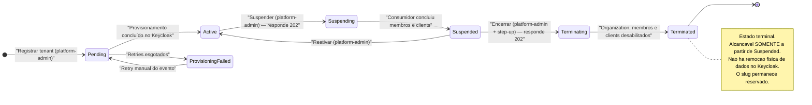

| Estado | O que significa para o negócio | O que é permitido | Quem dispara a saída |
|---|---|---|---|
| **`Pending`** | O tenant já existe na Gateway, mas ainda não existe no Keycloak. O `POST /tenants` respondeu `202`. | Consultar o status do provisionamento. **Não aceita membros** — a invariante de §6.1 exige `Active`. | Processo automático de provisionamento (sucesso → `Active`; retries esgotados → `ProvisioningFailed`). |
| **`ProvisioningFailed`** | O provisionamento falhou de forma persistente. O tenant **não** é descartado: o evento fica disponível para retry manual (§9.1). | Consulta e retry. | Operador da plataforma, por retry manual do evento (volta a `Pending`). O job de reconciliação varre este estado, não só `Active` (CI-6). |
| **`Active`** | O cliente está operante. É o único estado em que o tenant aceita novos membros. | Todas as operações de gestão: membros, clients, permission sets, domínios, IdPs; alteração de plano. | `platform-admin`, por suspensão. |
| **`Suspending`** | Estado de passagem: a suspensão foi aceita (`202`) e o evento está no Outbox; o consumidor está percorrendo membros e clients (§9.7). Existe para que o `GET` do tenant tenha o que reportar nessa janela. | Nenhuma operação de gestão. **A reativação e o encerramento são recusados com `409`** — só se reativa o que já está `Suspended`, e o encerramento parte de `Suspended` (§6.2). Aceitar um `DELETE` aqui poria dois consumidores percorrendo a mesma lista de membros e clients ao mesmo tempo. | Processo automático, ao concluir (→ `Suspended`). |
| **`Suspended`** | O acesso do cliente foi cortado **de fato**: membros desabilitados no Keycloak com sessões revogadas, **e os clients OIDC do tenant desabilitados** (§9.7, §9.7.1). Tipicamente inadimplência. | Consulta; reativação; encerramento. **Não aceita novos membros.** | `platform-admin`, por reativação (volta a `Active`) ou por encerramento (com step-up). |
| **`Terminating`** | Estado de passagem: o encerramento foi aceito (`202`) e o evento está no Outbox; o consumidor está desabilitando Organization, membros **e clients** (§9.8). | Nenhuma operação de gestão. | Processo automático, ao concluir. |
| **`Terminated`** | **Terminal.** O contrato acabou. A Organization e os usuários continuam existindo no Keycloak, desabilitados — a remoção física é operação administrativa fora da API. O `TenantSlug` permanece reservado, porque é imutável e único. | Nada. Não há transição de saída. | Ninguém. |

**Por que `Terminated` só vem de `Suspended`.** Encerrar é a operação mais destrutiva da
plataforma. Exigir que o cliente passe antes por `Suspended` cria um passo intermediário
reversível e visível — e a suspensão já corta o acesso, então nada se perde em segurança ao
exigi-la. Somado ao step-up (`acr` elevado) no `DELETE`, são duas barreiras independentes contra
o encerramento acidental de um tenant em operação (§6.2, C10).

**Por que existem dois estados de passagem.** `Suspending` e `Terminating` são a consequência
visível do desenho assíncrono: tanto o `suspend` quanto o `DELETE` respondem `202` e gravam o
evento no Outbox, e o efeito no Keycloak acontece depois (§6.2, I-1). Sem eles não haveria como
representar "operação aceita, ainda processando", e o `GET` do tenant precisaria mentir —
reportando `Active` enquanto membros já estão sendo desabilitados, ou `Suspended` antes de o
corte ter ocorrido de fato. Nenhum dos dois aceita operação de gestão, e **reativar um tenant em
`Suspending` responde `409`**: reativar uma suspensão pela metade restauraria um estado que
ninguém sabe qual é.

---

#### 3. Ciclo de vida do Membro

A regra que organiza todo este ciclo é uma só: **`Invited` já ocupa vaga do plano** (decisão 2
do brainstorm, N5). A partir dela, a expiração de convite deixa de ser um extra e vira
pré-requisito — sem ela, um convite nunca aceito travaria uma vaga paga para sempre.

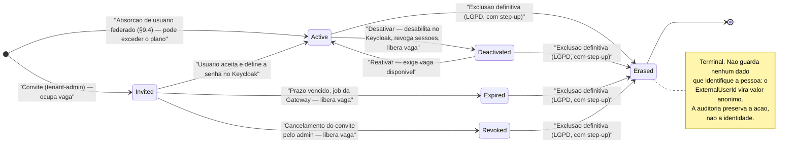

| Estado | O que significa | Ocupa vaga? | Como se sai |
|---|---|---|---|
| **`Invited`** | O convite foi enviado; o Keycloak mandou o e-mail de ações obrigatórias (`UPDATE_PASSWORD`, `VERIFY_EMAIL`). A pessoa ainda não entrou. | **Sim** — reservada no convite. | Aceite (→ `Active`), vencimento do prazo (→ `Expired`), cancelamento pelo admin (→ `Revoked`), ou exclusão definitiva. |
| **`Active`** | A pessoa tem acesso. Pode receber papéis e permission sets. | Sim. | Desativação, ou exclusão definitiva. |
| **`Deactivated`** | O acesso foi cortado: usuário desabilitado no Keycloak, sessões revogadas. O vínculo e o histórico permanecem. | **Não** — a vaga foi liberada. | Reativação (**sujeita a vaga disponível**), ou exclusão definitiva. |
| **`Expired`** | O convite venceu sem aceite: o **job de expiração da Gateway** (§9.9) transicionou o membro ao passar do prazo. A vaga voltou ao plano automaticamente. | Não. | Novo convite (novo membro) ou exclusão definitiva. |
| **`Revoked`** | O administrador **cancelou** o convite antes do aceite (`DELETE .../members/{memberId}/invite`, §9.9). O usuário é desabilitado no Keycloak e a vaga volta ao plano. | Não. | Novo convite (novo membro) ou exclusão definitiva. |
| **`Erased`** | **Terminal.** Exclusão definitiva por LGPD art. 18: o usuário foi removido do Keycloak e o `ExternalUserId` substituído por um valor anônimo. | Não. | Não há saída. |

**Três desfechos sem aceite, e a diferença entre eles importa** (§9.9, I-2). `Expired`, `Revoked`
e `Erased` liberam a vaga do mesmo jeito, mas contam histórias diferentes para a auditoria:
`Expired` é **decurso de prazo** — ninguém decidiu nada, o relógio correu; `Revoked` é **ação
humana deliberada** do administrador, que cancelou um convite enviado por engano ou para a pessoa
errada; `Erased` é **apagamento por LGPD**, com anonimização do `ExternalUserId`. Colapsar os
três num só perderia a distinção entre "o prazo venceu" e "o admin cancelou" — e aplicar a
semântica de anonimização a quem nunca existiu como pessoa ativa seria forte demais. De `Expired`
e de `Revoked`, um novo convite é sempre um **novo membro**, com nova reserva de vaga.

**A liberação de vaga é sempre consequência de uma transição que de fato ocorreu**, nunca uma
chamada solta (§6.1, C5). Desativar duas vezes o mesmo membro — o que acontece naturalmente
quando um timeout de balanceador faz o cliente repetir o `POST` — decrementa o contador **uma
vez só**. A concorrência otimista não protege contra isso: ela detecta escrita simultânea, não
escrita repetida. Um job de reconciliação compara o contador com a contagem real de membros
(§9.1).

**Sobre `WasActiveBeforeSuspension`.** Não é um estado, é uma marca (§6.1). Quando o tenant é
suspenso, todo membro `Active` é marcado e desabilitado no Keycloak — **a marca é gravada na
mesma operação que desabilita, membro a membro, nunca em lote prévio** (§9.7, L-3). Na reativação
do tenant, apenas os marcados voltam — quem já estava `Deactivated` individualmente antes da
suspensão permanece assim (§9.7). Os clients OIDC do tenant têm marca espelhada,
`WasEnabledBeforeSuspension`, com a mesma finalidade (§9.7.1).

---

#### 4. Regras de negócio transversais

Regras numeradas e testáveis. Cada uma indica o que acontece quando é violada. O critério de
pronto da §18 exige **teste negativo para cada regra de isolamento que a funcionalidade toca**.

##### 4.1. Isolamento entre tenants — as três regras

O princípio 5 (§3) diz que toda **regra** de isolamento tem um teste negativo correspondente, e
são três — não uma. A versão anterior da spec testava apenas a primeira, e por isso "ficava
verde enquanto três vetores reais passavam" (§13, C2, CI-8). Uma suíte mais estreita que o
princípio que ela deveria provar é pior que nenhuma suíte, porque produz confiança.

---

**RN-001 — Tenant da rota × tenant do token.**
Todo acesso de um ator de tenant compara o `{tenantId}` da rota com o claim `tenant_id` do
token; a comparação é de **igualdade** (§10.1, §11.7).
*Quando violada:* `403 Forbidden`. A negação é **explícita** em todos os caminhos de rejeição —
inclusive quando o claim está ausente e quando a rota não traz `{tenantId}`. Um requirement que
apenas deixa de aprovar não é *fail closed*: o projeto registra um segundo handler para o
`platform-admin`, e só uma negação explícita sobrevive a uma aprovação alheia (C11).

**RN-002 — Rota com policy de tenant precisa ter `{tenantId}` no template.**
Um endpoint com policy de tenant e sem `{tenantId}` na rota — uma busca global "de conveniência
para o suporte", por exemplo — escaparia da RN-001 *e* da suíte que a testa (C12).
*Quando violada:* **a aplicação não sobe**. Um teste de inicialização varre os endpoints
registrados e falha, o que faz o erro aparecer na build e não em produção (§13).

**RN-003 — Pertencimento de sub-recurso ao tenant da rota.**
`Member`, `PermissionSet` e `ClientApplication` são aggregate roots próprios que apenas
*referenciam* o `TenantId` (§6.1). Verificar o tenant da rota **não** impede que um ator do
tenant A, operando legitimamente em `/tenants/A/...`, informe o id de um recurso do tenant B —
e GUIDs vazam por URL compartilhada, log, auditoria e ticket de suporte. Por isso todo
repositório de sub-recurso expõe **exclusivamente** assinaturas que exigem o tenant:
`GetAsync(TenantId, MemberId)`, **nunca** `GetAsync(MemberId)`. A ausência da sobrecarga é o que
torna a regra verificável — não há como escrever o acesso inseguro por engano (§6.4, §11.9).
*Quando violada:* **`404 Not Found`, não `403`** — responder `403` confirmaria que o recurso
existe em outro tenant.

**RN-004 — Escopo de client M2M.**
Um token de Client Credentials **não carrega `tenant_id`**, então a RN-001 não tem o que
comparar. Há dois tipos de client (§10.1): o **client de tenant**, criado por um tenant-admin,
que recebe o atributo `tenant_id` do tenant criador e fica sujeito à RN-001 como qualquer ator;
e o **client de plataforma**, provisionado fora da API no bootstrap, com escopo
`gateway.permissions.read` e **acesso irrestrito por desenho** — é a credencial que as Resource
APIs usam para resolver permissões de qualquer tenant (§9.6).
*Quando violada* (um client de tenant tentando ler a governança de outro): negado pela RN-001.
O client de plataforma é a **exceção nomeada** do anti-pattern 7 (§17) e, por sê-lo, exige
`private_key_jwt`, rotação documentada e **auditoria por chamada**.

---

##### 4.2. Limites de plano e vagas

**RN-005 — Nenhuma operação da API eleva as vagas ocupadas acima do limite do plano.**
A formulação é deliberadamente precisa (§6.1, CI-5): a v2.0 afirmava que "o número de membros
ativos nunca excede `MaxUsers`", o que o próprio fluxo de absorção federada violava — e uma
invariante que o sistema sabe violar não sobrevive ao primeiro teste de domínio sério. O limite
de cada plano é **definido por plano**, não fixado na spec.
*Quando violada:* o convite ou a reativação é recusado, informando o limite atingido.

**RN-006 — A vaga é reservada no convite e liberada por transição efetiva de estado.**
`Invited` ocupa; `Deactivated`, `Expired`, `Revoked` e `Erased` liberam (§6.1).
A liberação é **consequência de uma transição que ocorreu**, nunca uma chamada solta.
*Quando violada* (dupla liberação por requisição repetida): o domínio **lança violação de
invariante** em vez de aplicar um `Math.Max(0, …)` — o clamp da v2.0 não protegia nada, apenas
escondia a divergência, impedindo o valor negativo que denunciaria o defeito (§11.1, C5). Um job
de reconciliação compara o contador com a contagem real (§9.1).

**RN-007 — Duas reservas simultâneas não ultrapassam o limite.**
O contador é protegido por concorrência otimista; o conflito de versão é reprocessado por retry
explícito no pipeline de comandos (§6.1, §11.10).
*Quando violada* (conflito persistente após os retries): `409 Conflict` em Problem Details.

**RN-008 — Downgrade de plano abaixo do que o tenant já usa é recusado.**
`PATCH /tenants/{tenantId}` é rejeitado quando o plano de destino tem `MaxUsers` **abaixo das
vagas ocupadas** ou `MaxClients` **abaixo dos clients ativos** (§6.1, §8, N8).
*Quando violada:* `409 Conflict` em Problem Details **nomeando quantos membros ou clients
precisam sair antes**. A alternativa — aceitar e desativar membros ou clients automaticamente —
destruiria dados do cliente sem pedir. Rebaixar o plano de um tenant com 40 vagas ocupadas para
um plano de 10 violaria a invariante de vagas no instante da troca; recusar preserva a invariante
sem destruir nada.

**RN-009 — A absorção de usuário federado é a única via pela qual o limite pode ser excedido.**
O excesso marca o tenant como `OverSubscribed`, publica evento e gera auditoria (§9.4). **O
limite volta a valer por tolerância**: aberta a janela configurável (padrão: 7 dias) sem ajuste
de plano nem desativação, os excedentes são desabilitados, o mais recente primeiro.
*Quando violada* (janela vencida sem ação): desativação automática dos excedentes. Sem isso,
"detectamos e não fazemos nada" deixaria o plano sem efeito para qualquer tenant com federação —
que é justamente o perfil de cliente maior (N10).

**RN-026 — O número de clients OIDC ativos nunca excede `Plan.MaxClients`.**
O registro de client (`POST /tenants/{tenantId}/clients`) é **rejeitado quando o limite do plano
já foi atingido** (§6.1, §8). A regra é o que dá efeito a `MaxClients`: sem ela, seria um campo
do plano que nenhuma operação consulta — limite declarado e sem consequência, que é pior do que
não ter limite, porque o comercial o vende como se valesse.
*Quando violada:* `409 Conflict` em Problem Details, informando o limite atingido.

**RN-027 — Convite tem prazo, e quem o expira é a Gateway.**
Um job periódico **da Gateway** varre os membros `Invited` cujo `InvitedAt` excedeu o prazo do
tenant — **configurável, padrão de 7 dias** — transiciona para `Expired`, libera a vaga e publica
`MemberInviteExpired` (§9.9). O reenvio reinicia `InvitedAt`, prorrogando a vaga já ocupada. O
prazo deve ser **alinhado ao tempo de vida do link de ações do Keycloak**: um link ainda válido
para um membro já `Expired` produziria um aceite sem vaga reservada.
*Quando violada* (expiração derivada de evento do Keycloak, em vez do job): quem libera a vaga
deixaria de ser quem controla o contador, e uma regra de plano ficaria amarrada à configuração de
realm e à latência do polling do ADR-007 (§9.9).

---

##### 4.3. Escalação de privilégio

**RN-010 — Um ator só atribui papéis do próprio tenant e nunca acima do seu papel mais alto.**
A hierarquia é `platform-admin` > `tenant-admin` > `financial-manager` > `reader` (§6.3, §11.2).
*Quando violada:* a atribuição é recusada, nomeando os papéis que excedem o teto do ator.

**RN-011 — `platform-admin` não é atribuível pela API.**
Ele nasce exclusivamente no bootstrap do realm, com senha gerada aleatoriamente, exibida uma
única vez no log e com `UPDATE_PASSWORD` obrigatória (§15, C13). Um teste de CI falha se o JSON
de bootstrap contiver qualquer credencial literal.
*Quando violada:* a atribuição é recusada, mesmo para quem já é `platform-admin`.

**RN-012 — A corretude da RN-010 depende da qualidade da sua entrada.**
O papel mais alto do ator deriva do claim `roles` do token. A regra só é confiável se o claim
chegar no formato plano esperado e se a verificação de tenant tiver passado antes (§6.3). Por
isso o teste que a cobre é de **integração, sobre a cadeia inteira**, não um teste unitário da
policy isolada.
*Quando violada* (claim em formato inesperado): a verificação de papel falha e o acesso é
negado — o comportamento *fail closed* é o correto aqui.

---

##### 4.4. Fail closed e sua exceção declarada

**RN-013 — Na dúvida, negar.**
Claim ausente, tenant divergente ou dependência indisponível em operação sensível resultam em
negação (§3, princípio 4).
*Quando violada:* é um defeito de segurança, não um erro de negócio.

**RN-014 — Negar por indisponibilidade responde `503`, não `403`.**
Quando a Gateway está fora e o cache de permissões está frio, a decisão é negar — mas com `503`
e `Retry-After` (§9.6, C6). Responder `403` faria o sintoma apontar para o lugar errado: o
usuário leria "você não tem permissão", o suporte investigaria papéis e o plantão procuraria uma
mudança de autorização que não houve. O `503` distingue *"negado"* de *"não sei"* e permite
retry. Para tornar o cenário raro, o pacote cliente serve cache vencido enquanto a Gateway está
fora (com teto de idade configurável) e a Resource API só entra em rotação depois de falar com a
Gateway ao menos uma vez.
*Quando violada:* incidente diagnosticado no lugar errado, a cada deploy coordenado.

**RN-015 — Exceção declarada: absorção de usuário criado fora da Gateway.**
Registrar e sinalizar é preferível a perder o vínculo (§3 princípio 4, §9.4, CI-5). O usuário já
foi autenticado pelo IdP do cliente; recusar o registro criaria **um usuário autenticado sem
membership**, situação pior que o excesso de vagas. É a **única** exceção ao *fail closed*, e ela
é nomeada, auditada e compensada pela janela de tolerância da RN-009.

**RN-016 — Falta de nível de autenticação (step-up) responde `401`, não `403`.**
Exclusão definitiva de membro, rotação de credenciais e encerramento de tenant exigem `acr`
elevado. Quando falta, a resposta é `401` com `WWW-Authenticate` contendo
`error="insufficient_user_authentication"` e o `acr_values` exigido (§10.1).
*Quando violada* (respondendo `403`): o usuário fica **sem caminho de recuperação** — ele *pode*
executar a operação, bastando reautenticar-se mais forte. O nível deriva do `auth_time` da
sessão, então um step-up recente vale para as operações seguintes dentro da janela do realm.

---

##### 4.5. Credenciais e dados pessoais

**RN-017 — A Gateway nunca vê nem guarda credencial de usuário.**
Nem senha, nem hash, nem segredo (§5, ADR-003, anti-pattern 3). A criação de usuário não define
senha: o Keycloak envia e-mail de ações obrigatórias.
*Quando violada:* amplia o escopo de compliance LGPD exatamente onde o desenho escolheu não
estar.

**RN-018 — Segredo de client é devolvido uma única vez e não é persistido em lugar nenhum.**
Nem no banco, nem no log, nem na auditoria, **nem no store de idempotência** (§10.3, CI-2).
Guardá-lo por 24h faria a Gateway persistir exatamente o segredo que ela diz não guardar — e a
`Idempotency-Key` é escolhida pelo cliente e circula em logs de proxy e coleções de API.
*Quando violada:* o "devolvido uma única vez" torna-se falso. No replay dessas rotas, a resposta
é `200` **sem o campo sensível**, indicando apenas que o recurso já existe.

**RN-019 — Dados pessoais ficam no Keycloak; a Gateway guarda vínculo e governança.**
Nome, e-mail e telefone não vivem no banco da Gateway, que guarda o identificador do usuário
(`sub`) e os dados de governança (§6). Isso limita o impacto de um eventual vazamento.
*Quando violada:* o banco da Gateway entra no escopo mais sensível de compliance.

**RN-020 — A exclusão definitiva preserva a ação, não a identidade.**
O `ExternalUserId` é substituído por um valor anônimo e o membro passa a `Erased`; a trilha de
auditoria registra que a operação ocorreu, sem identificar a pessoa (§9.5, §6.1).

---

##### 4.6. Consistência entre os dois sistemas

**RN-021 — Nenhuma chamada ao Keycloak acontece dentro da transação de um comando.**
A gravação local e o evento no Outbox são atômicos; o efeito externo acontece depois, de forma
idempotente (ADR-006, anti-pattern 6).
*Quando violada:* uma transação de banco aberta enquanto se espera um sistema externo.

**RN-022 — Provisionamento é "garanta que existe", não "crie".**
A correlação idempotente usa o atributo `gateway_tenant_id` gravado na Organization (§9.1,
ADR-006).
*Quando violada:* recursos duplicados. Por isso também **não há retry automático em `POST` para
a Admin API** (anti-pattern 8): a idempotência vem do "consultar antes de criar", não do retry.
Um teste **conta** as chamadas à Admin API e falha se um `POST` sob falha transiente virar duas
Organizations (§13).

**RN-023 — A reconciliação varre todos os estados não terminais, não só `Active`.**
`Pending`, `ProvisioningFailed` e `Active`, mais o sentido inverso — Organizations com
`gateway_tenant_id` sem tenant correspondente (§9.1, CI-6).
*Quando violada:* o órfão típico passa despercebido, porque ele nasce **antes** da ativação —
com a Organization criada e a gravação do id falhando. Varrer só `Active` cobriria apenas o caso
em que nada deu errado.

**RN-024 — Nenhum claim é emitido ou assinado fora do Keycloak.**
Todo claim customizado (`tenant_id`, `roles`, `tier`) vem de Protocol Mappers; a Gateway apenas
mantém sincronizados os atributos que os alimentam (ADR-004, anti-pattern 5).
*Quando violada:* a Gateway vira um segundo Authorization Server. **Escopo da regra:** achatar
o formato de um claim de um token **já validado**, no Data Plane, é permitido — derivar não é
emitir, e nada ali cria autoridade que o token não carregasse (CI-7).

**RN-025 — Nenhuma requisição de negócio depende da Gateway para ser autorizada.**
As APIs consumidoras validam o JWT localmente com as chaves públicas do Keycloak; permissões
finas vêm de cache com invalidação por evento, nunca de uma chamada por requisição (§2,
ADR-002, anti-pattern 2).
*Quando violada:* a Gateway vira gargalo e ponto único de falha — um monólito distribuído.

---

#### 5. Matriz de permissões

Quem pode fazer o quê. As colunas são os quatro tipos de ator do sistema.

| Funcionalidade | platform-admin | tenant-admin | membro (`financial-manager` / `reader`) | client M2M |
|---|:---:|:---:|:---:|:---:|
| **F-01** Registrar tenant | ✅ | ❌ | ❌ | ❌ |
| **F-02** Consultar tenant / status de provisionamento | ✅ | ⚠️ ¹ | ❌ | ❌ |
| **F-03** Alterar nome e plano do tenant | ✅ | ❌ | ❌ | ❌ |
| **F-04** Suspender tenant | ✅ | ❌ | ❌ | ❌ |
| **F-05** Reativar tenant | ✅ | ❌ | ❌ | ❌ |
| **F-06** Encerrar tenant | ⚠️ ² | ❌ | ❌ | ❌ |
| **F-07** Convidar membro | ❌ ³ | ✅ | ❌ | ⚠️ ⁴ |
| **F-08** Reenviar convite | ❌ ³ | ✅ | ❌ | ⚠️ ⁴ |
| **F-09** Cancelar convite pendente | ❌ ³ | ✅ | ❌ | ⚠️ ⁴ |
| **F-10** Expiração automática de convite | — ⁵ | — ⁵ | — ⁵ | — ⁵ |
| **F-11** Desativar membro | ❌ ³ | ✅ | ❌ | ⚠️ ⁴ |
| **F-12** Reativar membro | ❌ ³ | ✅ | ❌ | ⚠️ ⁴ |
| **F-13** Excluir membro (LGPD) | ❌ ³ | ⚠️ ² | ❌ | ❌ |
| **F-14** Atribuir papéis | ❌ ³ | ⚠️ ⁶ | ❌ | ❌ |
| **F-15** Absorver usuário federado | — ⁵ | — ⁵ | — ⁵ | — ⁵ |
| **F-16** Registrar client OIDC | ❌ ³ | ✅ | ❌ | ❌ |
| **F-17** Rotacionar credenciais de client | ❌ ³ | ⚠️ ² | ❌ | ❌ |
| **F-18** Remover client | ❌ ³ | ✅ | ❌ | ❌ |
| **F-19** Gerir permission sets | ❌ ³ | ✅ | ❌ | ❌ |
| **F-20** Consultar permissões efetivas | ❌ ³ | ✅ | ❌ | ⚠️ ⁷ |
| **F-21** Vincular / remover domínios | ❌ ³ | ✅ | ❌ | ❌ |
| **F-22** Configurar IdP federado | ❌ ³ | ✅ | ❌ | ❌ |
| **F-23** Discovery por e-mail | ✅ ⁸ | ✅ ⁸ | ✅ ⁸ | ✅ ⁸ |
| Consultar catálogo de papéis (`GET /roles`) | ✅ | ✅ | ✅ | ✅ |

**Notas**

1. ⚠️ **Somente o próprio tenant** (§8). Garantido pela RN-001.
2. ⚠️ **Exige step-up**: nível `acr` elevado. Faltando, a resposta é `401` com
   `insufficient_user_authentication` e o `acr_values` exigido, não `403` (RN-016).
3. ❌ O `platform-admin` **não** opera dentro de um tenant. Ele não satisfaz a verificação de
   tenant da RN-001, e abrir uma exceção para ele criaria um bypass no mecanismo de isolamento
   que o projeto usa como sua principal prova de segurança. Foi justamente para evitar essa
   exceção que `POST /tenants` passou a exigir `initialAdminEmail` (C9, §9.1): criar o admin
   junto do tenant **elimina** uma exceção em vez de acrescentar outra.
4. ⚠️ Apenas um **client de tenant** com o escopo correspondente (ex.: `gateway.members.write`),
   e sujeito à RN-001 como qualquer ator do tenant — ele carrega o atributo `tenant_id` do
   tenant que o criou (§10.1).
5. — Processo automático. Não há ator humano: é disparado por job periódico (F-10) ou pela
   leitura de eventos do Keycloak (F-15, ADR-007).
6. ⚠️ Sujeito à `RoleAssignmentPolicy` (RN-010 e RN-011): nunca acima do próprio papel, e
   `platform-admin` jamais.
7. ⚠️ **Client de plataforma** com escopo `gateway.permissions.read`, provisionado fora da API
   no bootstrap. **Acesso irrestrito por desenho** — é a credencial que as Resource APIs usam
   para resolver permissões de qualquer tenant (§9.6). É a exceção nomeada do anti-pattern 7,
   exige `private_key_jwt` e é **auditada por chamada** (RN-004, §10.1).
8. Endpoint **anônimo**, com rate limit mais restrito. Qualquer um pode chamar; a resposta tem
   sempre o mesmo formato, para não permitir enumeração de tenants (§9.2).

---

#### 6. Roadmap de entrega

Oito marcos, cada um terminando em algo demonstrável e testado (§16). O que segue é o **valor de
negócio** de cada um, não a lista de tarefas.

| Marco | O valor que entrega |
|---|---|
| **M0 · Fundação** | *"Qualquer pessoa consegue rodar isto."* Ambiente local completo por `docker compose up`, realm configurado como código, health checks, CI com testes de arquitetura, e **auditoria e observabilidade desde o primeiro dia** — não como retrofit. |
| **M1 · Tenants** | *"A plataforma sabe receber e despedir um cliente."* Registro com administrador inicial, provisionamento resiliente, suspensão **com efeito real** e encerramento. |
| **M2 · Membros e papéis** | *"O cliente administra a própria equipe, sem vazar para os outros."* Ciclo completo do convite, desativação com revogação de sessões, exclusão LGPD, papéis sem escalação, vagas com regra explícita. Encerra com a suíte de autorização negativa verde **nas três regras de isolamento**. |
| **M3 · Data Plane** | *"A governança funciona sem a Gateway no caminho."* A biblioteca cliente e a API de exemplo demonstram uma requisição de negócio autorizada **sem nenhuma chamada à Gateway** — a prova concreta do ADR-002. |
| **M4 · Federação e discovery** | *"O cliente corporativo entra com o próprio SSO."* Domínios, IdP externo por tenant, discovery e sincronização de eventos. Demonstra que o login federado cria o membro **e respeita o limite do plano**. |
| **M5 · Permissões finas** | *"Cada cliente modela as próprias permissões, e revogá-las tem efeito imediato."* Permission Sets com cache invalidado por evento: uma permissão revogada deixa de valer **sem novo login**. |
| **M6 · M2M** | *"Serviços do cliente se integram sem senha de pessoa."* Clients com `private_key_jwt` e rotação de credenciais. |
| **M7 · Hardening** | *"O repositório está pronto para ser apresentado."* Step-up nas operações destrutivas, rate limiting e o README detalhado com `curl` reproduzível. |

**O ponto de "apresentável" é declarado.** Ao fim de **M3 + M7'** (step-up, rate limiting e
README), o repositório está completo e defensável: ADRs, testes, limites honestos e demonstração
reproduzível. M4 a M6 são incrementos sobre uma base que já pode ser mostrada, não pré-requisitos
para mostrá-la. Num projeto sem prazo, esse marco é a defesa contra o modo de falha mais comum —
seis marcos pela metade e nada apresentável.

**Por que o M0 virou peça crítica.** A demonstração do projeto é por **README com `curl`
reproduzível** (decisão 7 do brainstorm). Isso muda o peso do M0: ele deixa de ser "preparar o
terreno" e passa a ser **o primeiro contato do avaliador**. Uma falha ali — um `docker compose
up` que não sobe, um primeiro `curl` que retorna erro — encerra a leitura antes dos ADRs, antes
dos testes de isolamento, antes de qualquer coisa que o projeto queira demonstrar. Um exemplo
concreto do risco: sem a feature flag `organization` no container, o Keycloak sobe normalmente,
o import do realm passa sem erro e o endpoint de Organizations responde `404` — falha silenciosa
que só apareceria na primeira demonstração. Por isso o M0 inclui um *smoke test* que falha
explicitamente nesse caso, na subida (§15).

**As duas demonstrações que o README precisa conter**, porque provam competências difíceis em
poucos comandos (§16):

1. **Consistência sem transação distribuída.** Parar o Keycloak → `POST /tenants` responde `202`
   normalmente → subir o Keycloak → o tenant vira `Active` sozinho.
2. **Isolamento multi-tenant.** Com token do tenant A, tentar a rota do tenant B (`403`); e
   tentar um `memberId` do tenant B **dentro da rota do tenant A** (`404`). São a RN-001 e a
   RN-003, lado a lado — a segunda é a que a maioria dos projetos não testa.

---

#### 7. Limites conhecidos e não-objetivos

Registrar os limites faz parte do projeto (§19): eles mostram onde a arquitetura escolhe
simplicidade de forma consciente, e distinguem uma decisão de um esquecimento.

##### 7.1. O ponto honesto: o SPOF não foi eliminado, foi deslocado

O ADR-002 tira a Gateway do caminho crítico — se ela cair, os logins continuam e as requisições
de negócio que dependem apenas de papéis globais também. **Mas isso não torna o sistema
resiliente à queda do Keycloak** (§2.1, CI-3). Com o Keycloak fora do ar, nenhum login acontece e
nenhum token é renovado; decorridos os 5 minutos de vida do access token, **o Data Plane inteiro
para**, porque a validação local depende de token vivo, não de Keycloak vivo. O Keycloak
permanece dependência crítica de ambos os caminhos. Além disso, ele roda em **instância única**
no ambiente local — clustering e multi-site estão documentados, não implementados.

##### 7.2. Fora do escopo, por decisão (§1.1)

| Não faz parte | Por quê |
|---|---|
| Qualquer front-end, painel administrativo ou SPA | O projeto é **API-first**: toda interação acontece por endpoints REST documentados em OpenAPI. |
| Telas de login | São do Keycloak. Customização de tema é opcional. |
| Emissão ou reassinatura de tokens pela Gateway | Isso a tornaria um segundo Authorization Server (ADR-004, anti-pattern 5). |
| Armazenamento de senhas, hashes ou segredos de usuário | Responsabilidade exclusiva do Keycloak; mantém o banco da Gateway fora do escopo mais sensível de compliance. |
| Cobrança real | O plano é apenas **metadata de governança** — ele limita vagas e clients, não emite fatura. |
| Alta disponibilidade do Keycloak | Documentada, não implementada. |
| Deploy em nuvem | Opcional, fora do núcleo. |
| **Auto-serviço de cadastro** | Todo tenant nasce de um `POST /tenants` de `platform-admin`. O modelo é **sales-led**, por escolha — não por esquecimento (N4). |

##### 7.3. Limites funcionais assumidos (§19)

**Do modelo de tenancy**

- **Políticas de senha, força bruta e rotação de refresh token são por realm** e, portanto,
  iguais para todos os tenants (ADR-001). Um cliente com política própria de compliance —
  expiração a cada 90 dias, por exemplo — exigiria realm dedicado. Na prática o impacto é menor
  do que parece: esse perfil de cliente costuma usar IdP federado, e então a política de senha é
  a do IdP dele.
- **Um usuário pertence a um único tenant** (ADR-009). *Consequência comercial declarada:* um
  consultor que atende dois clientes precisa de **duas contas com e-mails diferentes**, e um MSP
  não consegue usar a plataforma como um único usuário. A evolução exigiria papéis por
  Organization, seleção de organização no login e uma verificação de tenant contra **lista**, em
  vez da comparação de igualdade — que é justamente a peça de segurança que o projeto quer
  exibir (N9).

**Da revogação e da validação stateless**

- **Desativar um membro não invalida o access token já emitido**, que sobrevive até 5 minutos. É
  o preço da validação stateless do ADR-002, e não há como encurtá-lo sem reintroduzir
  verificação remota por requisição.
- **Suspender um tenant não invalida os tokens já emitidos** — nem os de membro, nem os de
  **client M2M** (§19). Desabilitar usuários e clients impede a **emissão** de novos tokens, não
  o uso dos que já circulam: eles sobrevivem até expirar, no máximo 5 minutos. É a mesma janela
  do item anterior, aplicada ao tenant inteiro. Vale dizê-lo com todas as letras porque a
  expectativa comercial de "cortar o acesso agora" é literal, e a resposta honesta é *quase*
  agora.
- **A queda do Keycloak degrada o Data Plane em até 5 minutos** — passada essa janela, nenhuma
  requisição de negócio é autorizada.

**Das permissões finas**

- **Permissões finas têm janela de atraso** igual ao TTL do cache, quando o evento de
  invalidação não chega.
- **A queda da Gateway nega permissões finas com cache frio**, respondendo `503`. Endpoints que
  dependem apenas de papéis globais seguem funcionando. Mitigado por cache vencido servido
  durante a indisponibilidade e por aquecimento na entrada em rotação — **mitigado, não
  eliminado**.

**Da sincronização com o Keycloak**

- **A sincronização Keycloak → Gateway tem latência** igual ao intervalo de polling, e é
  *at-least-once* **com perda possível**: se o processo ficar parado mais tempo que a retenção
  de eventos do realm, os eventos daquele intervalo deixam de existir. Um alarme sinaliza a
  aproximação desse limite (ADR-007).
- **Há uma janela sem `tenant_id` no primeiro login federado**: entre o login e o processamento
  do evento, o usuário recebe `403` nas rotas de tenant.

**Dos limites de plano**

- **O limite de usuários não bloqueia o primeiro login federado.** O excesso é detectado,
  auditado e sinalizado, e o limite volta a valer por janela de tolerância. **Sem federação, o
  limite é estrito.**

**Do encerramento**

- **O encerramento de tenant não remove dados do Keycloak.** Ele desabilita e marca
  `Terminated`; a remoção física é operação administrativa fora da API, e o `TenantSlug`
  permanece reservado.

---

# Parte III — Fluxos de execução

### Como a solução funciona: fluxos de execução

Esta parte percorre os oito fluxos principais da especificação (§9) e mostra, passo a passo, o que cada
componente faz e por quê. Antes deles vem o diagrama de contexto, que fixa quem conversa com quem; depois
deles vêm três seções de honestidade operacional: o que acontece quando a Gateway cai, o que acontece
quando o Keycloak cai e como a consistência eventual se fecha.

Uma convenção de leitura: **Control Plane** é a IdentityGateway — quem governa tenants, membros,
permissões e clients. **Data Plane** são as APIs de negócio que consomem os tokens. A regra que organiza
tudo é o ADR-002: *a Gateway orquestra, mas não intermedia*. Ela nunca está no caminho do login nem no
caminho da requisição de negócio.

---

### Diagrama de contexto: Control Plane × Data Plane

A §2.1 descreve seis fluxos de tráfego entre cinco blocos. O diagrama abaixo é a transcrição fiel deles.

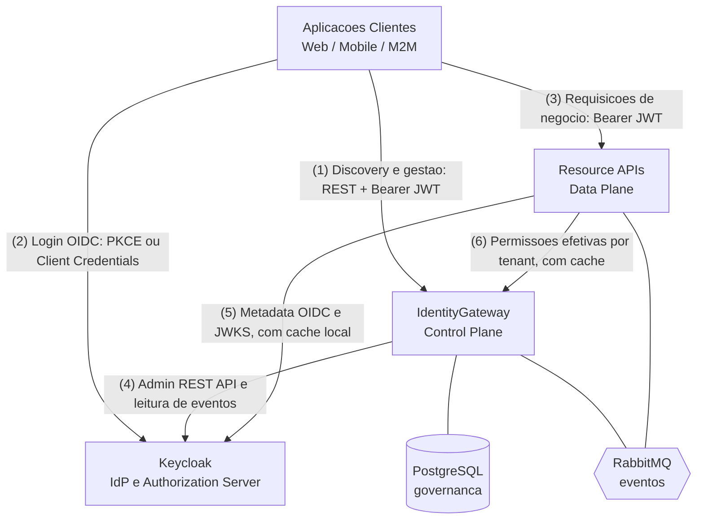

| Seta | O que trafega | Por que importa |
|---|---|---|
| (1) | Chamadas de gestão e de descoberta, autenticadas com JWT emitido pelo Keycloak | É a superfície REST do Control Plane |
| (2) | Authorization Code + PKCE (interativo) ou Client Credentials (M2M), **direto no Keycloak** | A Gateway não vê senha nem token |
| (3) | Requisições de negócio com `access_token`; **a Gateway não participa** | Sem latência adicional por requisição |
| (4) | Admin REST API (provisionamento) e leitura de eventos do Keycloak | É por aqui que a governança vira configuração real |
| (5) | Metadata OIDC e JWKS, com cache local na API consumidora | Validação local: nível 1 de autorização |
| (6) | Permissões efetivas por tenant, com cache e invalidação por evento; **nunca por requisição** | Nível 2 de autorização, o único ponto em que o Data Plane toca a Gateway |

A leitura de negócio: as setas (2) e (3) — login e tráfego de negócio — **não passam pela Gateway**. Essa é
a propriedade central do desenho, e é dela que derivam quase todas as respostas das seções de falha.

---

### Fluxo 9.1 — Provisionamento de tenant

**Quando acontece:** um novo cliente é contratado e precisa existir como tenant isolado na plataforma.
É o fluxo fundador: sem ele nenhum usuário daquele cliente consegue entrar.

**Por que importa:** provisionar um tenant significa escrever em dois sistemas — o banco da Gateway e o
Keycloak — e a Admin API do Keycloak **não é transacional** (ADR-006). Não existe "commit nos dois".
Este fluxo é a resposta arquitetural a esse problema.

**Atores e sistemas:** operador `platform-admin` via aplicação cliente · IdentityGateway (API e consumidor)
· PostgreSQL · RabbitMQ · Keycloak.

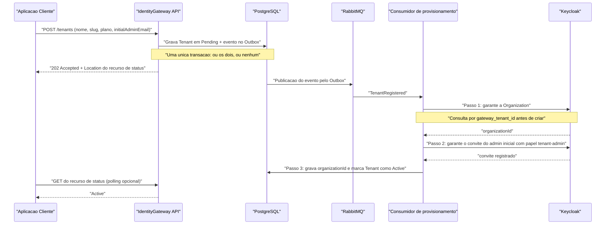

#### Passo a passo

1. **A aplicação pede a criação do tenant.** `POST /tenants` exige `initialAdminEmail` (§9.1). Esse campo
   não é burocracia: sem ele o tenant nasceria trancado.
2. **A Gateway grava o tenant em `Pending` e o evento no Outbox, na mesma transação** (ADR-006, §11.4).
   Nada é enviado ao Keycloak neste momento. Se a transação falhar, não sobra nem tenant nem evento.
3. **A resposta é `202 Accepted`, não `201 Created`** (ADR-006). O recurso ainda não está pronto; o
   `Location` aponta para um recurso de status que o cliente pode consultar. Isso é honestidade de
   contrato: prometer `201` seria mentir sobre um trabalho que ainda vai acontecer.
4. **O consumidor executa três passos idempotentes** (§9.1, §11.5). Idempotente aqui quer dizer "garanta
   que existe": se a mensagem for entregue duas vezes, o segundo processamento não duplica nada.
   1. garante a Organization, gravando nela o atributo `gateway_tenant_id` com o `TenantId` da Gateway;
   2. garante o convite do `initialAdminEmail` já com o papel `tenant-admin`;
   3. marca o tenant `Active`.
5. **Por que o admin inicial nasce junto.** `POST /tenants` é operação de `platform-admin`, mas convidar
   membros exige `tenant-admin` *daquele tenant* — que ainda não existiria (§9.1). A alternativa seria abrir
   uma exceção de platform-admin no mecanismo de isolamento da §11.7. Criar o admin junto do tenant
   **elimina** uma exceção em vez de acrescentar outra.
6. **A correlação é por atributo, não por alias.** O `gateway_tenant_id` é a chave estável do "consultar
   antes de criar" (§11.6, ADR-006). É escolhida pela Gateway, imune a rename de nome ou de alias.
7. **Esgotados os retries, o tenant vai para `ProvisioningFailed`** e o evento fica disponível para retry
   manual (§9.1). O estado é explícito, não um limbo silencioso.
8. **A reconciliação varre todos os estados não terminais** — `Pending`, `ProvisioningFailed` **e**
   `Active` — e também o sentido inverso: Organizations com `gateway_tenant_id` que não correspondem a
   nenhum tenant conhecido (§9.1). Varrer apenas `Active` cobriria só o caso em que nada deu errado; o
   órfão típico nasce antes da ativação, com a Organization criada e a gravação do id falhando.

#### Pontos de falha e comportamento esperado

| Dependência que cai | O que acontece |
|---|---|
| **PostgreSQL** (no passo 2) | A transação não commita. Não há tenant nem evento. A API responde erro; o cliente reenvia. Fail closed (§Princípio 4) — nada parcial sobrevive. |
| **RabbitMQ** (após o commit) | O evento **já está no Outbox**, dentro do banco. Ele é publicado quando o broker voltar. Nenhuma perda; só atraso. É exatamente o problema que o Outbox existe para resolver (ADR-006). |
| **Keycloak** (durante os três passos) | O consumidor falha, o MassTransit faz retry. Persistindo a falha, `ProvisioningFailed` + retry manual. O tenant fica visivelmente incompleto, nunca silenciosamente quebrado. |
| **A Gateway** (entre o passo 1 e o passo 3) | O evento sobrevive no Outbox. Quando a instância volta — ou outra assume —, o consumidor reprocessa. Os passos idempotentes garantem que reprocessar não duplica. |
| **Falha entre criar a Organization e gravar o id** | É o órfão típico. Coberto pela reconciliação bidirecional do item 8. Sem ela, existiria uma Organization no Keycloak sem dono do lado da Gateway. |

> **Nota de rigor.** A revisão crítica registra dois achados sobre este fluxo — **C3** (a busca por alias
> não existe na Admin API; a correção é buscar pelo atributo `gateway_tenant_id`) e **C4** (a proteção
> contra retry em POST pode não se comportar como configurado, conforme a issue dotnet/extensions #6708).
> Ambos atacam **mecanismos de apoio**, não o padrão Outbox. Ver a seção de consistência eventual ao final.

---

### Fluxo 9.2 — Login interativo com discovery

**Quando acontece:** um usuário abre a aplicação web ou mobile e digita o e-mail para entrar.

**Por que importa:** é aqui que se vê, na prática, o ADR-002. O login é o fluxo mais tentador para
colocar a Gateway no meio — e é precisamente onde ela fica de fora.

**Atores e sistemas:** usuário final · aplicação cliente · IdentityGateway (só no discovery) · Keycloak
(e, opcionalmente, um IdP corporativo federado).

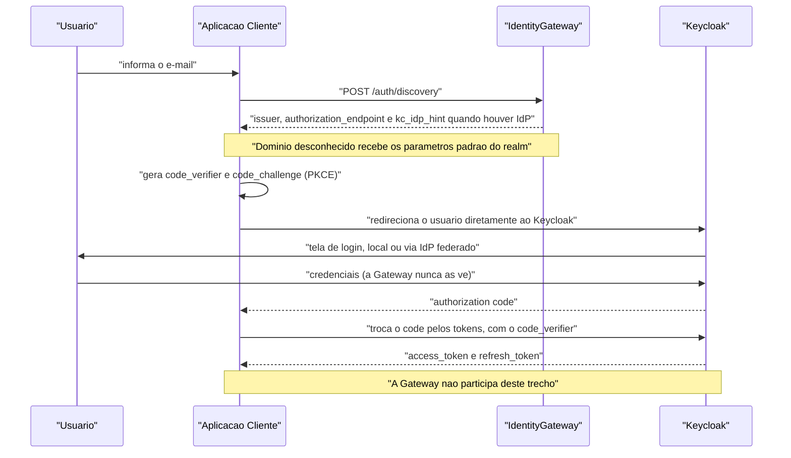

#### Passo a passo

1. **A aplicação coleta o e-mail e chama `POST /auth/discovery`** (§9.2). É a única participação da
   Gateway em todo o login.
2. **A Gateway resolve o tenant pelo domínio** e devolve os parâmetros do fluxo: `issuer`,
   `authorization_endpoint` e, quando o tenant tem IdP federado, o `kc_idp_hint`.
3. **A resposta tem sempre o mesmo formato, mesmo para um domínio desconhecido** — que recebe os
   parâmetros de login padrão do realm (§9.2). É uma defesa contra enumeração de tenants: um atacante não
   consegue descobrir quais empresas são clientes variando o domínio do e-mail.
4. **A aplicação gera `code_verifier` e `code_challenge` (PKCE) e redireciona o usuário diretamente ao
   Keycloak.** O código de autorização, se interceptado, é inútil sem o verificador.
5. **O Keycloak autentica** — localmente ou via IdP federado — e devolve o `code` à aplicação, que o troca
   pelos tokens **no próprio Keycloak** (§9.2).
6. **O discovery é conveniência, não obrigação.** O recurso Organizations já faz o redirecionamento por
   domínio sozinho (ADR-001). O discovery serve a clientes que precisam resolver o tenant *antes* do
   redirect — apps mobile, por exemplo (§9.2).

#### Pontos de falha e comportamento esperado

| Dependência que cai | O que acontece |
|---|---|
| **A Gateway** | O login **continua funcionando** (§2.1). O cliente perde o `kc_idp_hint` e o atalho de resolução, mas o redirecionamento por domínio do Organizations cobre o caso interativo. É a propriedade mais valiosa deste desenho. |
| **O Keycloak** | **Nenhum login acontece.** Não há plano B: o Keycloak é o único dono de credenciais e único emissor de tokens (Princípio 3). Ver "O que acontece quando o Keycloak cai". |
| **O IdP corporativo federado** | Usuários daquele tenant não entram por federação. O escopo da falha é um tenant, não a plataforma. |
| **PostgreSQL da Gateway** | Afeta só o discovery. O login direto no Keycloak segue. |

---

### Fluxo 9.3 — Comunicação M2M

**Quando acontece:** um serviço do cliente — um ERP, um job noturno, uma integração — precisa chamar as
APIs da plataforma sem um humano na frente.

**Por que importa:** é o fluxo onde segredos são criados. A postura adotada é tratar o segredo como algo
que a Gateway **transporta uma vez e esquece**, nunca como algo que ela guarda.

**Atores e sistemas:** tenant-admin · IdentityGateway · Keycloak · serviço M2M do cliente · API consumidora.

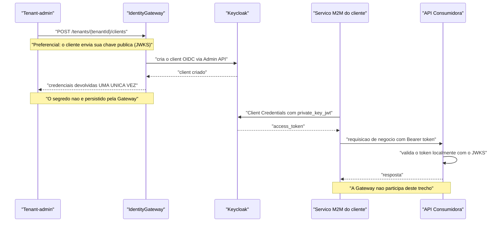

#### Passo a passo

1. **O tenant-admin registra um client M2M pela Gateway** (§9.3). É uma operação de governança, como
   qualquer outra do Control Plane.
2. **O método preferencial é `private_key_jwt`:** o cliente envia sua chave pública (JWKS) e a chave
   privada **nunca sai dele** (§9.3). Não existe segredo compartilhado a vazar.
3. **Quando `client_secret` é usado, o segredo é devolvido uma única vez** — na resposta da criação ou da
   rotação (§9.3). A Gateway não o persiste (§5, §10.3). Perder o segredo significa rotacionar, não
   consultar.
4. **A partir daí o serviço obtém tokens diretamente do Keycloak** via Client Credentials (§9.3). A Gateway
   sai de cena.
5. **Um token de Client Credentials não carrega `tenant_id`** (§10.1) — não há usuário cujo atributo ler.
   Por isso a spec distingue dois tipos de client:
   - **Client de tenant:** recebe o atributo `tenant_id` do tenant que o criou, emitido como claim plano, e
     fica sujeito ao `SameTenantRequirement` como qualquer ator;
   - **Client de plataforma:** provisionado fora da API, no bootstrap, com **acesso irrestrito por desenho**
     — é a credencial que as Resource APIs usam para resolver permissões de qualquer tenant (fluxo 9.6).
     É tratado como credencial de infraestrutura: `private_key_jwt` obrigatório, rotação documentada e
     **auditoria por chamada** (§10.1).
6. **A rotação de credenciais exige step-up** (§10.1): é operação sensível e pede `acr` de nível elevado.

#### Pontos de falha e comportamento esperado

| Dependência que cai | O que acontece |
|---|---|
| **A Gateway** | Não é possível registrar novos clients nem rotacionar credenciais. Os clients **já existentes continuam obtendo tokens e operando normalmente** — a Gateway não está no caminho (§2.1, seta 3). |
| **O Keycloak** | Nenhum token M2M é emitido. Passados os 5 minutos do token corrente, a integração para. |
| **A Gateway cai durante a criação do client** | Se o client foi criado no Keycloak mas a resposta não chegou, o segredo se perde — ele só é devolvido uma vez. O caminho de recuperação é a rotação, não a consulta. |
| **A API consumidora perde contato com o Keycloak** | Enquanto o JWKS em cache for válido, a validação local segue (§2.1, seta 5). |

> **Subespecificado.** A §9.3 não descreve o ciclo de vida completo do client M2M — revogação, expiração de
> credencial, o que acontece com clients de um tenant suspenso. A §9.7 fala de membros, não de clients.
> Não preenchemos essa lacuna aqui.

---

### Fluxo 9.4 — Usuário criado no primeiro login federado

**Quando acontece:** um funcionário de um cliente que usa IdP corporativo (Azure AD, Okta) faz login pela
primeira vez. O Keycloak cria o usuário automaticamente — **sem passar pela Gateway**.

**Por que importa:** é o fluxo em que a arquitetura enfrenta seu próprio ponto cego. Usuários nascem fora
do Control Plane, o que contornaria o limite de usuários do plano contratado (ADR-007). E é o **único
lugar da especificação onde o princípio fail closed é conscientemente suspenso**.

**Atores e sistemas:** usuário · IdP corporativo · Keycloak · serviço de sincronização (poller) da Gateway
· PostgreSQL · RabbitMQ.

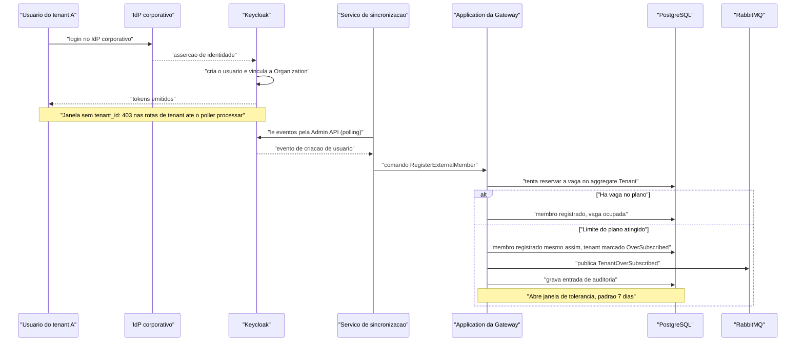

#### Passo a passo

1. **O usuário do tenant A faz login pelo IdP corporativo.** O Keycloak cria o usuário e o vincula à
   Organization (§9.4). A Gateway não foi consultada e não tinha como ser: exigir isso significaria um
   authenticator customizado em Java chamando a Gateway durante o login — o que derrubaria o ADR-002
   junto com o ADR-004.
2. **O serviço de sincronização lê o evento e dispara o comando `RegisterExternalMember`** (§9.4, ADR-007).
   A latência é igual ao intervalo de polling.
3. **A Application tenta reservar a vaga no aggregate `Tenant`.**
4. **Se o limite do plano foi atingido, o membro é registrado assim mesmo**, o tenant é marcado
   `OverSubscribed`, o evento `TenantOverSubscribed` é publicado e uma entrada de auditoria é gerada (§9.4).
5. **Esta é a exceção declarada ao Princípio 4 (fail closed).** A spec a nomeia explicitamente, em dois
   lugares (§Princípio 4 e §9.4). O raciocínio: *o usuário já foi autenticado pelo IdP do cliente; recusar
   o registro criaria um usuário autenticado sem membership, pior que o excesso.* É também a única via pela
   qual `OccupiedSeats` pode exceder `Plan.MaxUsers` (§6.1).
6. **O limite volta a valer por tolerância, não por bloqueio.** `TenantOverSubscribed` abre uma janela
   configurável — padrão 7 dias — registrada no tenant. Vencida a janela sem que o plano seja ajustado nem
   membros desativados, os excedentes são desabilitados via `SetUserEnabledAsync`, por ordem de entrada, o
   mais recente primeiro (§9.4). Sem esse fecho, "detectamos e não fazemos nada" deixaria o plano sem
   efeito para qualquer tenant com federação — justamente o perfil de cliente maior.
7. **A janela sem `tenant_id`.** Entre o login e o processamento do evento pelo poller, o usuário recebe
   **403 nas rotas de tenant** (§12.2, §19). Ele está autenticado, mas ainda não é ninguém para a
   governança. É um limite conhecido e declarado, não um bug.

#### Pontos de falha e comportamento esperado

| Dependência que cai | O que acontece |
|---|---|
| **A Gateway / o poller** | **O login continua acontecendo** e o usuário continua sendo criado no Keycloak. Os eventos se acumulam. Ao voltar, o poller relê a partir do checkpoint e absorve o atraso. |
| **O poller parado tempo demais** | Risco real e declarado: se ficar parado mais que o `eventsExpiration` do realm, **os eventos do intervalo deixam de existir** (ADR-007, §19). A sincronização é at-least-once **com perda possível sob downtime prolongado**. Por isso um alarme dispara quando `now - checkpoint > eventsExpiration × 0,5` (§14, §19). |
| **Entrega duplicada de evento** | Os eventos da Admin API não têm identificador estável, então a dedup é por **tupla** (`time`, `type`, `userId`, `clientId`, hash dos `details`) persistida numa janela móvel. O checkpoint avança por timestamp com **sobreposição deliberada**: relê os últimos N segundos e descarta repetições — trocando reprocesso por não-perda (ADR-007). Como rede final, `(TenantId, ExternalUserId)` é único no banco. |
| **Várias réplicas da API rodando** | O poller e o job de reconciliação tomam `pg_try_advisory_lock` antes de rodar (ADR-007). Sem isso, N réplicas processariam os mesmos eventos em paralelo. |
| **RabbitMQ** | `TenantOverSubscribed` fica no Outbox e é publicado depois. A contagem e a auditoria já foram gravadas no banco. |

---

### Fluxo 9.5 — Desativação e exclusão de membro

**Quando acontece:** um funcionário sai da empresa cliente (desativação), ou exerce o direito ao
esquecimento previsto na LGPD art. 18 (exclusão).

**Por que importa:** é onde a arquitetura stateless cobra seu preço, e onde a spec se recusa a fingir que
não cobra. Desabilitar um usuário **não** invalida o que já foi emitido.

**Atores e sistemas:** tenant-admin · IdentityGateway · PostgreSQL · Keycloak · APIs consumidoras.

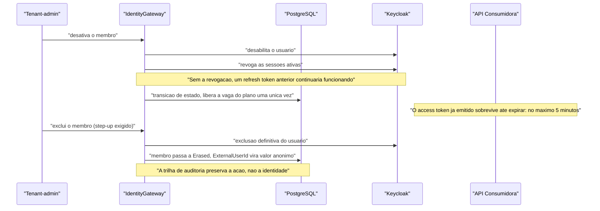

#### Passo a passo

**Desativar:**

1. **A Gateway desabilita o usuário no Keycloak e revoga suas sessões ativas** (§9.5). Os dois passos são
   necessários: sem a revogação, um refresh token emitido antes continuaria funcionando, e o usuário
   "desativado" renovaria acesso indefinidamente.
2. **A vaga do plano é liberada — uma vez só**, como consequência da transição efetiva de estado (§6.1).
   A ressalva "uma vez só" existe porque desativar duas vezes não pode liberar duas vagas.

**Excluir (direito ao esquecimento):**

3. **Exclusão definitiva no Keycloak.** Os dados pessoais moram lá (§6), então é lá que a remoção acontece.
4. **Na Gateway, o membro passa a `Erased` e o `ExternalUserId` é substituído por um valor anônimo** (§9.5).
   A trilha de auditoria preserva **a ação, não a identidade**: continua sendo possível saber que alguém foi
   removido, sem saber quem.
5. **A operação exige step-up** (§10.1): é destrutiva e pede `acr` de nível elevado.

#### Duas janelas que a revogação não fecha (§9.5, §19)

1. **Offline tokens.** `POST .../users/{id}/logout` remove sessões online, mas **não** sessões offline. Como
   `offline_access` integra o `default-roles` de todo usuário do realm por padrão, qualquer usuário que
   tenha obtido um offline token continuaria renovando acesso depois da "revogação". Por isso o realm de
   bootstrap **remove `offline_access` do `default-roles`** (§15): o projeto não usa offline tokens, e
   mantê-los ligados anularia a desativação.
2. **Access token já emitido.** Ele sobrevive até expirar — no máximo 5 minutos. É o preço da validação
   stateless do ADR-002, e **não há como encurtá-lo sem reintroduzir verificação remota por requisição**
   (§9.5). É um trade-off assumido, não um descuido.

#### Pontos de falha e comportamento esperado

| Dependência que cai | O que acontece |
|---|---|
| **O Keycloak** | A desativação **não se completa** — e é justamente aqui que fail closed (§Princípio 4) manda negar: "dependência indisponível em operação sensível" é um dos casos nomeados. A operação falha visivelmente em vez de gravar no banco um estado que o Keycloak desconhece. |
| **PostgreSQL** | O estado de governança não muda. Se o usuário já foi desabilitado no Keycloak, há divergência temporária — endereçada pela reconciliação (ADR-006). |
| **A Gateway** | O tenant-admin não consegue desativar ninguém enquanto ela estiver fora. Não há caminho alternativo: a governança é toda dela. |
| **RabbitMQ** | `MemberDeactivated` espera no Outbox. As APIs consumidoras demoram mais a invalidar cache, mas a desabilitação no Keycloak já valeu. |

---

### Fluxo 9.7 — Suspensão e reativação de tenant

**Quando acontece:** um cliente fica inadimplente, ou há uma violação contratual que exige cortar o acesso
sem encerrar o contrato.

**Por que importa:** é o fluxo que demonstra melhor a consequência do ADR-002. Numa arquitetura em que a
Gateway validasse cada requisição, suspender seria uma flag no banco. Aqui **não é** — e a spec explica com
todas as letras por que não pode ser.

**Atores e sistemas:** platform-admin · IdentityGateway · PostgreSQL · RabbitMQ · consumidor de suspensão ·
Keycloak.

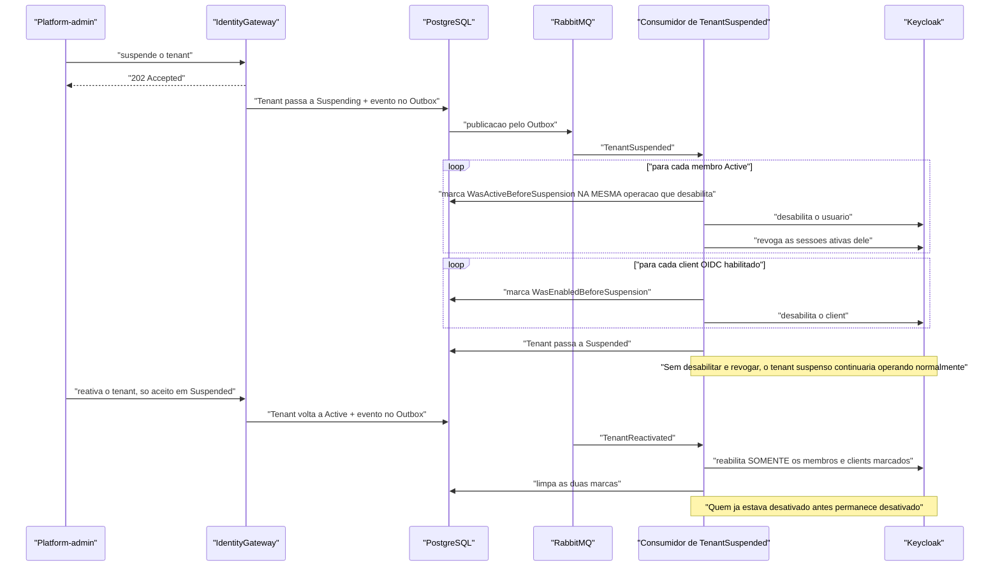

#### Passo a passo

1. **Suspender não é uma flag no banco da Gateway** (§9.7). Essa é a frase-chave do fluxo.
2. **O `POST .../suspend` responde `202` e marca `Suspending`** (§6.2). O efeito no Keycloak vem depois, pelo
   consumidor. O estado de passagem existe para que o `GET` do tenant tenha o que reportar nessa janela — e
   **a reativação é recusada com `409` enquanto ele durar**: só se reativa uma suspensão concluída.
3. **O consumidor percorre membro a membro** e, para cada um que esteja `Active`:
   1. marca `WasActiveBeforeSuspension` **na mesma operação** que o desabilita;
   2. desabilita o usuário no Keycloak;
   3. revoga as sessões ativas dele.
4. **A marca é gravada por membro, nunca em lote prévio** (§9.7, L-3). Marcar todos os `Active` numa passada
   e só depois desabilitá-los cria uma janela em que um consumidor interrompido deixa membros marcados que
   nunca foram desabilitados — e a reativação, lendo a marca, restauraria gente que continuou ativa o tempo
   todo. Gravando marca e desabilitação juntas, um consumidor que cai **retoma de onde parou**: reprocessar
   um membro já tratado é no-op, porque ele não está mais `Active`. É a operação **idempotente e retomável**
   que fecha o antigo L-3.
5. **Em seguida vêm os clients OIDC** (§9.7.1), com a marca espelhada `WasEnabledBeforeSuspension` gravada
   pelo mesmo critério por-client. Sem esse passo a suspensão teria um furo exatamente no canal que não
   depende de pessoa: um client M2M `Confidential` continuaria obtendo tokens por Client Credentials direto
   no Keycloak, e as Resource APIs os validariam localmente sem nada que os alcançasse (ADR-002). Um tenant
   inadimplente seguiria com suas integrações de máquina operando normalmente. Concluído tudo, o tenant passa
   a `Suspended`.
6. **Por que desabilitar e revogar são indispensáveis.** Sem eles, os usuários do tenant suspenso continuariam
   logando e usando as Resource APIs normalmente — o token é emitido pelo Keycloak e validado localmente
   (ADR-002), e **nada na suspensão o alcançaria** (§9.7). Um tenant inadimplente suspenso seguiria
   operando, o que esvaziaria o sentido da operação.
7. **As marcas existem para tornar a reativação correta.** A reativação reabilita **apenas** os membros com
   `WasActiveBeforeSuspension = true` e os clients com `WasEnabledBeforeSuspension = true`, e limpa as duas
   ao final, sem ressuscitar quem já estava desativado individualmente antes da suspensão (§9.7). Sem esse
   registro, reativar um tenant devolveria acesso a pessoas que a empresa já havia desligado.
8. **O estado `Suspended` é o único caminho para `Terminated`** (§6.2), o que impede o encerramento
   acidental de um tenant em operação.

#### Pontos de falha e comportamento esperado

| Dependência que cai | O que acontece |
|---|---|
| **O Keycloak** (durante o consumo) | A suspensão fica **parcialmente aplicada**: o tenant permanece em `Suspending`, com parte dos membros e clients ainda habilitados. O consumidor faz retry; a reconciliação (ADR-006) é a rede. É um risco real — o efeito de negócio da suspensão depende do Keycloak estar de pé. Como o tenant não chegou a `Suspended`, **a reativação é recusada com `409`** e ninguém restaura um estado pela metade. |
| **RabbitMQ** | O evento espera no Outbox. O tenant está marcado `Suspending`, mas o efeito real só chega quando o broker volta. |
| **A Gateway cai no meio da desabilitação em massa** | Alguns membros e clients desabilitados, outros não — e **nenhuma marca órfã**, porque marca e desabilitação são gravadas juntas (L-3). A entrega do evento se repete e o percurso **retoma de onde parou**: reprocessar quem já não está `Active` é no-op. |
| **Tokens já emitidos** | Sobrevivem até 5 minutos, como em 9.5 — tanto os de membro quanto os de **client M2M** (§19). Desabilitar impede a **emissão**, não o uso do que já circula. A suspensão não é instantânea; é *quase* instantânea. |

---

### Fluxo 9.8 — Encerramento de tenant

**Quando acontece:** o contrato com um cliente termina. É o cenário em que a LGPD costuma ser invocada em
escala — não um titular, mas a relação inteira.

**Por que importa:** fecha a simetria de compliance. A §9.5 dá direito ao esquecimento **por membro**; esta
seção permite encerrar **um cliente inteiro**. E é um dos poucos fluxos que a spec declara **irreversível**.

**Atores e sistemas:** platform-admin (com step-up) · IdentityGateway · PostgreSQL · RabbitMQ · consumidor
· Keycloak.

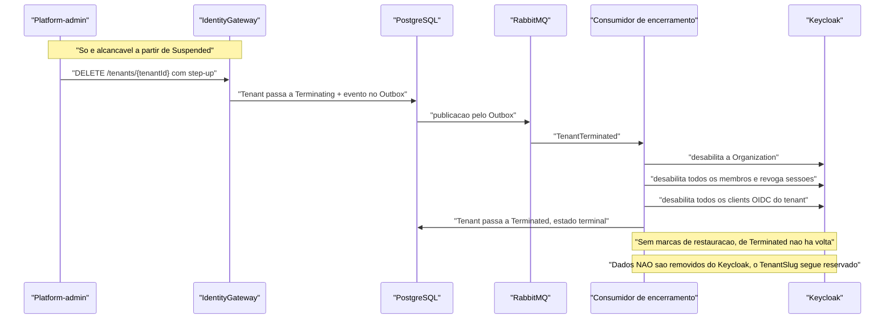

#### Passo a passo

1. **`DELETE /tenants/{tenantId}` exige `platform-admin` **e** step-up** (§9.8, §10.1). É a operação mais
   destrutiva da API; reautenticação forte é o mínimo.
2. **Só é alcançável a partir de `Suspended`** (§6.2, §9.8). Não existe encerrar um tenant em operação num
   único clique: é preciso suspendê-lo antes, o que dá uma etapa de reversão de fato.
3. **O tenant passa a `Terminating` e o evento vai para o Outbox** — mesmo desenho de 9.1, na direção
   inversa (§9.8).
4. **O consumidor desabilita a Organization, todos os membros (revogando sessões) e todos os clients OIDC do
   tenant** (§9.8), pelo mesmo percurso idempotente e retomável da §9.7 — incluindo os clients, pelo mesmo
   motivo da §9.7.1: um encerramento que deixasse integrações de máquina de pé não teria encerrado nada.
5. **O encerramento não grava marcas de restauração** (§9.8). `WasActiveBeforeSuspension` e
   `WasEnabledBeforeSuspension` só existem para a reativação, e de `Terminated` não há volta.
6. **O tenant passa a `Terminated`, estado terminal** (§6.2). Não há transição de saída.
7. **O encerramento não remove dados do Keycloak** (§9.8). A remoção física da Organization e dos usuários é
   operação administrativa **fora da API**. O motivo declarado: removê-la aqui agravaria a correlação
   idempotente (§11.6) e a reconciliação bidirecional (§9.1) em troca de pouco.
8. **O `TenantSlug` permanece reservado**, pois é imutável e único (§9.8). Um novo cliente não pode reusar
   o slug de um encerrado — o que evita que histórico e auditoria se confundam.

#### Pontos de falha e comportamento esperado

| Dependência que cai | O que acontece |
|---|---|
| **O Keycloak** | O tenant fica em `Terminating` — um estado intermediário visível, não um limbo. O consumidor faz retry; a reconciliação detecta a divergência. |
| **RabbitMQ** | O evento espera no Outbox. O tenant está `Terminating`, os usuários ainda ativos. Atraso, não perda. |
| **A Gateway cai no meio** | Reprocessamento idempotente ao voltar: desabilitar o que já está desabilitado é inócuo. |
| **Reversão** | Não há. `Terminated` é terminal (§6.2) e o slug fica reservado. Por isso o step-up e o pré-requisito `Suspended`. |

---

### Fluxo 9.9 — Ciclo de vida do convite

**Quando acontece:** toda vez que um tenant-admin dá acesso a uma pessoa — e em cada um dos quatro
desfechos possíveis desse convite.

**Por que importa:** porque `Invited` **já ocupa vaga do plano** (§6.1, decisão 2 do brainstorm). Essa
única escolha transforma a expiração de convite em requisito, não em conveniência: sem ela, um convite
nunca aceito prenderia uma vaga paga para sempre. Todo o resto do fluxo — o job, o prazo, o reenvio, o
cancelamento — decorre daí.

**Atores e sistemas:** tenant-admin · pessoa convidada · IdentityGateway · job de expiração · Keycloak.

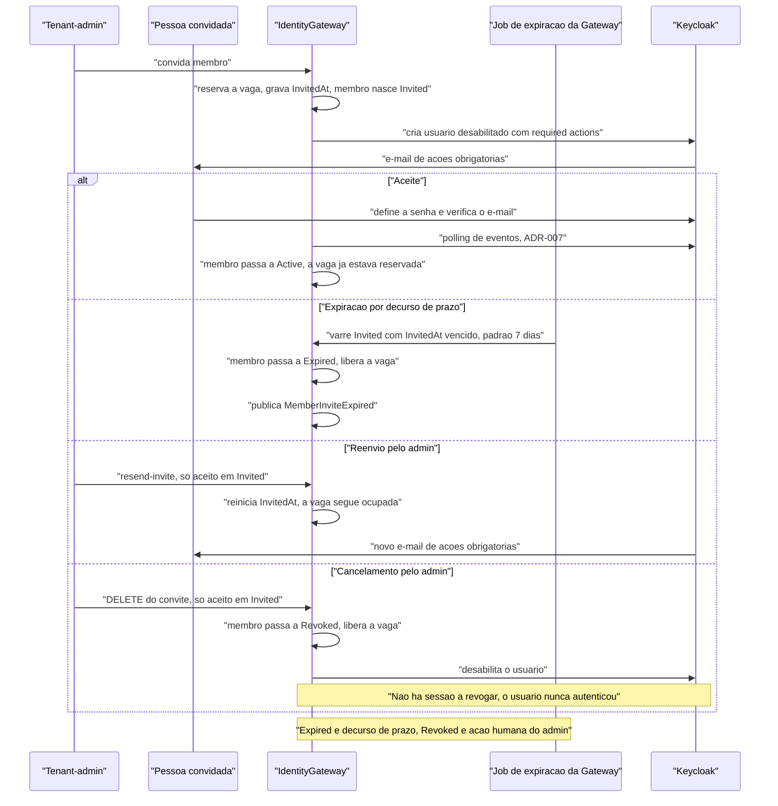

#### Passo a passo

1. **O convite reserva a vaga na hora** (§9.9, §6.1). `POST /tenants/{tenantId}/members` cria o usuário no
   Keycloak **desabilitado**, com as *required actions* `UPDATE_PASSWORD` e `VERIFY_EMAIL`, dispara o e-mail
   e grava `InvitedAt`. Reservar só na ativação permitiria que N convites simultâneos estourassem o plano no
   aceite — e o aceite chega pelo polling do ADR-007, tarde demais para recusar.
2. **O aceite não cria reserva nova.** A pessoa define a senha no Keycloak, o evento chega pela sincronização
   do ADR-007 e o membro passa a `Active`. A vaga apenas deixa de ser provisória. É exatamente por isso que
   **o aceite não pode falhar por limite de plano** (§6.1) — o que seria péssimo: a pessoa já recebeu o
   convite, já escolheu a senha, e o erro apareceria no pior momento possível.
3. **A expiração roda por job da Gateway** (§9.9, RN-027). O job varre os membros `Invited` cujo `InvitedAt`
   excedeu o prazo, transiciona para `Expired`, libera a vaga e publica `MemberInviteExpired`. O prazo é
   **configurável por tenant, com padrão de 7 dias**.
4. **O prazo precisa estar alinhado ao link do Keycloak.** Um link de ações ainda válido para um membro já
   `Expired` produziria um aceite sem vaga reservada — a pessoa entraria por uma porta que a Gateway já
   fechou no contador.
5. **Por que o job vive na Gateway, e não no Keycloak** (§9.9). Quem libera a vaga tem de ser quem controla o
   contador. Derivar a expiração de um evento do Keycloak amarraria uma regra de plano à configuração de
   realm e dependeria do polling do ADR-007 — tarde demais, pelo mesmo motivo do passo 1.
6. **O reenvio reinicia `InvitedAt`** (§9.9, F-08). Redispara o e-mail e prorroga a vaga já ocupada; só é
   aceito em `Invited`. É o ticket de suporte mais comum de qualquer plataforma multi-tenant (N7), e existe
   por necessidade do modelo de vagas, não como conveniência.
7. **O cancelamento leva a `Revoked`** (§9.9, I-2), libera a vaga e desabilita o usuário no Keycloak. Só é
   aceito em `Invited`.
8. **Os três desfechos sem aceite são distintos.** `Expired` é decurso de prazo, `Revoked` é ação humana
   deliberada do administrador, e `Erased` é apagamento LGPD com anonimização do `ExternalUserId` (§9.5).
   De `Expired` e de `Revoked`, um novo convite é um **novo membro**, com nova reserva de vaga; ambos
   admitem exclusão definitiva, que os leva a `Erased`.

#### Pontos de falha e comportamento esperado

| Dependência que cai | O que acontece |
|---|---|
| **O Keycloak** (no convite) | O convite não se completa: o usuário não é criado e o e-mail não sai. A vaga reservada é liberada pela transição efetiva, e o job de reconciliação de vagas (§9.1) é a rede contra divergência de contador. |
| **O e-mail nunca chega** | É o caso mais comum, e tem resposta de produto: o **reenvio** (F-08), que reinicia o prazo sem consumir uma segunda vaga. |
| **O job de expiração fica parado** | Convites vencidos continuam ocupando vaga até o job voltar. É atraso, não perda: a varredura é por `InvitedAt`, não por agendamento individual, então uma execução tardia recupera todo o acúmulo de uma vez. |
| **Aceite e expiração concorrem** | A transição é de estado: quem chegar primeiro vence, e o outro caminho vira no-op porque o membro já não está `Invited`. Se o aceite perder, a pessoa encontra um link vencido e o admin reconvida — um **novo membro**, com nova vaga. |

---

### Fluxo 9.6 — Permissões finas numa API consumidora

**Quando acontece:** a cada requisição de negócio que exige uma permissão específica do tenant — aprovar
uma fatura, por exemplo — e não apenas um papel global.

**Por que importa:** é o **único** ponto em que o Data Plane toca a Gateway (§2.1, seta 6). Entender este
fluxo é entender exatamente qual é o raio de impacto da queda da Gateway.

**Atores e sistemas:** aplicação cliente · API consumidora (com a biblioteca
`IdentityGateway.Client.AspNetCore`) · cache local · IdentityGateway · RabbitMQ.

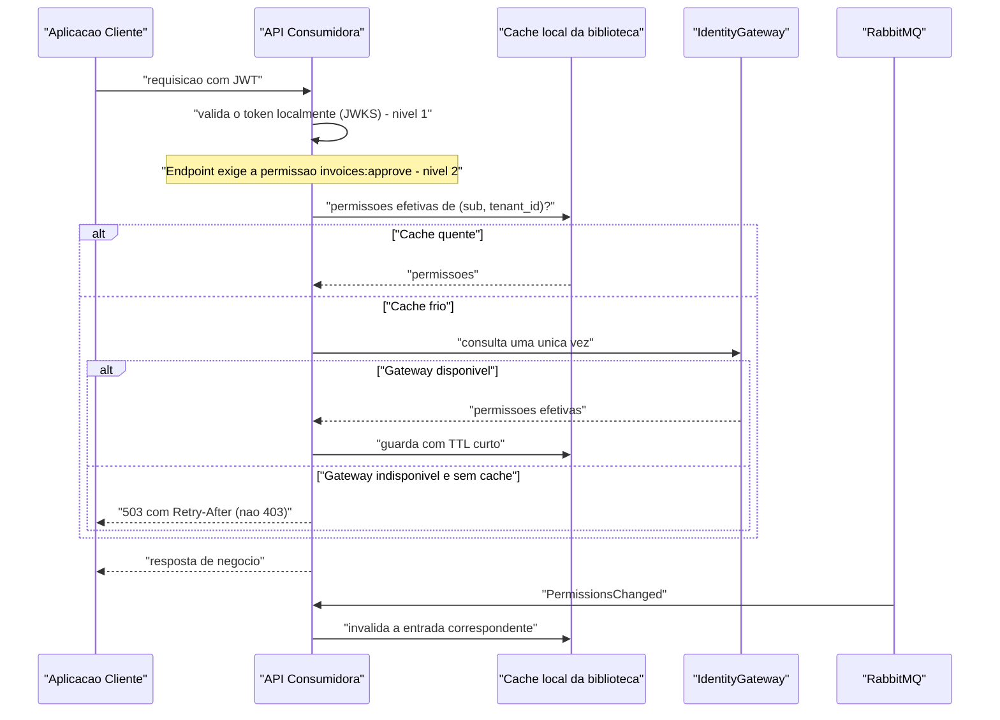

#### Passo a passo

1. **A requisição chega com o JWT, que é validado localmente** com as chaves públicas do Keycloak (§9.6,
   §2.1 seta 5). Nenhuma chamada à Gateway acontece aqui — este é o nível 1.
2. **O endpoint exige a permissão `invoices:approve`** — uma permissão fina, definida pelo tenant, que não
   está no token (ADR-005). O token carrega apenas `tenant_id` e um catálogo pequeno e fixo de papéis.
3. **A biblioteca cliente busca as permissões efetivas de (`sub`, `tenant_id`) no cache local.** Sem
   entrada, consulta a Gateway **uma vez** e guarda o resultado com TTL curto (§9.6).
4. **O evento `PermissionsChanged`, recebido via RabbitMQ, invalida a entrada correspondente** (§9.6). É o
   que reduz a janela de revogação do TTL para praticamente zero no caminho feliz.
5. **Se a Gateway estiver indisponível e não houver cache, a decisão é negar** — fail closed (§Princípio 4)
   — **mas a resposta é `503` com `Retry-After`, não `403`** (§9.6).
6. **Por que 503 e não 403.** A spec argumenta: responder 403 a uma falha de dependência faz o sintoma
   apontar para o lugar errado. O usuário lê "você não tem permissão", o suporte investiga papéis e o
   plantão procura uma mudança de autorização que não houve. O **503 distingue *"negado"* de *"não sei"***,
   e permite retry do cliente (§9.6). É uma decisão de diagnosticabilidade, não de segurança — em ambos os
   casos o acesso é negado.
7. **Duas mitigações reduzem a frequência do cenário** (§9.6):
   - **stale-while-revalidate:** o pacote cliente serve cache vencido enquanto a Gateway está fora, com teto
     de idade configurável;
   - **warm-up:** a Resource API só entra em rotação — health `ready` — depois de falar com a Gateway ao
     menos uma vez. Sem isso, cada instância nova entraria servindo 503 até aquecer, e um deploy coordenado
     transformaria isso em indisponibilidade de todos os endpoints de nível 2 por alguns segundos.
8. **O acesso é feito com um client de plataforma** (§10.1): a Resource API serve todos os tenants, então
   sua credencial tem acesso irrestrito por desenho — compensado por `private_key_jwt` obrigatório e
   **auditoria por chamada**.

#### Pontos de falha e comportamento esperado

| Dependência que cai | O que acontece |
|---|---|
| **A Gateway, com cache quente** | **Nada.** As permissões são servidas do cache local. |
| **A Gateway, com cache vencido** | Servido em modo stale enquanto estiver dentro do teto de idade configurado. Degradação silenciosa e limitada. |
| **A Gateway, com cache frio** | **503 com `Retry-After`.** Fail closed (§Princípio 4), com diagnóstico honesto. Endpoints de nível 1 — que dependem só de papéis globais — **seguem funcionando** (§19). |
| **RabbitMQ** | O evento `PermissionsChanged` não chega; a invalidação passa a depender do TTL. Janela de atraso igual ao TTL do cache (§19). |
| **O Keycloak** | A validação do nível 1 segue enquanto o JWKS em cache for válido e o token estiver vivo. Passados 5 minutos, nada mais é autorizado — ver a seção sobre a queda do Keycloak. |

---

### O que acontece quando a Gateway cai

Esta é a pergunta que o desenho inteiro foi feito para responder bem — e ele responde bem, dentro de um
limite que a spec delimita com precisão.

**Continua funcionando:**

- **Todos os logins interativos.** O usuário digita a senha no Keycloak e recebe os tokens do Keycloak
  (§2.1, seta 2). O discovery deixa de responder, mas o redirecionamento por domínio do recurso
  Organizations cobre o caso interativo (§9.2, ADR-001).
- **Toda a comunicação M2M já provisionada.** Os clients existentes continuam obtendo tokens do Keycloak e
  chamando as APIs (§9.3).
- **Todas as requisições de negócio que dependem apenas de papéis globais** — o nível 1. A validação é
  local, com JWKS em cache (§2.1, §19).
- **Permissões finas com cache quente**, e com cache vencido dentro do teto de stale-while-revalidate (§9.6).

**Para de funcionar:**

- **Toda a gestão:** criar tenants, convidar membros, desativar usuários, suspender clientes, registrar
  clients M2M, alterar permission sets. O Control Plane é a Gateway; sem ela não há governança.
- **Permissões finas com cache frio:** `503` com `Retry-After` (§9.6). É fail closed com diagnóstico
  correto, mas é indisponibilidade real para o endpoint afetado.
- **A sincronização Keycloak → Gateway.** Usuários continuam nascendo por federação; os eventos se
  acumulam. Se o poller ficar parado além do `eventsExpiration` do realm, **há perda de eventos** — limite
  declarado no ADR-007 e na §19, sinalizado por alarme.

**Em uma frase de negócio:** com a Gateway fora, *ninguém é barrado de entrar e quase ninguém é barrado de
trabalhar, mas ninguém administra nada*. O impacto é de administração, não de operação — com a exceção
nomeada do cache frio.

---

### O que acontece quando o Keycloak cai

Aqui a resposta é desconfortável, e a especificação escolhe dizê-la em vez de escondê-la.

> **"O ponto único de falha não foi eliminado, foi deslocado."** (§2.1)

**Imediatamente:**

- **Nenhum login acontece.** Nem interativo, nem federado, nem M2M. O Keycloak é o único emissor de tokens
  (Princípio 3).
- **Nenhum token é renovado.** Refresh tokens não podem ser trocados.
- **Nenhuma operação de governança que toque o Keycloak se completa** — desativar membro, suspender tenant,
  provisionar tenant. A Gateway grava seu lado e espera; o efeito real fica pendente.

**Passados até 5 minutos:**

- **O Data Plane inteiro para.** Decorrido o tempo de vida do access token, nenhuma requisição de negócio é
  autorizada, porque **a validação local depende de token vivo, não de Keycloak vivo** (§2.1, §19). Os
  tokens em circulação expiram e não há como obter novos.

**Por que isso não é uma falha do ADR-002.** O ADR-002 tem um objetivo declarado e limitado: remover a
Gateway do caminho crítico, para que ela não seja um **ponto único de falha adicional**. Ele cumpre isso.
O que ele explicitamente **não** promete é tornar o sistema resiliente à queda do Keycloak, que permanece
dependência crítica dos dois caminhos (§2.1, ADR-002).

**O agravante declarado:** **o Keycloak roda em instância única** no ambiente local; clustering e multi-site
ficam documentados, não implementados (§19). A revisão crítica registra isso como contradição interna
(CI-3): "sem ponto único de falha" convive com Keycloak em instância única.

**Em uma frase de negócio:** com o Keycloak fora, *a plataforma tem cinco minutos de inércia e depois para
por completo*. É o risco concentrado da arquitetura, e mitigá-lo é trabalho de infraestrutura — alta
disponibilidade do Keycloak —, não de redesenho da Gateway.

---

### Consistência eventual: por que Outbox, o que se vê na janela, e como fecha

#### O problema que o Outbox resolve

Criar um tenant significa escrever em dois sistemas: o banco da Gateway e o Keycloak. **A Admin API do
Keycloak não é transacional** (ADR-006). Não existe "commit nos dois ou em nenhum".

Sem Outbox, restariam duas opções, ambas ruins:

- **Chamar o Keycloak antes de gravar:** se a gravação falhar, sobra uma Organization órfã que ninguém
  conhece.
- **Gravar antes e chamar o Keycloak depois, fora da transação:** se o processo cair entre os dois, sobra um
  tenant que o Keycloak desconhece — e ninguém fica sabendo.

**A solução do ADR-006:** o comando grava o aggregate em estado `Pending` **e** o evento no Outbox do
MassTransit **na mesma transação**. Um consumidor executa o provisionamento em passos idempotentes
("garanta que existe"). Um job periódico reconcilia divergências entre os dois lados.

O ganho é que o dual-write vira um single-write. O preço é a consistência eventual: existe uma janela em que
o tenant existe na Gateway e ainda não existe no Keycloak.

#### O que o usuário percebe durante a janela

| Situação | O que se vê |
|---|---|
| **Criação de tenant** | `202 Accepted` em vez de `201 Created`, com um `Location` apontando para o recurso de status (ADR-006). O tenant aparece como `Pending` até o provisionamento fechar. A API não mente dizendo que está pronto. |
| **Provisionamento falhando** | O tenant vai para `ProvisioningFailed` após esgotar os retries, e o evento fica disponível para retry manual (§9.1). Estado explícito, não limbo. |
| **Primeiro login federado** | Entre o login e o processamento pelo poller, o usuário está autenticado mas **recebe 403 nas rotas de tenant**, porque o `tenant_id` ainda não foi sincronizado (§12.2, §19). A latência é o intervalo de polling (ADR-007). |
| **Mudança de permissão fina** | Vale imediatamente quando o evento `PermissionsChanged` chega; se o evento se perder, a janela é o TTL do cache (§9.6, §19). |
| **Suspensão de tenant** | O tenant fica `Suspended` no banco antes de os usuários serem efetivamente desabilitados no Keycloak. Enquanto o consumidor não roda, eles continuam trabalhando (§9.7). |
| **Mudança de plano** | Reflete no token **no próximo refresh** (ADR-004), porque o claim `tier` vem de Protocol Mapper. |

#### Como a reconciliação fecha o ciclo

O Outbox garante **entrega**, não garante que o outro lado **aceitou**. O fecho é o job de reconciliação
(ADR-006, §9.1):

1. Compara periodicamente **todos os tenants em estado não terminal** — `Pending`, `ProvisioningFailed` e
   `Active` — com as Organizations existentes no Keycloak.
2. Compara também o **sentido inverso**: Organizations com `gateway_tenant_id` que não correspondem a nenhum
   tenant conhecido.
3. A correlação é feita pelo atributo `gateway_tenant_id` gravado em cada Organization (ADR-006, §11.6) —
   chave estável, escolhida pela Gateway, imune a rename de nome ou alias.
4. O job toma `pg_try_advisory_lock` antes de rodar, para que N réplicas da API não reconciliem em paralelo
   (ADR-007).
5. As divergências encontradas são expostas como métrica (§14).

**Por que varrer só `Active` não bastaria:** o órfão típico nasce **antes** da ativação — a Organization foi
criada e a gravação do id falhou (§9.1, ADR-006). Um job que olhasse apenas tenants ativos cobriria
exatamente o caso em que nada deu errado.

#### Uma leitura que precisa ficar clara

A revisão crítica tem dois achados sobre este fluxo, e eles são fáceis de interpretar mal:

- **C3** — o método `FindOrganizationByAliasAsync` **não existe** na Admin API: `GET /organizations` casa
  por nome ou domínio, não por alias. A consulta prévia e a recuperação pós-409 caíam junto. **A correção é
  o atributo `gateway_tenant_id`**, já incorporada na v2.1.
- **C4** — a proteção primária contra duplicatas (não fazer retry em POST) está **corretamente configurada**,
  mas a issue dotnet/extensions **#6708** relata que o retry acontece mesmo assim. A correção é fixar versão
  mínima, acompanhar a issue e escrever um teste de integração que **conta chamadas**.

**Nenhum dos dois é um argumento contra o Outbox.** A própria revisão registra isso de forma explícita: o
handler de registro não toca o Keycloak (INSERT + Outbox na mesma transação), o consumidor é fino, a
marcação de provisionado tem guarda de idempotência e o tratamento de conflito prevê entrega duplicada
concorrente. Nas palavras da revisão: *"o padrão está certo. C3 e C4 atacam a busca de que ele depende e o
retry do HTTP, não o Outbox. Quem ler C3/C4 isoladamente pode concluir que o ADR-006 está errado — não
está."*

A distinção é importante para quem avalia a arquitetura: **o desenho de consistência está correto; o que a
revisão encontrou foram dois mecanismos de apoio apoiados em premissas erradas sobre a API do Keycloak.**
Corrigir mecanismo é trabalho de implementação. Corrigir desenho seria outra coisa.

---

### Pontos que os fluxos deixavam subespecificados — e como fecharam

Percorrer a §9 na produção da v1.0 deste documento expôs três lacunas. Elas foram registradas em vez de
preenchidas por suposição, levadas ao ciclo seguinte e **estão fechadas na v2.2**:

1. **Efeito da suspensão sobre os clients do tenant (antigo L-1).** A suspensão e o encerramento agora
   desabilitam **também os clients OIDC**, com a marca `WasEnabledBeforeSuspension` espelhando a de membros
   (§9.7.1, §9.8). O que segue em aberto é o resto do ciclo de vida do client M2M — revogação e expiração de
   credencial fora do contexto de suspensão (§9.3).
2. **Ciclo de vida do convite (antigo L-2).** Ganhou fluxo próprio: convite, aceite, expiração por job da
   Gateway com prazo configurável (padrão 7 dias), reenvio que reinicia `InvitedAt` e cancelamento para
   `Revoked` (§9.9, Fluxo 9.9 acima).
3. **Suspensão parcial (antigo L-3).** A marca passou a ser gravada **por membro, na mesma operação que o
   desabilita**, o que torna a suspensão idempotente e retomável e elimina marcas órfãs. O estado
   `Suspending` fecha a ponta restante: reativar um tenant cuja suspensão ainda não concluiu responde `409`
   (§9.7, §6.2).

---

# Parte IV — Arquitetura e decisões

### Arquitetura em uma página

O **IdentityGateway** é uma API de governança de identidade multi-tenant construída sobre o Keycloak. A frase que resume o desenho inteiro cabe em uma linha: **a Gateway decide quem pode o quê, mas não participa de nenhum login e de nenhuma requisição de negócio**.

Isso produz dois planos com ciclos de vida independentes (§2, §3, princípio 2):

- **Control Plane — o IdentityGateway.** É onde a governança é *definida*: tenants, membros, papéis, conjuntos de permissões, domínios de e-mail, provedores de identidade federados e aplicações OIDC. Tudo é recurso REST versionado, documentado em OpenAPI. Não existe front-end no repositório (§1.1).
- **Data Plane — as APIs consumidoras.** É onde a governança é *executada*. Cada API de negócio valida o token localmente, com as chaves públicas do Keycloak, sem consultar ninguém. A biblioteca `IdentityGateway.Client.AspNetCore` empacota essa configuração para que cada equipe não tenha de redescobrir sozinha os detalhes do Keycloak (§12).

Em volta desses dois planos ficam quatro peças de infraestrutura:

| Peça | Papel |
|---|---|
| **Keycloak 26.x** | Único dono de credenciais e único emissor de tokens. Cada tenant é uma *Organization* dentro de um realm compartilhado (ADR-001) |
| **PostgreSQL** | Banco de governança da Gateway. Guarda vínculos e regras — **nunca** dados pessoais nem senhas (§6, §10.3) |
| **RabbitMQ** | Transporte dos eventos de integração publicados pelo Outbox, e canal de invalidação de cache de permissões (ADR-006, §9.6) |
| **`Client.AspNetCore`** | Pacote que as APIs consumidoras instalam: validação de token, resolução de permissões finas com cache e degradação controlada |

#### Diagrama de containers (C4 nível 2)

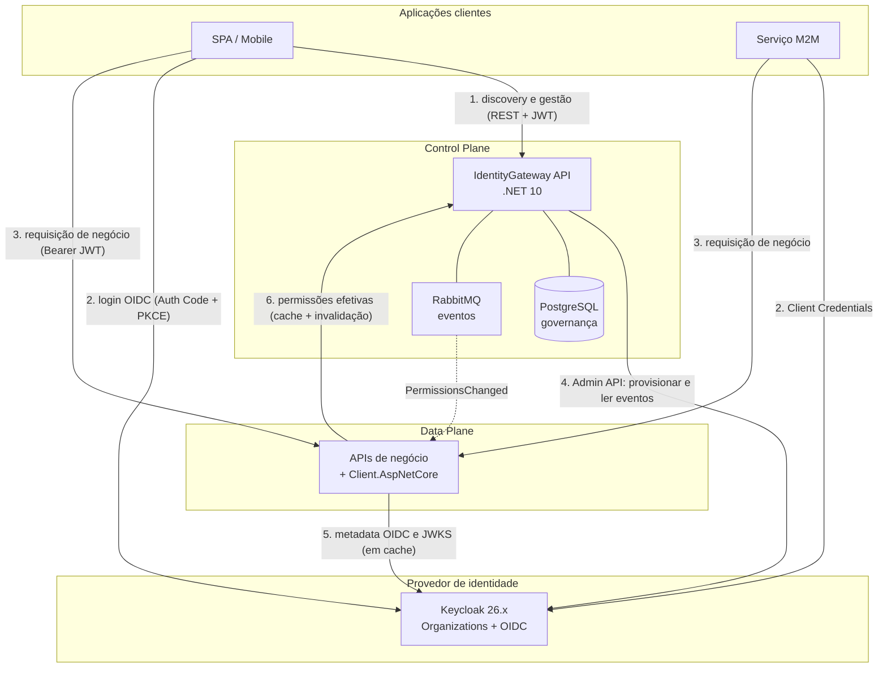

As setas **2** e **3** — login e tráfego de negócio — **não passam pela Gateway**. É essa ausência que o ADR-002 protege. A seta **6** existe, mas é por evento e por cache, nunca por requisição (§9.6).

**Um alerta de honestidade que a própria spec faz.** Tirar a Gateway do caminho crítico não elimina o ponto único de falha: ele foi **deslocado para o Keycloak** (§2.1). Com o Keycloak fora do ar, nenhum token novo é emitido e, passados os 5 minutos de vida do access token, o Data Plane inteiro para. A spec escreve isso em vez de esconder — e a revisão crítica registrou a versão anterior, que dizia "sem ponto único de falha", como contradição CI-3.

---

### As 9 decisões arquiteturais (ADRs) explicadas ao negócio

Cada ficha responde quatro perguntas: o que foi decidido, que problema isso resolve, o que foi recusado e **que preço estamos pagando por isso**. O último item é o que distingue uma decisão arquitetural de uma preferência técnica.

#### ADR-001 — Um realm compartilhado, cada tenant como *Organization*

| | |
|---|---|
| **Decisão** | Todos os tenants convivem num único realm `identity-gateway`; cada tenant é uma Organization do Keycloak 26+ |
| **Problema** | Isolar clientes uns dos outros sem multiplicar a infraestrutura de identidade por cliente |
| **Alternativa rejeitada** | Um realm dedicado por tenant — isolamento mais forte, mas cada tenant vira um emissor de token diferente, e toda API consumidora passaria a lidar com múltiplos *issuers* |
| **Custo aceito** | Política de senha, detecção de força bruta e rotação de refresh token são configuração **do realm**, logo iguais para todos os tenants (§19). Um cliente com exigência própria de compliance precisaria de realm dedicado |

A spec acrescenta uma observação comercialmente relevante: esse perfil de cliente normalmente usa IdP corporativo próprio, e aí a política de senha é dele, não deste realm.

#### ADR-002 — A Gateway fica fora da emissão e da validação de tokens · **decisão estruturante**

| | |
|---|---|
| **Decisão** | A Gateway orquestra (descobre o tenant, registra aplicações, provisiona credenciais), mas o token é obtido direto do Keycloak e validado localmente por cada API |
| **Problema** | "Autenticação centralizada" naturalmente empurra a Gateway para o meio de cada login e de cada requisição. Ali ela vira gargalo, latência e ponto único de falha do negócio inteiro |
| **Alternativa rejeitada** | A Gateway como intermediária do fluxo OIDC ou como serviço de introspecção chamado por requisição — o que a spec classifica como anti-pattern nº 2 (§17) |
| **Custo aceito** | A Gateway perde a capacidade de revogar um acesso instantaneamente: um access token já emitido sobrevive até expirar, no máximo 5 minutos (§9.5, §19). E permissões finas com cache frio ainda dependem dela (§9.6) |

Este é o ADR do qual todos os outros derivam. Vale notar o que ele **não** promete: ele remove a Gateway do caminho crítico, não torna o sistema resiliente à queda do Keycloak (§2.1).

#### ADR-003 — Nenhuma senha encosta na Gateway · **decisão de risco**

| | |
|---|---|
| **Decisão** | O fluxo ROPC (usuário e senha trafegando pela API) é proibido. Criar usuário não define senha: o Keycloak envia e-mail com ações obrigatórias (`UPDATE_PASSWORD`, `VERIFY_EMAIL`) |
| **Problema** | Uma API que recebe senhas herda todo o escopo de compliance e anula o MFA — o backend passa a ser um alvo com valor equivalente ao do IdP |
| **Alternativa rejeitada** | Um `POST /auth/login` "de conveniência" na Gateway. Rejeitado inclusive **no realm de testes** — e a revisão registrou isso como o ponto que faz a decisão valer, porque o ROPC costuma voltar pela porta dos testes |
| **Custo aceito** | Nenhum fluxo de login pode ser simplificado para demonstração; toda integração passa pelo Authorization Code com PKCE |

#### ADR-004 — Todo claim nasce no Keycloak, por Protocol Mapper

| | |
|---|---|
| **Decisão** | Nenhum claim é emitido ou assinado fora do Keycloak. Dados de negócio que precisam estar no token (`tenant_id`, `tier`) são sincronizados pela Gateway **como atributos**, e o Keycloak os publica |
| **Problema** | Assinar ou enriquecer tokens na Gateway a transformaria num segundo Authorization Server |
| **Alternativa rejeitada** | Um mapper customizado em Java que consultasse a Gateway durante a emissão do token. Isso criaria dependência de runtime **no login** e derrubaria o ADR-002 junto |
| **Custo aceito** | Mudança de plano só aparece no token no próximo refresh |

#### ADR-005 — Papéis globais no token, permissões finas na Gateway · **decisão de escala**

| | |
|---|---|
| **Decisão** | O token carrega apenas `tenant_id` e um catálogo pequeno e fixo de papéis (`platform-admin`, `tenant-admin`, `financial-manager`, `reader`). Permissões customizáveis por tenant (`invoices:approve`) vivem na Gateway, como *Permission Sets*, e são resolvidas com cache |
| **Problema** | Colocar permissão fina no token torna o token grande, custoso de revogar e acoplado ao catálogo de cada cliente |
| **Alternativa rejeitada** | Todas as permissões dentro do JWT — o que estoura limites de header e faz cada mudança de permissão exigir novo login |
| **Custo aceito** | Revogar uma permissão fina tem janela de atraso igual ao TTL do cache. Mitigado por um evento de invalidação (`PermissionsChanged`), não eliminado (§19) |

Em linguagem de negócio: **o que é estável e pequeno viaja no token; o que é customizável por cliente fica onde pode ser editado sem reemitir credenciais.**

#### ADR-006 — Consistência via Outbox, provisionamento idempotente e reconciliação · **decisão de confiabilidade**

| | |
|---|---|
| **Decisão** | Criar um tenant grava o registro em estado `Pending` **e** o evento na mesma transação do banco. Um consumidor executa o provisionamento no Keycloak em passos do tipo "garanta que existe". Um job periódico reconcilia divergências |
| **Problema** | A Admin API do Keycloak não é transacional. Criar um tenant toca dois sistemas, e não há transação distribuída entre eles |
| **Alternativa rejeitada** | Chamar o Keycloak dentro da transação do comando (anti-pattern nº 6, §17) — o que produziria tenants gravados sem Organization, ou Organizations sem tenant |
| **Custo aceito** | O endpoint responde `202 Accepted`, não `201`: o cliente recebe um recurso de status e acompanha o provisionamento. A consistência é eventual, por desenho |

O resultado demonstrável está no roadmap M1: derrubar o Keycloak, criar um tenant (responde `202` normalmente), subir o Keycloak de volta e ver o tenant virar `Active` sozinho (§16).

#### ADR-007 — Sincronização Keycloak → Gateway por leitura de eventos

| | |
|---|---|
| **Decisão** | Um serviço em segundo plano lê periodicamente os eventos do Keycloak pela Admin API e os converte em comandos |
| **Problema** | Usuários podem nascer **fora** da Gateway — no primeiro login via IdP corporativo do cliente — o que contornaria o limite de usuários do plano contratado |
| **Alternativa rejeitada** | Um *Event Listener SPI* em Java publicando direto no RabbitMQ. Ficou como evolução: manteria o projeto 100% .NET foi a escolha da v1 |
| **Custo aceito** | Latência de sincronização igual ao intervalo de polling, e **perda possível sob indisponibilidade prolongada**: se o poller parar por mais tempo que a retenção de eventos do realm, aqueles eventos deixam de existir. Um alarme dispara na metade dessa janela (§14, §19) |

#### ADR-008 — A integração com o Keycloak vive atrás de uma porta

| | |
|---|---|
| **Decisão** | O núcleo da aplicação conhece apenas a interface `IIdentityProvider`. Nenhum tipo do Keycloak atravessa essa fronteira, e um teste de arquitetura garante isso |
| **Problema** | Sem essa fronteira, trocar ou atualizar o IdP viraria refatoração do sistema inteiro |
| **Alternativa rejeitada** | Gerar o cliente completo da Admin API a partir do OpenAPI (Kiota) — rejeitada pelo volume de código gerado frente aos poucos endpoints realmente usados; revisável se a superfície crescer |
| **Custo aceito** | Cada endpoint novo do Keycloak precisa ser adicionado à mão |

#### ADR-009 — Na v1, um usuário pertence a um único tenant · **decisão com preço comercial declarado**

| | |
|---|---|
| **Decisão** | Cada usuário é membro de exatamente uma Organization |
| **Problema** | Múltiplos tenants por usuário tornariam o claim `tenant_id` ambíguo e exigiriam papéis por organização e seleção de organização no login |
| **Alternativa rejeitada** | Suporte a usuário multi-tenant desde a v1 |
| **Custo aceito — e é comercial, não técnico** | Um consultor que atende dois clientes precisa de **duas contas com e-mails diferentes**, e um MSP não consegue operar como um único usuário (§19) |

Este ADR sustenta duas peças diretamente: o `SameTenantRequirement`, cuja comparação é de **igualdade** — não de pertencimento a uma lista — e a decisão de escopo plano da v2.1: não há sub-tenancy, um tenant não possui "clientes de negócio" abaixo dele (§0). Evoluir aqui não é uma flag: exige reescrever a regra de isolamento.

---

### Divisão de responsabilidades: Keycloak × IdentityGateway

A fronteira é única e fácil de enunciar: **o Keycloak é dono de tudo que prova *quem você é*; a Gateway é dona de tudo que define *o que você pode* e *sob qual contrato*.**

| Assunto | Keycloak | IdentityGateway |
|---|---|---|
| **Credenciais** | Hash (Argon2/PBKDF2), expiração, reset, MFA/TOTP | **Nenhuma.** Nunca vê credencial de usuário |
| **Emissão de tokens** | Assina os JWT, faz rotação de refresh token | **Nenhuma.** Apenas provisiona as aplicações que pedem tokens |
| **Claims** | Protocol Mappers produzem `tenant_id`, `roles`, `tier` | Mantém sincronizados os atributos que alimentam esses mappers |
| **Tenants** | Organization, domínios e IdPs vinculados | Plano contratado, limites, status e ciclo de vida do tenant |
| **Usuários** | Perfil, dados pessoais, sessões | Vínculo (`sub`), status de governança, papéis e permission sets |
| **Permissões finas** | Nenhuma | **Fonte da verdade** dos Permission Sets por tenant |
| **Step-up (reautenticação forte)** | Executa o fluxo e emite o claim `acr` | **Define e verifica** que nível cada operação sensível exige |
| **Auditoria** | Eventos de login e administrativos | Trilha de auditoria de toda ação de governança |

*(§5)*

#### Por que a fronteira foi desenhada aqui

**Primeiro: reduzir o valor do alvo.** Dados pessoais — nome, e-mail, telefone — ficam no Keycloak. A Gateway guarda apenas o identificador do usuário (`sub`) e os dados de governança (§6). Um vazamento do banco da Gateway expõe vínculos e regras, não identidades nem credenciais. Isso também mantém o banco fora do escopo mais sensível de compliance LGPD (ADR-003).

**Segundo: não competir com o IdP.** Reimplementar hash de senha, MFA ou rotação de token é trabalho já resolvido pelo Keycloak, e mal resolvido custa caro. A Gateway assume o que o Keycloak **não** faz: o conceito de plano contratado, limite de vagas, ciclo de vida do tenant e permissões customizáveis por cliente.

**Terceiro: a fronteira precisa ser verificável, não apenas declarada.** O ADR-008 a converte numa interface, e um teste de arquitetura falha se um tipo do Keycloak aparecer fora da camada de infraestrutura. A separação não depende de disciplina.

Há uma assimetria deliberada no step-up: o Keycloak **executa** o fluxo de reautenticação, mas é a Gateway que **decide quais operações o exigem**. A v2.0 dizia em §5 que a Gateway apenas documentava o nível e em §10.1 que ela o exigia — a revisão registrou isso como contradição CI-4, e a v2.1 fechou a favor de "define e verifica", com um `StepUpRequirement` explícito.

---

### Modelo de segurança em linguagem de negócio

#### O que protege o quê

| Risco | Proteção |
|---|---|
| Vazamento de senha pela API | A Gateway nunca recebe uma (ADR-003). Não há o que vazar |
| Um cliente ler dados de outro | Três regras de isolamento independentes, cada uma com teste negativo (§3, princípio 5) |
| Um administrador se promover | `RoleAssignmentPolicy`: ninguém atribui papel acima do próprio, nem fora do próprio tenant (§6.3) |
| Operação destrutiva por sessão sequestrada | Step-up: exclusão de membro, rotação de credencial e encerramento de tenant exigem reautenticação forte (§10.1) |
| Enumeração de clientes pelo endpoint público | O discovery responde com formato idêntico para domínio desconhecido, sob rate limit restrito (§9.2) |
| Segredo de aplicação persistido indevidamente | O `client_secret` é devolvido **uma única vez** e nunca entra no store de idempotência, na auditoria ou no log (§10.3) |

#### Os dois níveis de validação

**Nível 1 — quem você é e que papel global tem.** Cada API de negócio valida o token localmente com as chaves públicas do Keycloak. Nenhuma chamada à Gateway. Se a Gateway estiver fora do ar, este nível continua funcionando integralmente (§2).

**Nível 2 — o que exatamente você pode fazer neste tenant.** As permissões finas vivem na Gateway. A API consumidora as busca **uma vez**, guarda em cache e recebe um evento quando mudam. Também aqui não há chamada por requisição (§9.6).

Quando o nível 2 não pode ser resolvido — Gateway fora do ar **e** cache frio — a resposta é **negar**, mas com `503 Retry-After`, não `403`. A spec explica a diferença em termos operacionais: 403 faz o usuário ler "você não tem permissão", o suporte investigar papéis e o plantão procurar uma mudança de autorização que nunca houve. **O 503 distingue "negado" de "não sei"** (§9.6). A versão anterior respondia 403; a revisão registrou isso como parte de C6.

#### Por que a Gateway nunca vê uma senha

Não é uma política de conduta — é uma consequência estrutural. O usuário digita a senha **na tela do Keycloak**, e o token volta direto para a aplicação cliente (§2). A Gateway não está nesse caminho: mesmo que alguém quisesse capturar uma credencial ali, não há ponto onde ela passe. O ROPC, único fluxo que colocaria a senha dentro da API, é o anti-pattern nº 1 (§17) e está proibido inclusive no realm de testes.

#### Como o isolamento multi-tenant é garantido — e verificado

São **três regras**, não uma (§3, princípio 5; §10.1):

1. **Tenant da rota × tenant do token.** O `SameTenantRequirement` compara o `{tenantId}` da URL com o claim `tenant_id` do token — e **nega explicitamente** (`context.Fail()`) em todo caminho de rejeição, inclusive quando o claim está ausente. A distinção importa: um requirement que apenas deixa de aprovar pode ser satisfeito por outro handler registrado; só a negação explícita sobrevive a uma aprovação alheia (§10.1, correção C11).

2. **Pertencimento de cada sub-recurso ao tenant da rota.** Membros, permission sets e aplicações são entidades próprias que *referenciam* o tenant. Verificar a rota não impede que um administrador do tenant A, operando numa rota de A, informe o id de um membro do tenant B. A regra: **todo repositório de sub-recurso expõe exclusivamente assinaturas que exigem o tenant** — `GetAsync(TenantId, MemberId)`, nunca `GetAsync(MemberId)`. A ausência da sobrecarga insegura é o que torna a regra verificável: não há como escrever o acesso errado por engano (§6.4). Um id de outro tenant resulta em **404, não 403** — responder 403 confirmaria a existência do recurso alheio.

3. **Escopo de aplicação M2M.** Um token de Client Credentials **não carrega `tenant_id`**, então o `SameTenantRequirement` não tem o que comparar. A v2.1 separa *client de tenant* (recebe o `tenant_id` de quem o criou, sujeito à regra 1) de *client de plataforma* (acesso irrestrito **por desenho**, porque é a credencial que as APIs de negócio usam para resolver permissões de qualquer tenant — e por isso exige `private_key_jwt` e **auditoria por chamada**) (§10.1, correção CI-1).

**O override do `platform-admin` é estreito e auditado** (§10.1, I-3). O provedor da plataforma precisa
enxergar a própria carteira de clientes, e para isso um segundo handler de autorização o dispensa da regra 1
— mas **apenas** em `GET /tenants` e `GET /tenants/{tenantId}`, e **em nenhuma rota interna do tenant**:
membros, clients, permission sets, domínios e IdPs permanecem inacessíveis a ele. Cada uso do override gera
entrada de auditoria.

O limite não é zelo excessivo: é o que sustenta a decisão de o tenant nascer com um administrador próprio.
Se o platform-admin pudesse operar **dentro** do tenant, `initialAdminEmail` perderia a razão de existir —
o argumento de C9 é precisamente que ele não satisfaz a verificação de tenant nas rotas de membros. Um
override amplo reintroduziria, pela porta dos fundos, a exceção de isolamento que a decisão 1 do brainstorm
eliminou.

**E a verificação.** Cada uma das três regras tem teste negativo correspondente, parametrizado a partir da tabela de rotas: token de A contra rota de B; token de A, rota de A, id de sub-recurso de B (esperando 404); e client de tenant tentando ler governança de outro tenant (§13). Há ainda um teste de *startup* que varre os endpoints registrados e falha se um endpoint com policy de tenant não tiver `{tenantId}` no template — o inverso do anterior (§13, correção C12).

O critério de pronto (§18) fecha o ciclo: uma funcionalidade só é considerada concluída quando tem **teste negativo para cada regra de isolamento que ela toca**. Não é "se a rota tiver `{tenantId}`" — essa formulação, que era a da v2.0, deixava passar sub-recursos, rotas sem `{tenantId}` e clients de plataforma. Essa mudança de uma linha é a história da próxima seção.

#### Como a própria Gateway prova quem é para o Keycloak (A9)

A Gateway também precisa se autenticar no Keycloak para executar as operações administrativas que faz em
nome dos tenants. Ela **não usa senha nem segredo compartilhado**: usa `private_key_jwt` (§10.2). Em
linguagem de negócio, a diferença é a mesma que separa uma chave copiável de uma assinatura: com
`client_secret`, o segredo trafega e qualquer cópia dele serve para se passar pela Gateway; com
`private_key_jwt`, a chave privada **nunca sai do cofre de segredos** — o que vai na rede é apenas uma prova
de posse, um documento curto assinado, válido por menos de um minuto e com identificador único que impede
reapresentação.

O mecanismo está especificado na §10.2 e usa o mesmo stack .NET já empregado na validação de tokens
(`JsonWebTokenHandler`), sem dependência adicional. Do lado do Keycloak, o client é configurado com **Signed
JWT** e a chave pública chega por JWKS publicado pela Gateway — o que permite **rotacionar a chave sem
downtime**, expondo as duas durante a janela de transição.

> **O erro mais comum tem nome e endereço.** O campo de destinatário da prova (`aud`) precisa apontar para o
> **token endpoint** do realm, **não para o issuer**. Trocar um pelo outro é o engano mais frequente nesta
> integração, e o Keycloak responde apenas `invalid_client`, sem dizer o que está errado — uma tarde inteira
> de depuração por um caractere de caminho. Por isso a §10.2 registra o ponto explicitamente e um teste de
> integração contra o Keycloak real cobre a obtenção de token por este caminho (§13). É o mesmo padrão de
> valor da §12.1: a armadilha de integração é resolvida uma vez, documentada, e protegida por teste.

---

### A história da revisão crítica — o diferencial do projeto

Esta é a parte do projeto que mais difícil de simular: a especificação v2.0 foi submetida a uma **revisão independente por três frentes** — negócio, arquitetura e adversarial — com a postura acordada de tratar os nove ADRs já fechados como **hipóteses a testar, não como premissas**.

O resultado: **33 achados** (14 críticos, 16 relevantes, 3 menores) e **8 contradições internas**. A v2.1 é a resposta a eles.

E o veredito mais importante: **nenhum ADR precisou ser revogado.** Todas as correções couberam dentro do desenho original (§0). Onde a spec caiu, caiu por **assumir comportamento do Keycloak** — não por erro de raciocínio arquitetural.

#### CI-8 — o critério de pronto era mais estreito que o princípio que deveria provar

Este é o achado mais elegante da revisão, e vale ser lido devagar.

O princípio 5 da spec dizia: *"**Toda regra** de isolamento tem um teste negativo correspondente."*
O critério de pronto da §18 dizia: *"teste negativo de autorização, **se a rota tiver `{tenantId}`**."*

O princípio quantifica sobre **regras**. O critério quantifica sobre **rotas com um determinado formato de URL**. São coisas diferentes — e a diferença é exatamente onde os vetores reais moravam: vínculo sub-recurso↔tenant (C2), rotas sem `{tenantId}` que operam sobre dados de tenant (C12) e escopo M2M (CI-1) **passavam no critério de pronto sem nenhum teste negativo**.

Nas palavras da revisão: *"O gate que o projeto exibe como prova do princípio 5 é mais estreito que o princípio, e é o gate que decide o que entra."*

A correção é **uma linha reescrita na §18**. E ela converte C2, C12 e CI-1 de "achados de revisão" — que dependem de alguém lembrar — em **falhas automáticas do critério de pronto**. A revisão a classificou como a correção de maior alcance de todo o trabalho.

A lição de negócio é transferível para qualquer projeto: **um gate mais estreito que o princípio que ele deveria provar é pior que nenhum gate, porque produz confiança** (§13).

#### C1 + C2 — a dupla que precisa ser corrigida junta

**C1: o claim `tenant_id` não existia.** A v2.0 afirmava que o `tenant_id` viria do mapper nativo de organização do Keycloak. Não vem. O mapper emite um claim chamado `organization`, cujo valor é um **objeto aninhado chaveado pelo alias** do tenant:

```json
{ "organization": { "acme-corp": { "id": "f8d3c4e1-...", "groups": [...] } } }
```

Pela regra que a **própria §12.1 da spec documenta com precisão**, um objeto aninhado vira um único claim com o JSON inteiro como valor. Logo `FindFirst("tenant_id")` retorna `null`, e a peça de isolamento entre tenants nunca aprovaria nada. A ironia é registrada na revisão: a spec explica a armadilha em detalhe e depois pisa nela no campo mais sensível.

O perigo não é o sintoma, é a **sequência de falha**. No dia 1, todas as rotas com `{tenantId}` retornam 403. O sintoma "tudo nega" força uma correção às pressas **no handler de isolamento, com a suíte vermelha** — a pior condição possível para editar esse código. As três correções intuitivas são todas mais rápidas de escrever que a certa, e a terceira é explorável: comparar por substring sobre o JSON bruto faz o slug `acme` casar dentro de `acme-corp` — **e o slug vem no corpo do `POST /tenants`**, bastando escolher um que seja prefixo de outro tenant.

A correção adotada (§12.2): `tenant_id` passa a ser um **atributo do usuário**, gravado pela Gateway e emitido por um *User Attribute mapper* plano — o mesmo mecanismo que o ADR-004 já previa para o `tier`.

**C2: IDOR por id de sub-recurso.** Verificar que a rota diz "tenant A" e o token diz "tenant A" não impede que o `{memberId}` na mesma rota seja de um membro do tenant B. GUIDs vazam — URL compartilhada, log, ticket de suporte. O cenário concreto da revisão: `DELETE /tenants/A/members/{memberId-do-tenant-B}`, que é **exclusão definitiva LGPD**, executada com sucesso.

O agravante é o mesmo padrão de CI-8: a suíte da v2.0 testava "token de A → rota de B", o vetor **que já estava protegido**. Ela ficaria verde enquanto o vetor exposto passava. *"O teste que o projeto exibe como principal prova de isolamento valida o caso coberto e ignora o exposto."*

**Por que os dois andam juntos.** Enquanto C1 não é corrigido, o sistema nega tudo — e essa negação indiscriminada mascara C2. **Corrigir C1 isoladamente reabre o sistema com o IDOR de sub-recurso ativo.** A revisão marca o sequenciamento explicitamente: os dois, juntos, antes do marco M2.

#### "O que a revisão NÃO conseguiu atacar" — a seção que calibra tudo

A revisão inclui uma seção deliberada, no formato *"tentei X, esperava Y, mas a spec previne em Z"*. Dos **oito alvos examinados, sete resistiram inteiros**, e o oitavo (`RoleAssignmentPolicy`) resistiu com uma dependência de entrada que o documento sozinho não permitia verificar.

Exemplos do que foi tentado e barrado:

- **ROPC (ADR-003):** procurados os três caminhos por onde uma senha encostaria na Gateway. Nenhum existe. O terceiro — realm de teste com ROPC ligado "para facilitar a suíte" — é o que importa, porque é por onde o ROPC volta na prática, e a spec o fecha explicitamente. *"Antecipar o atalho de teste é o que faz a decisão valer."*
- **ADR-002 / Data Plane:** procurada qualquer chamada síncrona à Gateway por requisição — introspecção, `userinfo`, consulta de papéis. Nada. O único ponto de contato é o cache frio, já delimitado.
- **Superfície anônima:** apenas duas rotas não autenticadas, e nenhuma é de registro — a superfície onde nasce a maior parte dos abusos em plataformas multi-tenant simplesmente não existe.
- **Rigor em declarar limites (§19):** teste inverso — procurar um limite **real e não declarado**, que é o que faz um avaliador desconfiar do documento inteiro. Conclusão: *"A seção está incompleta, não desonesta."*

**Essa seção é evidência de qualidade do desenho original, não de fraqueza da revisão.** Uma revisão que só reporta achados não permite distinguir "a spec é frágil" de "o revisor foi agressivo". Registrar os ataques que falharam é o que dá peso aos que acertaram.

#### O ADR-006 está certo — e a revisão faz questão de dizer isso

Há um aviso explícito no relatório: quem ler C3 e C4 isoladamente pode concluir que o padrão Outbox está errado. **Não está.**

O mecanismo foi auditado peça por peça: o handler de registro não toca o Keycloak (grava o registro e o evento na mesma transação), o consumidor é fino, a marcação de "já provisionado" tem guarda de idempotência, e o tratamento de conflito prevê entrega duplicada concorrente. **O padrão está correto.**

C3 e C4 atacam **a busca de que ele depende** (a consulta "existe esta Organization?" usava um campo que a Admin API não permite buscar) e **o retry da camada HTTP** — não o Outbox. São defeitos de implementação de um ADR correto, o que é uma categoria diferente de um ADR errado. A correção foi correlacionar por um atributo estável, `gateway_tenant_id`, e contar chamadas à Admin API num teste de integração (§11.6, §13).

#### Verificação nos dois sentidos — a prova de que a revisão não estava só procurando culpa

Cinco afirmações da spec foram checadas contra documentação oficial e código-fonte. O placar:

| Afirmação verificada | Veredito |
|---|---|
| Organizations é GA no Keycloak 26 | ✅ Confirmado — mas exige a feature flag de build (virou o achado A3) |
| O mapper de organização emite id ou alias | ✅ **Nenhum dos dois** — objeto aninhado → **virou C1** |
| É possível buscar Organization por alias | ✅ Confirmado que **não** — a busca exata é por nome ou domínio → **virou C3** |
| `DisableForUnsafeHttpMethods()` provavelmente não existe | ❌ **Existe, e o código da spec está correto** — o problema é um bug aberto do pacote |
| O .NET talvez não mapeie o claim `roles` | ❌ **Mapeia** — verificado no código-fonte; a §12.1 estava correta |

**As três suspeitas sobre o Keycloak se confirmaram (3/3). As duas sobre o .NET se refutaram a favor da spec (0/2).** E a revisão tirou uma consequência metodológica disso: os itens .NET ainda não verificados foram **graduados um degrau abaixo** por esse viés demonstrado.

Duas leituras para o avaliador:

1. **A revisão inocentou a spec em 2 de 5 verificações** — inclusive registrando que a §12.1, o trecho mais vendável do documento, *"sai ilesa"*. Uma revisão que só confirma suspeitas não está verificando, está construindo um caso.
2. **O padrão que emergiu é acionável:** a spec modela com rigor o lado .NET e **assume** o lado Keycloak. Três revisores independentes, com ângulos diferentes, convergiram para a mesma fronteira — *decisões que a Gateway toma no próprio banco e presume refletidas no Keycloak, mas que não chegam lá*. Isso não é uma lista de bugs; é um diagnóstico de onde olhar primeiro, sempre.

---

### Linha evolutiva dos documentos

Os documentos do repositório se relacionam por **sucessão, não por concorrência**. Não há fontes rivais a conciliar: cada documento fecha pontos que o anterior deixou em aberto, e o vigente é sempre o último.

```mermaid
flowchart LR
    A["Documento de ideia<br/>origem"] --> B["Especificação v2.0"]
    B --> R["Revisão crítica<br/>3 frentes independentes<br/>33 achados · 8 contradições"]
    R --> C["Especificação v2.1"]
    C --> N["Documentacao de negocio<br/>v1.0"]
    N --> D["Especificação v2.2<br/>VIGENTE"]

    A -.->|"deixa em aberto:<br/>realm vs. Organizations,<br/>mappers vs. enriquecimento"| B
    B -.->|"deixa em aberto:<br/>claim tenant_id, IDOR de<br/>sub-recurso, gate estreito"| R
    R -.->|"nenhum ADR revogado"| C
    C -.->|"deixa em aberto:<br/>clients na suspensao, ciclo do<br/>convite, suspensao parcial"| N
    N -.->|"nenhum ADR revogado"| D
```

#### O que mudou em cada salto

**Ideia → v2.0: as escolhas em aberto viram decisões registradas.**
O documento de origem enunciava alternativas sem escolher: *"realms dedicados **ou** Groups/Organizations"*, *"Protocol Mappers **ou** enriquecimento customizado na Gateway"*. A v2.0 escolheu, e cada escolha virou um ADR com consequência assumida — a primeira virou o ADR-001, a segunda o ADR-004. A origem também descrevia a Gateway como *Facade/BFF Pattern*; a v2.0 recusou explicitamente o rótulo BFF (ADR-002) e separou Control Plane de Data Plane como decisão estruturante.

Há um detalhe que a revisão aponta como **ativo de portfólio**: o exemplo de código da origem usava `RequireClaim("roles", "tenant-admin")` — que é **exatamente o caso que a §12.1 da v2.0 disseca como armadilha**. A sequência *escolha em aberto → decisão registrada → armadilha explicada* é rastreável nos documentos.

**v2.0 → v2.1: as decisões registradas encontram o comportamento real do Keycloak.**
O changelog da §0 separa três tipos de mudança:

| Tipo | Exemplos |
|---|---|
| **Correções que mudam desenho** | `tenant_id` por User Attribute mapper plano (C1); filtro por tenant obrigatório em todo repositório de sub-recurso (C2); correlação por atributo `gateway_tenant_id` (C3); `initialAdminEmail` obrigatório no registro de tenant (C9); negação explícita no handler de isolamento (C11); critério de pronto cobrindo **toda regra** de isolamento (CI-8) |
| **Decisões de escopo tomadas no brainstorm** | `Invited` ocupa vaga (e por isso a expiração de convite passa a ser obrigatória); suspensão de tenant desabilita usuários no Keycloak e revoga sessões; novo estado terminal `Terminated`; escopo completo M0–M7; demonstração por README com `curl` reproduzível; **modelo plano confirmado — sem sub-tenancy** |
| **Correções de redação com consequência** | O SPOF foi deslocado, não eliminado (CI-3); a invariante de vagas foi reescrita para não ser violada pelo próprio fluxo que a spec descreve (CI-5); cache frio responde 503, não 403 (C6) |

O último grupo merece atenção: **a v2.0 afirmava uma invariante que o próprio fluxo 9.4 violava**. A v2.1 registra por quê a mudança importa: *"uma invariante que o sistema sabe violar não sobrevive ao primeiro teste de domínio sério"* (§6.1). A formulação nova separa o que a API garante do que a absorção de usuários externos pode romper — e marca o tenant como `OverSubscribed`, de forma auditada.

**v2.1 → v2.2: a documentação de negócio devolve à spec o que a leitura de ponta a ponta expôs.**
Este documento não foi apenas derivado da spec — ao percorrê-la inteira em busca de coerência, ele encontrou três lacunas (L-1, L-2, L-3) e quatro pontos que admitiam mais de uma leitura (I-1 a I-4). Em vez de preenchê-los por suposição, registrou-os, e a v2.2 os fechou: clients OIDC alcançados pela suspensão e pelo encerramento (§9.7.1, §9.8), ciclo de vida do convite especificado (§9.9), suspensão em massa idempotente e retomável com marca por membro (§9.7), `Suspending` e `Terminating` como estados reais (§6.2), cancelamento de convite para `Revoked` (§9.9), override do `platform-admin` restrito e auditado (§10.1), `MaxClients` aplicado no registro de client e downgrade de plano recusado com `409` (§6.1, §8), e o mecanismo .NET do client assertion (§10.2). **Nenhum ADR foi revogado.** Que a documentação de negócio tenha produzido correções na especificação é, em si, parte do argumento: escrever para outro público é uma forma de revisão.

**Como ler os documentos.** A **v2.2 é a fonte da verdade** — é a única aprovada para implementação. A v2.0 e a v2.1 são preservadas como estavam, **intocadas**, porque o valor delas agora é mostrar a evolução; e a revisão crítica é o registro do que produziu a v2.1. O documento de origem mostra de onde tudo partiu.

---

### Qualidade e verificabilidade — como sabemos que funciona

A pergunta que um avaliador faz de um documento de arquitetura é sempre a mesma: *isto é um desenho ou uma intenção?* A spec responde amarrando cada afirmação a um mecanismo que falha quando a afirmação deixa de ser verdadeira.

#### Estratégia de testes (§13)

| Nível | O que responde |
|---|---|
| **Unitário de domínio** | As regras de negócio valem isoladamente: limite de vagas, máquina de estados do tenant, política de atribuição de papéis. Sem mocks |
| **Integração** | Os endpoints funcionam contra **Keycloak, PostgreSQL e RabbitMQ reais**, em contêineres (Testcontainers) — com os mappers de verdade, não simulados |
| **Formato de claim** | O token emitido pelo Keycloak real traz `roles` **e** `tenant_id` como valores planos. Este é o teste que impede a regressão de C1: ele afirma que o tipo do claim **não** é JSON |
| **Autorização negativa** | As **três** regras de isolamento, cada uma parametrizada a partir da tabela de rotas. É o teste mais importante do projeto |
| **Configuração de endpoint** | Um teste de *startup* varre os endpoints registrados e falha se um endpoint com policy de tenant não tiver `{tenantId}` no template |
| **Não duplicação no Keycloak** | Um interceptador **conta** as chamadas à Admin API: uma falha transiente não pode virar duas Organizations. Protege o anti-pattern 8 contra a possibilidade de a configuração de retry não surtir efeito |
| **Arquitetura** | As regras de dependência entre camadas são verificadas automaticamente; nenhum tipo do Keycloak escapa da camada de infraestrutura |
| **Contrato** | O documento OpenAPI gerado é comparado com a versão aprovada, o que impede quebras acidentais de contrato |

O ponto de desenho aqui: **o teste negativo é gerado a partir da tabela de rotas**, não escrito rota a rota. Um endpoint novo não entra desprotegido por esquecimento — ele entra com a suíte vermelha.

#### Observabilidade (§14)

- **Logs estruturados** sempre com `tenantId`, `correlationId` e identificador do ator. **Nunca** com tokens ou dados pessoais.
- **Rastreamento distribuído** cobrindo a requisição HTTP, o Outbox, o consumidor e as chamadas ao Keycloak — ou seja, o caminho inteiro de um provisionamento assíncrono.
- **Métricas** que medem exatamente os riscos declarados nos ADRs: duração e falhas de provisionamento, divergências encontradas pela reconciliação, **atraso da sincronização de eventos** (o custo declarado do ADR-007) e rejeições por rate limit.
- **Health checks separados:** `live` responde "o processo está de pé"; `ready` responde "as dependências respondem". A distinção é o que permite ao orquestrador reiniciar sem tirar de rotação uma instância saudável.

Um alarme merece destaque porque fecha um limite declarado: dispara quando o atraso da sincronização passa de metade da retenção de eventos do Keycloak — antes de os eventos começarem a se perder de fato (ADR-007, §19).

A revisão recomendou **mover auditoria e observabilidade de M7 para M0/M1**, por serem transversais e caras de retrofitar. A v2.1 acatou: o M0 já inclui ambos (§16).

#### Ambiente como código (§15)

Um `docker compose up` sobe o ambiente inteiro: Keycloak com a feature de Organizations habilitada, PostgreSQL com os dois bancos, RabbitMQ, um capturador de e-mails, a API e a API de exemplo. O realm é importado de arquivo versionado; a evolução da configuração usa Terraform, **porque arquivos de export não produzem diffs revisáveis nem aplicam mudanças incrementais**.

Três detalhes que mostram cuidado operacional real:

1. **A feature `organization` é flag de build, não toggle de realm.** Sem ela, o Keycloak sobe normalmente, o import passa sem erro, e o endpoint de Organizations responde 404 — falha silenciosa que só apareceria no primeiro provisionamento. O M0 inclui um *smoke test* que falha explicitamente nesse 404 (achado A3).
2. **`offline_access` é removido do realm.** O papel vem ligado por padrão, e sessões offline **não** são encerradas pelo logout — um usuário desativado continuaria renovando acesso depois da "revogação". É hardening de uma linha, com teste de integração garantindo que não voltou (achado C8).
3. **Nenhuma credencial literal no repositório.** O primeiro `platform-admin` precisa nascer no bootstrap, mas o arquivo é versionado publicamente: a senha é **gerada aleatoriamente** no `docker compose up`, exibida uma única vez no log, e o usuário nasce obrigado a trocá-la. Um teste de CI falha se o arquivo contiver qualquer credencial literal (achado C13).

#### Anti-patterns proibidos (§17)

Oito práticas estão declaradas como proibidas, cada uma com a razão e, quando possível, com o mecanismo que a impede:

| Proibido | Por quê |
|---|---|
| ROPC (senha pela API) | Removido no OAuth 2.1, expõe credencial ao backend e anula o MFA |
| Validar tokens chamando a Gateway | Transformaria a Gateway em gargalo e ponto único de falha — um monólito distribuído |
| Guardar senhas, hashes ou segredos no banco da Gateway | Amplia o escopo de compliance. Vale inclusive para segredos M2M |
| Chamar a Admin API fora da camada de infraestrutura | **Verificado por teste de arquitetura** |
| Reassinar ou enriquecer tokens | Criaria um segundo Authorization Server (ADR-004) |
| Chamar o Keycloak dentro da transação de um comando | Produziria estado órfão (ADR-006) |
| Confiar apenas na presença do claim `tenant_id` | A verificação da rota **e** o pertencimento do sub-recurso — as duas, porque a primeira sozinha não impede informar o id de um recurso alheio |
| Retry automático em POST para a Admin API | Pode criar recursos duplicados. A idempotência vem de "consultar antes de criar", não do retry — **e um teste conta as chamadas** |

O padrão vale ser notado: a maioria destes não é uma regra que alguém deve lembrar. **É uma regra que um teste quebra.** Essa é a diferença entre um documento de arquitetura e uma arquitetura.

#### Limites conhecidos (§19) — a seção que mais credibilidade dá

A spec declara onze limites reais, entre eles: política de senha igual para todos os tenants; um usuário pertence a um único tenant, com o custo comercial nomeado; a queda do Keycloak degrada o Data Plane em até 5 minutos; a desativação de um membro não invalida o token já emitido; a sincronização pode perder eventos sob indisponibilidade prolongada; e há uma janela sem `tenant_id` no primeiro login federado.

A frente adversarial da revisão atacou justamente essa seção, procurando um limite **real e não declarado** — o tipo de omissão que faz um avaliador desconfiar do documento inteiro. O veredito: nenhum dos custos é maquiado, e as omissões encontradas eram todas **consequências de decisões que a seção já assumia**. *"A seção está incompleta, não desonesta."*

Como a v2.1 incorporou essas consequências, o que restou é o registro de um projeto que **sabe o que escolheu não resolver — e por quê**.

---

# Apêndice — Verificações que dependem do Keycloak real

As lacunas que a produção da v1.0 deste documento encontrou (**L-1**, **L-2**, **L-3**) e as
interpretações que ele havia adotado por conta própria (**I-1**, **I-2**, **I-3**) foram levadas
ao ciclo seguinte e **estão resolvidas na v2.2**: suspensão e encerramento alcançam os clients
OIDC (§9.7.1, §9.8), o ciclo de vida do convite ganhou fluxo próprio (§9.9), a suspensão em massa
é idempotente e retomável com marca por membro (§9.7), `Suspending` e `Terminating` são estados
reais do diagrama (§6.2), o cancelamento de convite leva a `Revoked` (§9.9) e o override do
`platform-admin` está restrito à leitura de tenant e auditado (§10.1). O achado **A9** também
fechou: o mecanismo .NET do client assertion está especificado na §10.2.

Restam **duas verificações** que nenhum documento pode fechar sozinho, porque dependem do
comportamento do Keycloak em execução. **Decidir no M1, por teste de integração** — não vale
especular antes.

1. **`searchQuery` filtra atributos de Organization?** É a base da correção de **C3** (correlação
   idempotente por `gateway_tenant_id`, Fluxo 9.1). A §11.6 já documenta o plano B: manter o
   mapeamento só no banco da Gateway e tratar o `409` como sinal de reconciliação pendente.
2. **O toggle de Organizations por realm é necessário além da feature flag de build?** (**A3**)
   Sem `KC_FEATURES=organization` — no singular — o Keycloak sobe, o import passa e
   `POST .../organizations` devolve **404 silencioso**. É falha que não se anuncia, e por isso
   consta do M0.
